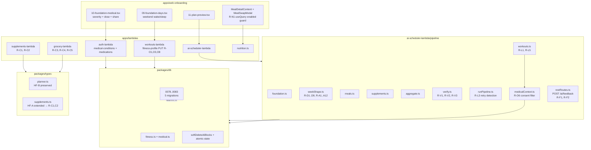
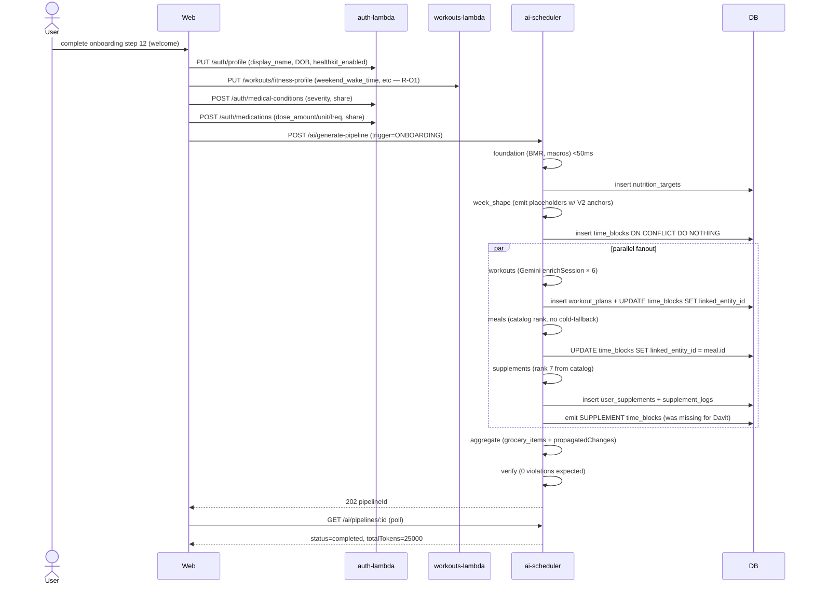
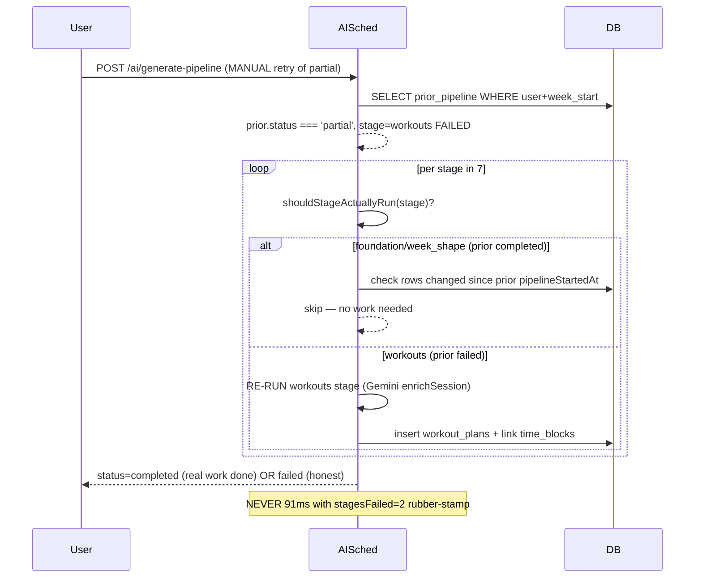
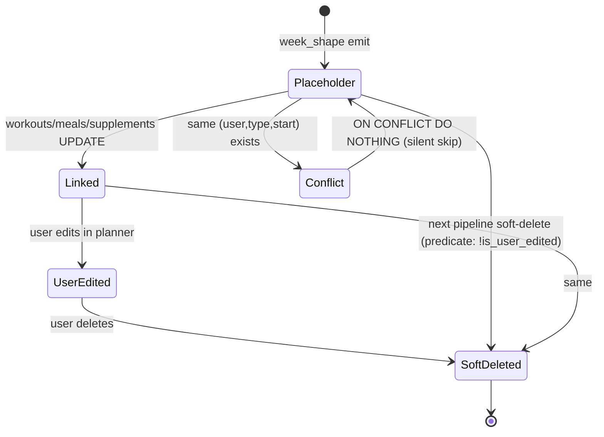

# Design — audit-driven-fidelity-v1

> SPARC design phase per USAGE.md Day 1-2. Specification → Pseudocode → Architecture. 21-day appetite, 63 ACs across 3 waves.
> Sources: `spec.md`, `solution-sketches.md`, `architect-review.md` (NEEDS_CHANGES → amendments folded), `security-review.md` (PASS_WITH_FOLLOWUP → 4 absorbed), `docs/sprints/_index/master-requirements-2026-05-19.md`.

---

## SPARC Specification (formalized)

### Functional requirements

**FR-1 (onboarding persistence)** — every wizard field captured at steps 04-plan-notifications lands in its DB column on submit. No silent drops. Zero post-onboarding NULLs for fields the user filled.

**FR-2 (block emission)** — every `time_blocks` row emitted by `weekShape.ts` or `workouts.ts` satisfies:

- `end_time - start_time > 0 min` (no zero-duration)
- `start_time >= fitness_profile.wake_time` for AM workouts (no pre-wake)
- `start_time + N min ≤ next_block.start_time` for adjacent blocks (no anchor collision)
- duration derived from `fitness_profile.*_minutes` or `user_supplements.*` user-pref fields (no hard-coded)

**FR-3 (linkage)** — every block of type MEAL / WORKOUT / SUPPLEMENT / ACTIVITY has `linked_entity_id` populated within the same transaction as the placeholder insert. Verify reports unlinked=0 on a clean ONBOARDING run.

**FR-4 (pipeline idempotency)** — both `weekShape` and `workouts` stage INSERTs into `time_blocks` use `ON CONFLICT (user_id, type, start_time) WHERE deleted_at IS NULL DO NOTHING`. Retry of a `partial` pipeline either re-executes stages with stale state OR fails fast with "no work to do" — never rubber-stamps `completed` in <100ms.

**FR-5 (response contracts)** — every Zod-validated GET response on supplements/grocery/pantry endpoints parses cleanly against the schema. Numeric-from-postgres-js columns use `NumericFromDb` transform. Optional timestamps use `.nullable().optional()`.

**FR-6 (AI feedback resilience)** — `POST /ai/feedback` timeout configurable via `LIFEOS_AI_FEEDBACK_TIMEOUT_MS` (default 1500ms local, 800ms prod). Circuit breaker uses exponential backoff (30s → 60s → 120s, reset on first success).

**FR-7 (consent gating)** — `medicalContext.ts:buildPromptContext()` filters by `share_with_ai_scheduler=true` per condition AND per medication. Default false everywhere. Pre-existing rows (Davit, Levan) default false.

**FR-8 (backfill correction)** — the 6 inaccurate Production claims in `pipeline-onboarding-fidelity/state.json` + `proof/W*.md` corrected to match live DB reality.

### Non-functional requirements

- **NFR-1**: total pipeline runtime budget ≤ 30s for ONBOARDING trigger (current baseline 73-91ms is rubber-stamp; honest baseline pre-fix is unknown).
- **NFR-2**: zero new RLS surface. New columns inherit parent-table policies.
- **NFR-3**: zero new PII surface to Gemini beyond what `share_with_ai_scheduler=true` consents to.
- **NFR-4**: 0 new response-contract-mismatch warnings in dev log (current rate: ~50/page-load).
- **NFR-5**: Davit synthetic-fixture verify=0 violations (acceptance gate for V2 flag flip).
- **NFR-6**: bundle size budget already over (ai-scheduler 5.20MB, auth 7.99MB) — sprint MUST NOT add net bytes; deferred to follow-up.

### Constraints

- **C-1**: 21-day appetite hard cap (3 waves × 7 days). No extension.
- **C-2**: All migrations applied LOCAL only — remote apply gated on operator approval per plan decision #17.
- **C-3**: No `git push` (PR flow only, hook-enforced).
- **C-4**: Wave 2 (30 deep ACs) MUST land behind `LIFEOS_PIPELINE_EMISSION_V2` feature flag, default off.
- **C-5**: Pre-migration cleanup of existing `dietary_restrictions` freeform values BEFORE CHECK constraint applies (per architect amendment AC-W1-T1.5a).
- **C-6**: R-X1 (commit untracked prior-sprint dir) runs Wave-1 Day-1 first action — no exceptions.

---

## SPARC Pseudocode — 7 key flows

### Flow F1 — Onboarding step-09 weekend-times persist (R-O1)

```
on PUT /workouts/fitness-profile {body}:
  validated = UpdateFitnessProfileSchema.parse(body)   # NEW: accepts weekendWakeTime/weekendSleepTime/weekendWork
  if body.weekdaysSameAsWeekends === false:
    require body.weekendWakeTime != null               # 400 if missing
    require body.weekendSleepTime != null
  db.update(fitness_profiles).set(validated).where(user_id = jwt.sub)
  return ok(updated_row)

acceptance:
  PUT with weekdays_same_as_weekends=false + weekend_wake_time='09:00' + weekend_sleep_time='00:30'
    → row reflects both fields non-null
  PUT with weekdays_same_as_weekends=false + missing weekend_wake_time
    → 400 with field-level error
  PUT with weekdays_same_as_weekends=true
    → weekend_* fields ignored (allowed to be null)
```

### Flow F2 — Medical condition severity + share (R-O2, R-O6)

```
migration_NNNN_share_with_ai_scheduler.sql:
  ALTER TABLE user_medical_conditions
    ADD COLUMN IF NOT EXISTS share_with_ai_scheduler boolean NOT NULL DEFAULT false;
  -- BLOCKING SECURITY CHECK: no backfill UPDATE — existing rows MUST default false.
  -- Existing 3 Davit conditions + 2 Levan conditions stay opt-out.
  ALTER TABLE user_medications ADD COLUMN ... DEFAULT false;

on POST /auth/medical-conditions {body}:
  validated = MedicalConditionSchema.parse(body)        # NEW: severity, diagnosedDate, shareWithAiScheduler
  db.insert(user_medical_conditions).values(validated)
  return ok(inserted_row)

on medicalContext.buildPromptContext(userId):
  conditions = db.select().from(user_medical_conditions)
    .where(user_id = userId, deleted_at = null, share_with_ai_scheduler = true)  # NEW filter
  medications = db.select().from(user_medications)
    .where(user_id = userId, deleted_at = null, share_with_ai_scheduler = true)  # NEW filter
  if conditions.length === 0 AND medications.length === 0:
    return { text: '', meta: { conditionsCount: 0, medicationsCount: 0 } }
  return formatPromptBlock(conditions, medications)

acceptance:
  user with 3 conditions, all share=false → block.text === ''
  user with 1 condition share=true, 2 share=false → block.text mentions only 1
  snapshot test in medicalContext.test.ts asserts shape
```

### Flow F3 — Block-emission anchor + duration fix (R-D1..D9, R-A1..A12)

```
weekShape.ts (NEW logic, gated by LIFEOS_PIPELINE_EMISSION_V2):

  function emitWorkoutBlock(args):
    if env.LIFEOS_PIPELINE_EMISSION_V2 === '1':
      anchor = max(fitness_profile.wake_time, preferred_workout_times[i])
      duration = fitness_profile.session_duration_minutes  # was 30 hard-coded
    else:
      anchor = MORNING_DOUBLE_MIN  # 06:30 literal
      duration = 30
    return BlockDraft(start: anchor, end: anchor + duration, type: 'WORKOUT')

  function spreadAnchorCollisions(drafts):
    # Resolves Breakfast + HIIT + Hydration all at 07:30 etc.
    grouped = drafts.groupBy(d => d.start_time)
    for (start, list) of grouped:
      if list.length > 1:
        list.sortBy(priority: MEAL > ACTIVITY > HEALTH)
        for i, draft in list[1:]:
          draft.start_time = draft.start_time + (i * BUFFER_MIN)
          draft.end_time = draft.start_time + draft.duration
    return drafts

acceptance:
  user with wake_time=07:15 + session_duration_minutes=75:
    AM workout: start >= 07:15, duration === 75
  user with breakfast_time=07:30 + HIIT cardio + hydration:
    Breakfast: 07:30-08:00 (30min)
    HIIT cardio: 08:00-08:30
    Hydration: 08:30-08:50
    (or some non-collision order; key: all 3 distinct start times)
```

### Flow F4 — Workouts stage ON CONFLICT (R-L1)

```
workouts.ts (NEW): persist enriched plan + time_block linkage in one TX

  await db.transaction(async (tx) => {
    [plan] = await tx.insert(workout_plans).values(enrichedPlan).returning()
    await tx.update(time_blocks)
      .set({ linked_entity_id: plan.id })
      .where(and(
        eq(time_blocks.id, placeholder.id),
        eq(time_blocks.linked_entity_id, null),
        eq(time_blocks.deleted_at, null),
      ))
    # If workouts stage RE-emits a placeholder due to AC-23 balance swap, do:
    await tx.insert(time_blocks).values(newPlaceholder)
      .onConflictDoNothing({
        target: [time_blocks.user_id, time_blocks.type, time_blocks.start_time],
        where: isNull(time_blocks.deleted_at),
      })
  })

acceptance:
  Davit onboarding pipeline:
    workouts stage completes without PG 23505
    6 WORKOUT time_blocks all have linked_entity_id != null
    6 workout_plans rows present
```

### Flow F5 — Pipeline retry rubber-stamp detection (R-L3, sequenced FIRST in Wave 2)

```
runPipeline.ts (NEW):

  async function shouldStageActuallyRun(stage, ctx):
    last_run = ctx.previousPipelineForWeek(ctx.weekStart)
    if !last_run: return true
    if last_run.status === 'completed': return false  # idempotent skip
    # last_run was partial — check if state actually changed
    if stage === 'workouts':
      placeholders = await countPlaceholders(ctx.userId, ctx.weekStart, 'WORKOUT')
      enriched = await countEnriched(ctx.userId, ctx.weekStart, 'WORKOUT')
      if placeholders === enriched: return false  # nothing to do
      return true
    # similar checks per stage
    return true

  for stage of [foundation, week_shape, workouts, meals, supplements, aggregate, verify]:
    if !shouldStageActuallyRun(stage, ctx):
      record_stage_status(stage, 'skipped-no-work-needed')
      continue
    duration_ms = await runStage(stage, ctx)
    if duration_ms < 5:
      throw "rubber-stamp detected — stage claimed completed in <5ms"
    record_stage_status(stage, duration_ms < 5 ? 'failed' : 'completed')

acceptance:
  Retry of Davit's partial pipeline cdb4cae4 (workouts failed):
    foundation: skipped-no-work-needed
    week_shape: skipped-no-work-needed
    workouts: RE-runs and completes (or fails honestly)
    NOT all stages rubber-stamping in 91ms
```

### Flow F6 — AI feedback timeout extension + backoff (R-F1, R-F2)

```
restRoutes.ts POST /ai/feedback:

  const TIMEOUT_MS = parseInt(env.LIFEOS_AI_FEEDBACK_TIMEOUT_MS ?? '1500')

  async function feedbackHandler(body):
    rule_verdict = computeRuleVerdict(body)  # always runs, <1ms
    if circuit_breaker.isOpen(): return { ...rule_verdict, source: 'rule' }

    const controller = new AbortController()
    setTimeout(() => controller.abort(), TIMEOUT_MS)
    try:
      gemini_msg = await generateGeminiFeedback(body, { signal: controller.signal })
      circuit_breaker.recordSuccess()
      return { verdict: rule_verdict.verdict, message: gemini_msg, source: 'gemini' }
    catch (e):
      circuit_breaker.recordFailure()  # next backoff: 30s → 60s → 120s
      return { ...rule_verdict, source: 'rule' }

acceptance:
  Onboarding session with 8 feedback calls:
    source=gemini for ≥80% (current: 0%)
    p95 latency < 2000ms (current: 605ms but all fallback)
```

### Flow F7 — Davit synthetic fixture (V2 flag cutover gate, AC-W2-FLAG)

```
__tests__/pipeline-fixtures/davit-onboarding.json:
  {
    "user": {
      "fitness_profile": { wake_time: '07:15', sleep_time: '23:15',
        breakfast_time: '07:30', lunch_time: '12:30', dinner_time: '19:00',
        training_frequency: 5, sessions_per_week: 6, does_doubles: true,
        session_duration_minutes: 75, ... },
      "work_schedule": { hours_per_week: 40, commute_minutes: 30,
        recurrence_rules: ['RRULE:FREQ=WEEKLY;BYDAY=MO,TU,WE,TH,FR'] },
      "user_supplements": [/* 7 entries */]
    },
    "expected_pipeline_result": {
      "status": "completed",
      "verify_violations": 0,
      "time_blocks_by_type": { WORKOUT: 6, MEAL: 21, SUPPLEMENT: 28, ... },
      "all_blocks_have_linked_id_where_applicable": true,
      "all_block_durations_gt_0": true,
      "am_workout_start_ge_wake_time": true,
      "work_block_total_minutes_per_week_pct_of_stated": 90
    }
  }

CI gate:
  pnpm test:fixtures:weekShape
    Runs pipeline with LIFEOS_PIPELINE_EMISSION_V2=0 → expects pre-fix behavior
    Runs pipeline with LIFEOS_PIPELINE_EMISSION_V2=1 → expects expected_pipeline_result above
    Fail if v2 diverges from expectation on any field
```

---

## SPARC Architecture

### Component dependency map



### Sequence — onboarding pipeline F7 happy path (post-fix)



### Sequence — retry rubber-stamp detection (R-L3 critical fix)



### State diagram — `time_blocks` lifecycle (post-fix)



### File-touch impact map (grouped by risk)

| Risk                                                      | Files                                                                                                                                                                                              | Wave |
| --------------------------------------------------------- | -------------------------------------------------------------------------------------------------------------------------------------------------------------------------------------------------- | ---- |
| **HIGH** (deep pipeline refactor, V2 flag)                | `apps/lambdas/ai-scheduler-lambda/src/pipeline/stages/weekShape.ts`, `workouts.ts`, `runPipeline.ts`, `verify.ts`                                                                                  | 2    |
| **HIGH** (PII consent gate)                               | `apps/lambdas/ai-scheduler-lambda/src/pipeline/medicalContext.ts`, `medicalContext.test.ts`, migration NNNN_share_with_ai_scheduler.sql                                                            | 1    |
| **MED** (Zod schema additions)                            | `apps/lambdas/workouts-lambda/src/routes/fitnessProfile.ts`, `apps/lambdas/auth-lambda/src/manifest.ts` (medical-conditions, medications), `packages/types/src/{supplements,planner,nutrition}.ts` | 1    |
| **MED** (write-time CHECK constraint with legacy cleanup) | migration NNNN_dietary_restrictions_check.sql + pre-cleanup SQL                                                                                                                                    | 1    |
| **MED** (frontend null guard)                             | `apps/web/components/nutrition/MealDetailContent.tsx`, MealSwapModal, useQuery enabled gate                                                                                                        | 1    |
| **LOW** (timeout config + backoff)                        | `apps/lambdas/ai-scheduler-lambda/src/restRoutes.ts` (POST /ai/feedback)                                                                                                                           | 1    |
| **LOW** (paperwork)                                       | `docs/sprints/pipeline-onboarding-fidelity/state.json` + `proof/W*.md` + `retro.md` + `_index/continuous-work-*.md`                                                                                | 3    |
| **CROSS-CUTTING**                                         | `docs/sprints/pipeline-onboarding-fidelity/` (commit untracked) — R-X1 Day 1 first action                                                                                                          | 1    |

### Wave structure (per user-confirmed decision + architect amendment)

```
Wave 1 (Days 1-7) — Mechanical, parallel-track agent swarm
├─ Day 1 morning: R-X1 commit untracked sprint dir (HIGH-RISK FIRST)
├─ Swarm A (backend-dev) → R-O1..O8 (8 ACs onboarding persistence)
├─ Swarm B (backend-dev) → R-C1..C5 (5 ACs response contracts)
├─ Swarm C (backend-dev) → R-F1..F4 (4 ACs ai-feedback resilience)
├─ Swarm D (frontend)    → R-N1 (1 AC null-meal-id guard)
├─ Plus AC-W1-T1.5a (pre-migration cleanup) + AC-W1-SEC1 (medicalContext snapshot test)
└─ Wave-1 close: 20 ACs (was 18, +2 from amendments)

Wave 2 (Days 8-14) — Pipeline block-emission, V2 flag
├─ Day 8 first action: R-L3 retry rubber-stamp detection MUST land before others
│   (else dev-loop produces false-greens against stale partial state)
├─ Swarm E (backend-dev) → R-D1..D9 (9 ACs durations)
├─ Swarm F (backend-dev) → R-A1..A12 (12 ACs anchors)
├─ Swarm G (backend-dev) → R-L1, L2, L4, L5, L6 (5 ACs linkage)
├─ Swarm H (backend-dev) → R-V1..V3 (3 ACs verify rules)
├─ Plus AC-W2-T2.0a (fixture format) + AC-W2-T2.0b (CI harness) + AC-W2-FLAG (cutover criteria)
├─ Day 14 close: LIFEOS_PIPELINE_EMISSION_V2=1 flag flip if Davit fixture passes
└─ Wave-2 close: 33 ACs (was 30, +3 from amendments)

Wave 3 (Days 15-21) — Backfill correction + cross-cutting + verify + retro
├─ R-B1..B6 (6 ACs backfill corrections to prior sprint)
├─ R-X2..X4 (3 ACs cross-cutting — pre-flight check, RLS audit, migrate-remote)
├─ Day 18: bash scripts/sprint-checkin.sh (mid-cycle hill chart)
├─ Day 19-20: bash scripts/sprint-verify.sh (workers audit+testgaps+optimize FIRE here)
├─ Day 20: pre-deploy review (reviewer + security-architect agents)
├─ Day 21: retro + close
└─ Wave-3 close: 10 ACs (R-X1 moved earlier)

Total: 20 + 33 + 10 = 63 ACs over 21 days
```

### Cut-line analysis (Day 21 panic order)

If we're behind at Day 18 check-in, cut in this order (lowest risk first):

1. **R-A7..A12** (6 P2 hard-coded-anchor cleanup) → defer to follow-up
2. **R-D8, R-D9** (P1 hobby/social durations) → user-pref-derived already close enough
3. **R-B4** (W2.5 reopen) → already known broken; comment in retro
4. **R-F4** (CloudWatch dashboard panel) → metric emitters land, dashboard later

Hard floor (cannot cut):

- All P0 ACs (R-O1..O6, R-D1..D7, R-A1..A6, R-L1..L6, R-V1..V3, R-C1..C5, R-F1, R-N1, AC-W1-T1.5a, AC-W1-SEC1, AC-W2-T2.0a, AC-W2-T2.0b, AC-W2-FLAG, R-X1..X4)
- All migration ACs (R-O5, R-O6, R-X3)

### Module ownership matrix (Wave 2 swarm claims)

| Swarm             | Claim       | AC range  | File-touch claim                                                           |
| ----------------- | ----------- | --------- | -------------------------------------------------------------------------- |
| E (R-D durations) | backend-dev | R-D1..D9  | weekShape.ts lines 30-36, 400, 701, 778                                    |
| F (R-A anchors)   | backend-dev | R-A1..A12 | weekShape.ts lines 251-253, 307, 410-423, 460, 766, 816, 833, 885, 687-693 |
| G (R-L linkage)   | backend-dev | R-L1..L6  | workouts.ts, runPipeline.ts, nutrition-lambda/generateMeal.ts              |
| H (R-V verify)    | backend-dev | R-V1..V3  | verify.ts violation categories                                             |

All swarms coordinate at the LIFEOS_PIPELINE_EMISSION_V2 flag and the Davit synthetic fixture.

---

## Refinement (anticipated)

Per SPARC Refinement phase — surfaces during build, captured in standup.md daily.

Known unknowns:

- Wave 2 R-A12 supplement timing anchors — may need a new `fitness_profile.supplement_timing_offsets` column if the simple "wake+1h MORNING, lunch_time WITH_MEAL" map doesn't fit user data.
- R-L4 cold-fallback ingredient-linkage — fix may require nutrition-lambda generateMeal.ts to call a separate ingredient-resolver pass; could be larger than estimated.

---

## Completion (sprint-close gates per USAGE.md phase-manifest)

- `done` phase requires retro.md with 6 H2 sections + 3+ `### Pattern N:` subsections
- `metrics.json` with success_criteria evaluated
- `dashboard.html` rendered
- `state.closed_at` set

Patterns expected to extract for ruflo memory:

1. `lifeos-feature-flag-pipeline-emission` — V2 flag pattern for deep refactors
2. `lifeos-pre-migration-cleanup` — `NOT VALID` + cleanup + `VALIDATE CONSTRAINT` pattern
3. `lifeos-share-with-ai-scheduler-consent` — column-as-consent-gate pattern
4. `lifeos-retry-rubber-stamp-detection` — pipeline retry should-stage-actually-run pattern
5. `lifeos-synthetic-fixture-cutover` — flag flip gated on fixture verify=0
