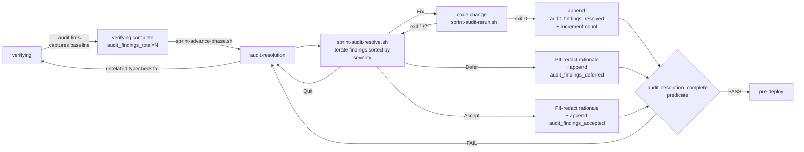
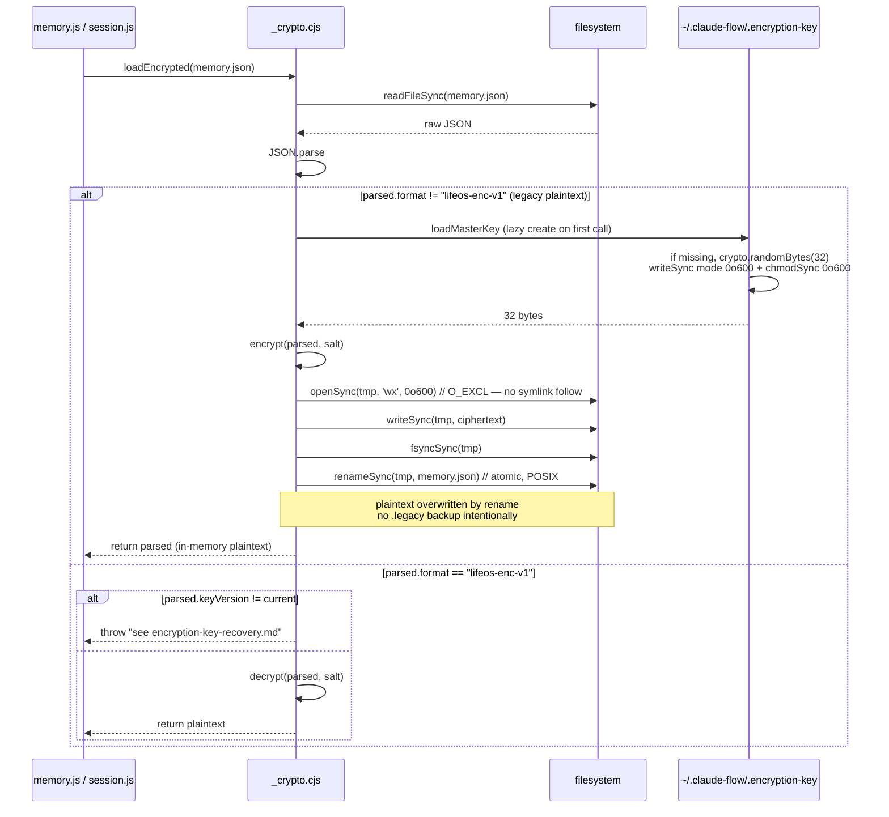

# SPARC Design — harness-audit-resolution-and-scope-v1

> **Status.** Design lock. Produced 2026-05-19 after spec lock, three reviews (architect/security/consensus), and Sketch A + (a) post-filter + (b) `__tests__/` lock.
> **Scope.** 19 ACs across 4 waves. Closes two load-bearing harness gaps proven by `harness-truthful-docs-and-wiring-v1` dogfood (100% noise repo-wide audit + audit→bypass→ship pattern) and fixes 10 HAR-1..10 vulnerabilities in `.claude/helpers/{github-safe,memory,session,statusline}.js`.
> **Source-of-truth refs.** [`spec.md`](./spec.md) §A/§H/§I/§J · [`solution-sketches.md`](./solution-sketches.md) Sketch A + (a) + (b) · [`architect-review.md`](./architect-review.md) ADR-1..5 + 3 conditions · [`security-review.md`](./security-review.md) S1..S8 + 6 conditions · [`consensus-spec.json`](./consensus-spec.json) C1..C8.

---

## Table of contents

1. [Specification recap (19 ACs)](#1-specification-recap-19-acs)
2. [Pseudocode per wave](#2-pseudocode-per-wave)
   - 2.1 [Wave 1 — Scope-bounding](#21-wave-1--scope-bounding)
   - 2.2 [Wave 2 — Audit-resolution phase](#22-wave-2--audit-resolution-phase)
   - 2.3 [Wave 3 — HAR-1..10 security fixes](#23-wave-3--har-110-security-fixes)
   - 2.4 [Wave 4 — Docs + v0.7.2 polish + dogfood](#24-wave-4--docs--v072-polish--dogfood)
3. [Architecture diagrams](#3-architecture-diagrams)
4. [ADRs (5 formal)](#4-adrs-5-formal)
5. [Invariants (5)](#5-invariants-5)
6. [Per-wave entry/exit predicates](#6-per-wave-entryexit-predicates)
7. [Verification matrix](#7-verification-matrix)
8. [Ship-gate condition execution map (C1..C8)](#8-ship-gate-condition-execution-map-c1c8)
9. [Cross-reference index (ADR ↔ S-surface ↔ AC)](#9-cross-reference-index)

---

## 1. Specification recap (19 ACs)

Each AC restated in one paragraph with its wave, complexity classification, and the load-bearing artifact it produces.

### Wave 1 — Scope-bounding (AC-1..AC-4)

- **AC-1 (S, `gate_audit_blocks` scope-bounded).** Extend `scripts/lib/worker-gates.sh` to add a new function `gate_audit_blocks(audit_json, slug)`. Mirror `gate_testgaps_blocks` lines 58-106 exactly: read `docs/sprints/<slug>/spec.md`, awk-parse the `## Files touched` section into a sorted-unique set, partition `audit.json::.vulnerabilities[]` by `.file ∈ files_touched`. In-scope vulnerabilities count toward the blocking gate (return 1 if any); out-of-scope vulnerabilities are logged to stderr as `[gate-audit] OUT-OF-SCOPE: <file>:<line>` and surfaced via state.audit_runs[] (ADR-1) for retro dashboard. Vacuous-pass on empty `## Files touched` (matches testgaps semantics). Locked decision: scope back-compat is advisory-for-all — old sprints that pre-date this AC get scope=repo + scope_mode=none from AC-4 default and still pass, no migration of historical state.json required.

- **AC-2 (S, `gate_optimize_scope_filter`).** New advisory-only function in `worker-gates.sh`. Parses `optimize.json::.suggestions[]`, applies the same `## Files touched` filter as AC-1, logs in-scope-vs-out-of-scope ratio to stderr, never blocks (always returns 0). Mirrors the existing `gate_optimize_advisory` shape — the only delta is the scope-filter step before the count. This unblocks a future "optimize-resolution" phase (out of scope for this sprint) by making the in-scope ratio observable.

- **AC-3 (S, `sprint-verify.sh` passes `$SLUG` to `gate_audit_blocks`).** One-line plumbing change in `scripts/sprint-verify.sh` around line 190 — pass `"$SLUG"` (already in scope from the script's CLI arg parsing) as the second argument to `gate_audit_blocks`. Also update the `gate_optimize_advisory` call site to use `gate_optimize_scope_filter` (AC-2). Without AC-3, AC-1's signature change is unreachable from the actual verify flow.

- **AC-4 (S, `phase-workers.json` scope metadata).** Extend `scripts/lib/phase-workers.json` schema by adding optional `{scope: "files-touched"|"repo"|"spec-h1", scope_mode: "post-filter"|"env-var"|"prompt-inject"|"none"}` fields to each worker entry. Default `{scope: "repo", scope_mode: "none"}` preserves current behavior. `audit` and `testgaps` workers explicitly set `{scope: "files-touched", scope_mode: "post-filter"}`. `optimize` keeps `{scope: "repo", scope_mode: "none"}` per AC-2 advisory contract. Per S8: `worker-gates.sh` MUST validate scope against the allowlist with fail-loud-to-repo default — never silent fall-through to vacuous pass.

### Wave 2 — Audit-resolution phase (AC-5..AC-8)

- **AC-5 (XL, `audit-resolution` phase in `phase-manifest.json`).** New 12th phase declared between `verifying` and `pre-deploy`. `advances_to: [pre-deploy, verifying, paused]` (the `verifying` back-edge handles the case where Fix-path surfaces unrelated typecheck failures — architect open-question 1, decision: yes, model on `cleaning`). `required_artifacts: [{kind: file_min_bytes, path: audit-resolutions.md, min_bytes: 1024}]`. `required_state_fields: [audit_findings_total present, audit_findings_resolved_count present, audit_findings_deferred array, audit_findings_accepted array]`. `required_sub_step_gates: [audit-resolution-fired, audit-resolution-walk-started, audit-resolution-walk-complete, audit-resolution-rerun-fired]`. New predicate kind `audit_resolution_complete` (see Wave 2 pseudocode + ADR-2) added to `scripts/lib/phase-predicates.sh`. `scripts/lib/phase-manifest.schema.json` enum updated to include `audit-resolution`. `sprint-end.sh` phase-list comments updated; `sprint-advance-phase.sh` unchanged (manifest-driven).

- **AC-6 (XL, `sprint-audit-resolve.sh` interactive walker).** ~350 LOC interactive bash. Reads `worker-output/audit.json::.vulnerabilities[]`, sorts by severity (high→medium→low), iterates each finding. Per finding, prompt operator `[F]ix / [D]efer / [A]ccept / [S]kip-resumable / [Q]uit`. Fix-path: pause for operator to make code change, then invoke `sprint-audit-rerun.sh <slug> <har_id>`; on PASS, append to `audit_findings_resolved[]` + increment `audit_findings_resolved_count`. Defer-path: require non-empty `deferred_to_sprint` slug + `ac_id`; append to `audit_findings_deferred[]`. Accept-path: require non-empty `risk_owner` + `acceptance_rationale ≥ 30 chars`; append to `audit_findings_accepted[]`. Every decision = one atomic `atomic_update_state` + one `record_sub_step` (ADR-3 atomicity). All rationale strings piped through `sprint-pii-redact.sh` before atomic write (S2 + C5). Resume reads state on start, skips findings whose `har_id` already appears in any of the three arrays (ADR-3 resume).

- **AC-7 (L, `sprint-audit-rerun.sh` re-fire + diff).** ~200 LOC. Captures baseline `worker-output/audit.baseline.json` from verifying-phase-entry timestamp (so diffs are deterministic per resolution walk). Re-fires `ruflo daemon trigger -w audit "$SLUG"` wrapped in `env -i HOME="$HOME" PATH="$PATH" SHELL="$SHELL" SPRINT_SLUG="$SLUG" RUFLO_WORKER_AUDIT_BASELINE="$baseline_path"` (S3 + C6 allowlist — no AWS/SUPABASE/\_API_KEY/\_TOKEN/DATABASE_URL inherited). Diffs `.vulnerabilities[]` against baseline by `har_id`. Categorizes each finding as `FIXED` (in baseline, not in rerun), `REGRESSION` (in rerun, not in baseline), `UNCHANGED` (in both). FIXED for the target `har_id` → exit 0. REGRESSION → run audit a second time (ADR-4 two-strikes); if regression reproduces, exit 1 + write to `state.audit_runs[]` with `jitter: false`; if absent on rerun, exit 0 + write `jitter: true`. UNCHANGED → exit 2 (operator didn't actually fix). `--baseline` operator-supplied arg passes through `realpath` canonicalization + `..` rejection (S4).

- **AC-8 (S, `audit-resolutions.md` template formalized).** New file at `docs/sprints/_templates/audit-resolutions.md`. Per-finding schema: `### HAR-<N> — <title>` heading, then bullet block (severity / file:line / description / audit_recommendations) followed by a status subsection `#### Status: FIXED|DEFERRED|ACCEPTED` with three mutually-exclusive variant bodies (FIXED: fix_approach / verification / evidence_path; DEFERRED: deferred_to_sprint / ac_id / rationale; ACCEPTED: risk_owner / acceptance_rationale / review_in). `sprint-audit-resolve.sh` seeds this template into the sprint dir as part of `audit-resolution-fired` sub-step. The template ships in this sprint but its first non-fixture exercise is W4 dogfood (synthetic finding from W3 fixtures, since this sprint's own audit should produce 0 in-scope findings per C8).

### Wave 3 — HAR-1..10 fixes (AC-9..AC-18)

- **AC-9 (M, HAR-1 command injection in `github-safe.js:45`).** Replace `execSync(\`gh ${command} ${subcommand} ${args.join(' ')}\`)`with`execFile('gh', [command, subcommand, ...args], { shell: false })`. `execFile`invokes`execve`directly with no shell interpreter, so metacharacters in args are passed verbatim as`argv`(S7 documents the`execve`semantic so future reviewers don't relitigate). Path:`path.resolve`validation on any file argument. Test at`.claude/helpers/**tests**/github-safe.test.cjs`covers (i) malicious`args`containing`;rm -rf ~`passes through as literal argv element, (ii) legitimate`gh issue comment <num> --body <body>` round-trips.

- **AC-10 (L, HAR-2 unencrypted `memory.json`).** Wrap `loadMemory()` + `saveMemory()` in `.claude/helpers/memory.js` with `aes-256-gcm` via `node:crypto`. Key derivation: `scryptSync(masterKey, salt='lifeos-memory-v1', 32)`. Master key at `~/.claude-flow/.encryption-key`, generated on first run via `crypto.randomBytes(32)` (S1 + C4 — never `Math.random`/`Date.now`). File written with `{ mode: 0o600 }` PLUS explicit `fs.chmodSync(file, 0o600)` (belt+braces — `mode` only applies on create). `.gitignore` updated to exclude `.claude-flow/.encryption-key`. Encrypted payload envelope: `{ format: "lifeos-enc-v1", keyVersion: 1, iv: <b64>, authTag: <b64>, ciphertext: <b64> }` (ADR-5). Legacy plaintext detection: parse as JSON; if successful AND no `format` field, treat as legacy → encrypt-tmp-fsync-rename-unlink (S6 + C7 atomic migration). New file: `docs/sprints/_guides/encryption-key-recovery.md` (architect condition 3) documenting (a) why opaque crypto errors happen, (b) restore from key backup, (c) nuke+reset path, (d) data-loss scope. Tests cover RNG source, mode 0o600, gitignore, no-log-path-leak (S1 conditions 4 items).

- **AC-11 (S, HAR-3 predictable session IDs in `session.js:18`).** Replace `Date.now()` with `crypto.randomUUID()`. Test asserts (i) regex match `^[0-9a-f]{8}-[0-9a-f]{4}-4[0-9a-f]{3}-[89ab][0-9a-f]{3}-[0-9a-f]{12}$` (RFC 4122 v4), (ii) 1000 calls produce 1000 unique IDs.

- **AC-12 (L, HAR-4 unencrypted `session.json`).** Same `aes-256-gcm` + scryptSync wrap as AC-10, applied to `.claude/helpers/session.js` `loadSession`/`saveSession`. Shares the same `~/.claude-flow/.encryption-key` (one key, two encrypted stores — simpler key rotation surface). Same envelope format + keyVersion check (ADR-5). Same atomic migration (S6 + C7). Test covers (i) encrypt-decrypt roundtrip, (ii) tamper detection (modify 1 byte of ciphertext → auth-tag mismatch on decrypt), (iii) legacy plaintext migration leaves no `.tmp.*`/`.legacy` artifacts.

- **AC-13 (S, HAR-5 input validation in `github-safe.js:46`).** Allowlist gate at function entry: `command ∈ {"issue", "pr", "repo", "api"}`; `subcommand ∈ {"comment", "create", "view", "list", "edit", "close"}`; `restArgs` validated against shell-metacharacter blocklist `/[;&|`$()<>]/`(these are unsafe even though execFile bypasses shell, because some`gh`subcommands write to files). Throw`Error('github-safe: rejected unsafe arg "X" at index N')` on violation. Tests cover each accepted case + one rejected case per blocklist character.

- **AC-14 (S, HAR-6 path traversal in `memory.js:23`).** Reject `key` containing `/`, `\`, `..`, NUL byte, or any control char `\x00-\x1f` at `getMemory`/`setMemory` entry. Regex: `/^[a-zA-Z0-9_.-]{1,128}$/`. Tests cover `../../../etc/passwd` rejected, `valid_key_123` accepted, empty string rejected, 129-char rejected.

- **AC-15 (S, HAR-7 context validation in `session.js:33`).** Allowlist `key` chars `/^[a-zA-Z0-9_]{1,64}$/`. Reject values whose stringified form contains `eval(`, `Function(`, `\`${`, or backtick `\``. Tests cover each pattern blocked.

- **AC-16 (S, HAR-8 unsafe DB file access in `statusline.js:22`).** Wrap every `fs.statSync` / `fs.readdirSync` / `fs.readFileSync` call in try/catch. On error: log to stderr with `[statusline] WARN: <error.code> <path>` and return sensible defaults (counts=0, lists=[], summary='unavailable'). Tests cover (i) missing DB file at `~/.claude-flow/data/*.db` → returns `{count: 0}`, (ii) EACCES permission denied → returns defaults + stderr log.

- **AC-17 (M, HAR-9 TOCTOU race in `github-safe.js:62`).** Atomic-rename pattern for the tmp body-file: `fs.writeFileSync(tmpFile, body, { flag: 'wx', mode: 0o600 })` (O_CREAT|O_EXCL — fails on existing file including symlinks; POSIX guarantees no symlink-follow on EEXIST). On `EEXIST`, retry once with a fresh `crypto.randomBytes(12).toString('hex')` suffix. After write, `const fd = fs.openSync(tmpFile, 'r'); fs.fsyncSync(fd); const st = fs.fstatSync(fd); if (st.uid !== process.getuid()) throw Error('ownership mismatch')` (S7 belt-and-braces against exotic FUSE filesystems). Test plants a symlink at the expected tmp name pointing to `/etc/hosts` (in a fixture sandbox) and asserts that writeFileSync throws EEXIST.

- **AC-18 (S, HAR-10 swallowed errors in `memory.js:45`).** Distinguish error classes in catch blocks:
  - `ENOENT` (file missing): expected on first read; return empty store, do not log.
  - `EACCES`/`EPERM` (permission denied): log to stderr + return empty store (read path) or rethrow (write path).
  - `SyntaxError` (corrupt JSON): log to stderr with first 100 chars of file + path; rename file to `<path>.corrupt.<timestamp>` and return empty store.
  - Any other error: log + rethrow on save path; log + return empty on load path.
    Tests cover ENOENT/EACCES/SyntaxError/EIO classes each as discrete cases.

### Wave 4 — Docs + v0.7.2 polish + dogfood (AC-19 + G1/G2/G3)

- **AC-19 (M, docs + 3 polish + dogfood).** Composite AC covering four docs + three polish items + Wave-5 dogfood:
  - **USAGE.md**: (a) §1 14-day flow table: insert `audit-resolution` row between `verifying` and `pre-deploy` with Day 11-12 budget + operator-action `bash scripts/sprint-audit-resolve.sh`; (b) §3 new subsection "worker_runs vs worker_invocations" clarifying that scope-bounded workers run once per verify but their gate evaluates twice (once for in-scope blocking, once for out-of-scope advisory); (c) §3 new subsection "Worker scoping" with the three legal scope values + post-filter semantics (ADR-1 dashboard ref).
  - **QUICKSTART.md**: one-line v0.7.1 callout pointing at the audit-resolution flow.
  - **DEVELOPER.md**: (a) link "Audit-driven fix days" pattern to `_templates/audit-resolutions.md`; (b) new "Worker scoping" section with allowlist enforcement contract (S8); (c) terminology anchor `audit_findings[]` documented as canonical state-field name.
  - **SCRIPTS.md**: add 4 previously-undocumented scripts (`sprint-pii-redact.sh`, `worker-trigger.sh`, `phase-predicates.sh`, `phase-manifest-validator.mjs`) + 2 new from this sprint (`sprint-audit-resolve.sh`, `sprint-audit-rerun.sh`) + mention `worker-trigger.sh` scope flag (S3 env-allowlist contract).
  - **G1 `sprint-replay-validator.mjs`**: add `phase_manifest_version_seen` field to per-sprint replay metadata so sprints predating AC-5's 12-phase manifest are validated against the manifest version they ran under, not the current one (back-compat).
  - **G2 `sprint-status.sh`**: reorder slug-resolution priority: (1) git branch name match `sprint/<slug>`, (2) `state.json::.slug` for active sprint, (3) `docs/sprints/<arg>/state.json` if arg given. Current order has 2 and 1 inverted, causing stale-branch sprint to resolve incorrectly.
  - **G3 `.husky/post-commit`**: add `.claude/state/edit-tool.lock` check + 30s stale-lock reclaim (mirror `atomic-state.sh` pattern). Prevents post-commit chain from racing with Claude Code's Edit tool mid-write.
  - **Wave-5 dogfood**: walk this sprint through `sprint-advance-phase.sh` from spec-wizard to done. Per C8, sprint's own audit produces 0 in-scope findings (HAR-1..10 are now fixed in `## Files touched`) and `audit_findings_deferred[]` is empty.

---

## 2. Pseudocode per wave

### 2.1 Wave 1 — Scope-bounding

#### 2.1.1 `gate_audit_blocks(audit_out, slug)` — AC-1

Mirror the structure of `gate_testgaps_blocks` lines 58-106. Differences: (1) input is `audit.json` not testgaps markdown; (2) finding key is `.vulnerabilities[].file` not regex-against-output; (3) writes `state.audit_runs[]` entry for ADR-1 dashboard.

```bash
gate_audit_blocks() {
  local audit_out="${1:-}"
  local slug="${2:-}"
  # 1. Arg validation — mirrors testgaps:61-64
  if [ -z "$audit_out" ] || [ -z "$slug" ]; then
    echo "[gate-audit] usage: gate_audit_blocks <audit-json> <slug>" >&2
    return 2
  fi
  if [ ! -f "$audit_out" ]; then
    echo "[gate-audit] no audit output at $audit_out — skipping gate (advisory pass)" >&2
    return 0
  fi

  # 2. spec.md presence check — mirrors testgaps:71-75
  local spec_file="$_gates_repo_root/docs/sprints/$slug/spec.md"
  if [ ! -f "$spec_file" ]; then
    echo "[gate-audit] spec.md missing for $slug; skipping gate" >&2
    return 0
  fi

  # 3. Parse ## Files touched — reuse testgaps:78-80 verbatim
  local files_touched
  files_touched="$(awk '/^## Files touched/,/^## /' "$spec_file" \
    | grep -oE '`[^`]+\.(ts|tsx|mjs|js|sh|cjs|sql)`|^- [^[:space:]]+\.(ts|tsx|mjs|js|sh|cjs|sql)' \
    | tr -d '`' | sed 's/^- //' | sort -u)"

  # 4. Vacuous-pass — mirrors testgaps:82-85
  if [ -z "$files_touched" ]; then
    echo "[gate-audit] ✓ PASS — no files in spec ## Files touched (vacuously)" >&2
    return 0
  fi

  # 5. Partition vulnerabilities[] by .file ∈ files_touched
  # jq accepts files_touched as a newline-separated string → split→set
  local in_scope_count out_of_scope_count out_of_scope_paths
  in_scope_count=$(jq --arg ft "$files_touched" \
    '[.vulnerabilities[]?
       | select(. as $v | ($ft | split("\n")) | index($v.file))]
     | length' "$audit_out" 2>/dev/null)
  out_of_scope_count=$(jq --arg ft "$files_touched" \
    '[.vulnerabilities[]?
       | select(. as $v | ($ft | split("\n")) | index($v.file) | not)]
     | length' "$audit_out" 2>/dev/null)

  # 6. Log out-of-scope advisory (S5: redact /Users/<name>/ → ~/)
  jq -r --arg ft "$files_touched" \
    '.vulnerabilities[]?
       | select(. as $v | ($ft | split("\n")) | index($v.file) | not)
       | "[gate-audit] OUT-OF-SCOPE: \(.file):\(.line // "?") (severity=\(.severity // "?"))"' \
    "$audit_out" \
    | sed "s|$HOME|~|g" >&2

  # 7. Record audit_runs[] entry (ADR-1)
  local timestamp; timestamp=$(date -u +%Y-%m-%dT%H:%M:%SZ)
  atomic_update_state "$slug" \
    --argjson run "{\"ran_at\":\"$timestamp\",\"vulnerabilities_in_scope\":$in_scope_count,\"vulnerabilities_out_of_scope\":$out_of_scope_count}" \
    '.audit_runs = ((.audit_runs // []) + [$run])'

  # 8. Block on in-scope; advisory on out-of-scope
  if [ "$in_scope_count" -gt 0 ]; then
    echo "[gate-audit] ✗ BLOCK — $in_scope_count in-scope vulnerabilities" >&2
    return 1
  fi
  echo "[gate-audit] ✓ PASS — 0 in-scope, $out_of_scope_count advisory out-of-scope" >&2
  return 0
}
```

**S8 enforcement** — at the call site in AC-3 (`sprint-verify.sh`), read scope from `phase-workers.json` and validate against allowlist before invoking:

```bash
scope=$(jq -r '.workers[] | select(.name=="audit") | .scope // "repo"' \
  scripts/lib/phase-workers.json)
case "$scope" in
  files-touched|repo|spec-h1) ;;
  *)
    echo "[worker-gates] unknown scope '$scope' for audit; defaulting to 'repo'" >&2
    scope="repo"
    ;;
esac
# scope drives whether to invoke gate_audit_blocks with slug arg (files-touched)
# or call the original gate_audit_advisory (repo).
```

#### 2.1.2 `gate_optimize_scope_filter(optimize_out, slug)` — AC-2

```bash
gate_optimize_scope_filter() {
  local optimize_out="${1:-}"; local slug="${2:-}"
  [ -z "$optimize_out" ] || [ ! -f "$optimize_out" ] && {
    echo "[gate-optimize] no output — advisory pass" >&2; return 0
  }
  local spec_file="$_gates_repo_root/docs/sprints/$slug/spec.md"
  [ ! -f "$spec_file" ] && return 0
  local files_touched; files_touched="$(awk '/^## Files touched/,/^## /' "$spec_file" \
    | grep -oE '`[^`]+\.(ts|tsx|mjs|js|sh|cjs|sql)`' | tr -d '`' | sort -u)"

  local in_scope out_of_scope
  in_scope=$(jq --arg ft "$files_touched" \
    '[.suggestions[]? | select(. as $s | ($ft | split("\n")) | index($s.file))] | length' \
    "$optimize_out")
  out_of_scope=$(jq --arg ft "$files_touched" \
    '[.suggestions[]? | select(. as $s | ($ft | split("\n")) | index($s.file) | not)] | length' \
    "$optimize_out")
  echo "[gate-optimize] ✓ advisory — in_scope=$in_scope out_of_scope=$out_of_scope" >&2
  return 0  # NEVER block
}
```

#### 2.1.3 `phase-workers.json` schema additions — AC-4

```jsonc
{
  "version": "1.1.0",
  "workers": [
    {
      "name": "audit",
      "trigger_phase": "verifying",
      "scope": "files-touched", // NEW
      "scope_mode": "post-filter", // NEW
    },
    {
      "name": "testgaps",
      "trigger_phase": "verifying",
      "scope": "files-touched", // NEW (codifies existing behavior)
      "scope_mode": "post-filter", // NEW
    },
    {
      "name": "optimize",
      "trigger_phase": "verifying",
      "scope": "repo", // NEW (advisory contract)
      "scope_mode": "none", // NEW
    },
  ],
}
```

Schema validator `phase-workers.schema.json` adds `"scope": {"enum": ["files-touched","repo","spec-h1"]}` + `"scope_mode": {"enum": ["post-filter","env-var","prompt-inject","none"]}` with both `optional`.

### 2.2 Wave 2 — Audit-resolution phase

#### 2.2.1 Phase manifest block — AC-5

Add this block to `scripts/lib/phase-manifest.json::.phases`, alphabetically between `pre-deploy` and `spec-locked` (JSON ordering is presentation-only; manifest reader is key-driven):

```jsonc
"audit-resolution": {
  "advances_to": ["pre-deploy", "verifying", "paused"],
  "required_artifacts": [
    { "kind": "file_min_bytes", "path": "audit-resolutions.md", "min_bytes": 1024 }
  ],
  "required_state_fields": [
    { "kind": "json_path_present", "path": "state.json", "json_path": ".audit_findings_total" },
    { "kind": "audit_resolution_complete" }
  ],
  "required_sub_step_gates": [
    "audit-resolution-fired",
    "audit-resolution-walk-started",
    "audit-resolution-walk-complete",
    "audit-resolution-rerun-fired"
  ]
},
```

`verifying.advances_to` is also extended to include `audit-resolution`:

```jsonc
"verifying": {
  "advances_to": ["audit-resolution", "pre-deploy", "building", "paused"],
  ...
}
```

#### 2.2.2 New predicate kind `audit_resolution_complete` — ADR-2

Add to `scripts/lib/phase-predicates.sh`:

```bash
_pp_pred_audit_resolution_complete() {
  local slug="$1"
  local sf="$(_pp_state_file "$slug")"
  local result
  result=$(jq -r '
    def safelen($x): if $x == null then 0 else ($x | length) end;
    (.audit_findings_resolved_count // 0) as $r
    | safelen(.audit_findings_deferred // []) as $d
    | safelen(.audit_findings_accepted // []) as $a
    | (.audit_findings_total // -1) as $t
    | if ($r + $d + $a) != $t then
        "FAIL: counts mismatch — resolved=\($r) deferred=\($d) accepted=\($a) total=\($t)"
      elif ((.audit_findings_deferred // []) | any(.deferred_to_sprint == "" or .ac_id == "")) then
        "FAIL: deferred[] entry missing slug or ac_id"
      elif ((.audit_findings_accepted // []) | any((.acceptance_rationale // "" | length) < 30)) then
        "FAIL: accepted[] entry has rationale < 30 chars"
      else
        "OK"
      end
  ' "$sf" 2>/dev/null)
  if [ "$result" != "OK" ]; then
    echo "[FAIL] audit_resolution_complete: $result" >&2
    return 1
  fi
  return 0
}
```

Wire into `check_phase_requirements` dispatcher inside the `required_state_fields` loop:

```bash
case "$kind" in
  audit_resolution_complete)
    _pp_pred_audit_resolution_complete "$slug" || rc=$?
    ;;
  state_field_min_length) ...
  state_field_all_values_in) ...
  json_path_present) ...
  json_path_in) ...
esac
```

Predicate is evaluable **purely from `state.json`** — no spec.md read, no filesystem walk. Fixture-testable in isolation (architect condition 1).

#### 2.2.3 `sprint-audit-resolve.sh` interactive walker — AC-6

```bash
#!/usr/bin/env bash
# sprint-audit-resolve.sh — interactive walker for audit-resolution phase.
# Usage: bash scripts/sprint-audit-resolve.sh <slug>
set -uo pipefail
source "$(dirname "$0")/lib/atomic-state.sh"
source "$(dirname "$0")/lib/sub-step.sh"

SLUG="$1"
SPRINT_DIR="docs/sprints/$SLUG"
AUDIT_JSON="$SPRINT_DIR/worker-output/audit.json"
STATE_JSON="$SPRINT_DIR/state.json"
RESOLUTIONS_MD="$SPRINT_DIR/audit-resolutions.md"

# 1. Seed audit-resolutions.md from template (idempotent — only if missing)
if [ ! -f "$RESOLUTIONS_MD" ]; then
  cp docs/sprints/_templates/audit-resolutions.md "$RESOLUTIONS_MD"
  record_sub_step "$SLUG" audit-resolution-fired PASS \
    "evidence:$AUDIT_JSON path-only"   # S4 path-only contract
fi

# 2. Set audit_findings_total from audit.json once
TOTAL=$(jq '[.vulnerabilities[]?] | length' "$AUDIT_JSON")
atomic_update_state "$SLUG" --argjson t "$TOTAL" \
  '.audit_findings_total = $t
   | .audit_findings_resolved_count = (.audit_findings_resolved_count // 0)
   | .audit_findings_deferred = (.audit_findings_deferred // [])
   | .audit_findings_accepted = (.audit_findings_accepted // [])
   | .audit_findings_resolved = (.audit_findings_resolved // [])'

record_sub_step "$SLUG" audit-resolution-walk-started PASS \
  "total=$TOTAL"

# 3. Build set of already-decided har_ids (ADR-3 resume)
DECIDED=$(jq -r '
  (.audit_findings_resolved // [] | map(.har_id)) +
  (.audit_findings_deferred // [] | map(.har_id)) +
  (.audit_findings_accepted // [] | map(.har_id))
  | unique | .[]
' "$STATE_JSON")

# 4. Iterate findings sorted high→medium→low severity
jq -c '.vulnerabilities[] | {
  har_id, severity, file, line, description, audit_recommendations
}' "$AUDIT_JSON" \
| jq -s 'sort_by(
    if .severity=="high" then 0 elif .severity=="medium" then 1 else 2 end
  ) | .[]' \
| while read -r finding; do
    har_id=$(echo "$finding" | jq -r '.har_id')
    # Skip already-decided (resume semantics)
    if echo "$DECIDED" | grep -Fxq "$har_id"; then
      echo "[resume] skipping $har_id (already decided)" >&2
      continue
    fi
    print_finding "$finding"
    read -r -p "Action [F]ix / [D]efer / [A]ccept / [S]kip / [Q]uit: " action
    case "${action,,}" in
      f) handle_fix "$SLUG" "$har_id" "$finding" ;;
      d) handle_defer "$SLUG" "$har_id" "$finding" ;;
      a) handle_accept "$SLUG" "$har_id" "$finding" ;;
      s) echo "[resume] skip $har_id — re-run script to resume" >&2 ;;
      q) echo "[quit] state preserved at $STATE_JSON" >&2; exit 0 ;;
      *) echo "[invalid] try again" >&2; continue ;;
    esac
  done

# 5. Walk complete → check exit predicate via phase-predicates.sh
source scripts/lib/phase-predicates.sh
if _pp_pred_audit_resolution_complete "$SLUG"; then
  record_sub_step "$SLUG" audit-resolution-walk-complete PASS
  echo "[done] audit-resolution complete — advance to pre-deploy" >&2
else
  echo "[incomplete] state not yet satisfying exit predicate; re-run when ready" >&2
  exit 1
fi
```

Sub-routine `handle_fix` — ADR-3 atomic-per-decision:

```bash
handle_fix() {
  local slug="$1" har_id="$2" finding="$3"
  echo "[fix] make code change for $har_id, then press ENTER to re-fire audit"
  read -r _
  bash scripts/sprint-audit-rerun.sh "$slug" "$har_id"
  local rc=$?
  if [ "$rc" -eq 0 ]; then
    # Atomic write: append to resolved[] + increment counter, in one jq expression
    atomic_update_state "$slug" --argjson f "$finding" \
      '.audit_findings_resolved += [{har_id: $f.har_id, fixed_at: (now|todate)}]
       | .audit_findings_resolved_count = (.audit_findings_resolved_count // 0) + 1'
    record_sub_step "$slug" "audit-resolution-finding-${har_id}-decided" PASS \
      "decision=FIX"
    # Append to audit-resolutions.md (advisory; not load-bearing for predicate)
    append_resolution_block "$slug" "$har_id" "FIXED" "$finding"
  else
    echo "[fix] rerun returned $rc — try again or D/A" >&2
  fi
}
```

Sub-routine `handle_defer` — S2 + C5 PII redact + ADR-3:

```bash
handle_defer() {
  local slug="$1" har_id="$2" finding="$3"
  read -r -p "Deferred-to-sprint: " defer_slug
  [ -z "$defer_slug" ] && { echo "ERR: deferred_to_sprint required" >&2; return 1; }
  read -r -p "AC-ID (e.g. AC-12): " ac_id
  [ -z "$ac_id" ] && { echo "ERR: ac_id required" >&2; return 1; }
  read -r -p "Rationale (≤1024 bytes, single line): " raw_rationale
  # S2 mitigations: 1024-byte cap + newline-flatten + redact + match-count surface
  local capped="${raw_rationale:0:1024}"
  local flat="${capped//$'\n'/ }"
  local sanitized
  sanitized=$(printf '%s' "$flat" | bash scripts/sprint-pii-redact.sh 2> /tmp/pii-stderr-$$)
  local match_count
  match_count=$(grep -oE '[0-9]+ pattern class' /tmp/pii-stderr-$$ | head -1 || echo "0 pattern class")
  echo "[redactor] $match_count matched; review sanitized rationale:" >&2
  echo "  $sanitized" >&2
  read -r -p "Confirm [y/N]: " confirm
  [ "${confirm,,}" != "y" ] && { echo "abort"; return 1; }

  atomic_update_state "$slug" \
    --arg id "$har_id" --arg ds "$defer_slug" --arg ac "$ac_id" --arg r "$sanitized" \
    '.audit_findings_deferred += [{
       har_id: $id, deferred_to_sprint: $ds, ac_id: $ac,
       rationale: $r, deferred_at: (now|todate)
     }]'
  record_sub_step "$slug" "audit-resolution-finding-${har_id}-decided" PASS \
    "decision=DEFER to=$defer_slug ac=$ac_id"
  append_resolution_block "$slug" "$har_id" "DEFERRED" "$finding"
  rm -f /tmp/pii-stderr-$$
}
```

`handle_accept` mirrors `handle_defer` but requires `risk_owner` + `acceptance_rationale ≥ 30 chars` (validated against `acceptance_rationale | length >= 30` in the predicate).

#### 2.2.4 `sprint-audit-rerun.sh` diff algorithm — AC-7

```bash
#!/usr/bin/env bash
# sprint-audit-rerun.sh — re-fire audit + diff vs baseline (ADR-4 two-strikes).
# Usage: bash scripts/sprint-audit-rerun.sh <slug> <target-har-id> [--baseline <path>]
set -uo pipefail

SLUG="$1"; TARGET_HAR="$2"; shift 2
BASELINE="docs/sprints/$SLUG/worker-output/audit.baseline.json"
while [ $# -gt 0 ]; do
  case "$1" in
    --baseline) BASELINE="$2"; shift 2 ;;
    *) shift ;;
  esac
done

# S4 path canonicalization — reject ../
BASELINE_REAL=$(realpath "$BASELINE" 2>/dev/null || true)
case "$BASELINE_REAL" in
  */docs/sprints/*) ;;  # OK
  *) echo "[audit-rerun] BLOCK: baseline path escaped sprint dir: $BASELINE" >&2; exit 1 ;;
esac

run_audit_once() {
  local out="docs/sprints/$SLUG/worker-output/audit.rerun.$1.json"
  # S3 + C6 env-allowlist
  env -i \
    HOME="$HOME" PATH="$PATH" SHELL="$SHELL" \
    SPRINT_SLUG="$SLUG" \
    RUFLO_WORKER_AUDIT_BASELINE="$BASELINE_REAL" \
    bash scripts/lib/worker-trigger.sh trigger_worker audit "$SLUG" \
      > "$out" 2>&1
  echo "$out"
}

diff_findings() {
  local rerun="$1"
  jq -n --slurpfile b "$BASELINE_REAL" --slurpfile r "$rerun" '
    ($b[0].vulnerabilities // []) as $base
    | ($r[0].vulnerabilities // []) as $cur
    | {
        fixed: [$base[] | select(.har_id as $h | ($cur | map(.har_id) | index($h) | not))],
        regressions: [$cur[] | select(.har_id as $h | ($base | map(.har_id) | index($h) | not))],
        unchanged: [$base[] | select(.har_id as $h | ($cur | map(.har_id) | index($h)))]
      }
  '
}

# Run 1
RUN1=$(run_audit_once 1)
DIFF1=$(diff_findings "$RUN1")
target_fixed=$(echo "$DIFF1" | jq --arg t "$TARGET_HAR" '[.fixed[] | select(.har_id==$t)] | length')
new_regressions=$(echo "$DIFF1" | jq '.regressions | length')

if [ "$target_fixed" -eq 0 ]; then
  echo "[audit-rerun] ✗ target $TARGET_HAR still present in rerun" >&2
  record_audit_run "$SLUG" "$RUN1" "$DIFF1" 1
  exit 2  # UNCHANGED — operator didn't actually fix
fi

if [ "$new_regressions" -eq 0 ]; then
  echo "[audit-rerun] ✓ $TARGET_HAR fixed, no regressions" >&2
  record_audit_run "$SLUG" "$RUN1" "$DIFF1" 1
  exit 0
fi

# Regression on Run 1 → ADR-4 second-strike
echo "[audit-rerun] regression on run 1 — re-running once more (jitter check)" >&2
RUN2=$(run_audit_once 2)
DIFF2=$(diff_findings "$RUN2")
target_fixed2=$(echo "$DIFF2" | jq --arg t "$TARGET_HAR" '[.fixed[] | select(.har_id==$t)] | length')
new_regressions2=$(echo "$DIFF2" | jq '.regressions | length')

# Reproduce check: do the regressions on Run 1 also appear on Run 2?
reproduced=$(jq -n --argjson d1 "$DIFF1" --argjson d2 "$DIFF2" '
  [$d1.regressions[] | select(.har_id as $h | ($d2.regressions | map(.har_id) | index($h)))] | length
')

if [ "$target_fixed2" -eq 1 ] && [ "$reproduced" -eq 0 ]; then
  echo "[audit-rerun] ✓ jitter — Run 1 regressions absent in Run 2; PASS" >&2
  record_audit_run "$SLUG" "$RUN1" "$DIFF1" 1
  record_audit_run "$SLUG" "$RUN2" "$DIFF2" 2  # jitter:true
  exit 0
else
  echo "[audit-rerun] ✗ regression reproduced on Run 2 — BLOCK" >&2
  record_audit_run "$SLUG" "$RUN1" "$DIFF1" 1
  record_audit_run "$SLUG" "$RUN2" "$DIFF2" 2  # jitter:false
  exit 1
fi
```

`record_audit_run` writes to `state.audit_runs[]` with shape per ADR-1, plus `run_index` + `jitter` boolean for ADR-4 dashboard visibility.

#### 2.2.5 `audit-resolutions.md` template — AC-8

```markdown
# Audit Resolutions — <slug>

> Generated by `sprint-audit-resolve.sh` on phase entry. One block per finding.
> Status MUST be one of FIXED / DEFERRED / ACCEPTED. Predicate-enforced at phase exit.

## Summary

- Total findings: <N>
- Resolved: <R>
- Deferred: <D>
- Accepted: <A>
- (must satisfy R + D + A == N)

---

### HAR-<N> — <one-line title from audit recommendation>

- **Severity:** high|medium|low
- **File:** path/to/file.js:<line>
- **Description:** <short description from audit.json>
- **Audit recommendation:** <verbatim recommendation>

#### Status: FIXED

- **Fix approach:** <how the code was changed>
- **Verification:** <test file path + audit-rerun output reference>
- **Evidence path:** worker-output/audit.rerun.1.json (path-only, no content)

<!-- OR -->

#### Status: DEFERRED

- **Deferred to sprint:** <slug>
- **AC ID:** <AC-N>
- **Rationale:** <≤1024 bytes, PII-redacted>

<!-- OR -->

#### Status: ACCEPTED

- **Risk owner:** <name or role>
- **Acceptance rationale:** <≥30 chars, PII-redacted>
- **Review in:** <next-sprint slug or quarter>
```

### 2.3 Wave 3 — HAR-1..10 security fixes

#### 2.3.1 Test directory structure

```
.claude/helpers/__tests__/
├── vitest.config.cjs              # dedicated config: extension .test.cjs, root = __tests__
├── github-safe.test.cjs           # HAR-1, HAR-5, HAR-9
├── memory.test.cjs                # HAR-2, HAR-6, HAR-10
├── session.test.cjs               # HAR-3, HAR-4, HAR-7
├── statusline.test.cjs            # HAR-8
└── fixtures/
    ├── legacy-plaintext-memory.json
    ├── tampered-encrypted-memory.json
    └── symlink-plant/             # for HAR-9 O_EXCL test
```

`vitest.config.cjs`:

```js
const { defineConfig } = require('vitest/config')
module.exports = defineConfig({
  test: {
    include: ['.claude/helpers/__tests__/**/*.test.cjs'],
    environment: 'node',
    globals: false,
    pool: 'forks', // each test gets isolated process for crypto/key state
  },
})
```

Hooked into root `package.json::scripts.test` via `pnpm test:helpers` → `vitest run --config .claude/helpers/__tests__/vitest.config.cjs`.

#### 2.3.2 Encryption module shape (shared by AC-10 + AC-12)

New module `.claude/helpers/_crypto.cjs` (private):

```js
const crypto = require('crypto')
const fs = require('fs')
const path = require('path')
const os = require('os')

const KEY_DIR = path.join(os.homedir(), '.claude-flow')
const KEY_FILE = path.join(KEY_DIR, '.encryption-key')
const FORMAT = 'lifeos-enc-v1'
const KEY_VERSION = 1

function loadMasterKey() {
  if (!fs.existsSync(KEY_FILE)) {
    fs.mkdirSync(KEY_DIR, { recursive: true, mode: 0o700 })
    const k = crypto.randomBytes(32) // S1/C4: only this RNG, no fallback
    fs.writeFileSync(KEY_FILE, k, { mode: 0o600 })
    fs.chmodSync(KEY_FILE, 0o600) // belt+braces; mode only applies on create
  }
  const stat = fs.statSync(KEY_FILE)
  if ((stat.mode & 0o777) !== 0o600) {
    throw new Error('encryption key has wrong perms; expected 0600')
  }
  return fs.readFileSync(KEY_FILE)
}

function deriveKey(salt) {
  return crypto.scryptSync(loadMasterKey(), salt, 32)
}

function encrypt(plaintextObj, salt) {
  const iv = crypto.randomBytes(12)
  const key = deriveKey(salt)
  const cipher = crypto.createCipheriv('aes-256-gcm', key, iv)
  const json = JSON.stringify(plaintextObj)
  const ct = Buffer.concat([cipher.update(json, 'utf8'), cipher.final()])
  const tag = cipher.getAuthTag()
  return {
    format: FORMAT,
    keyVersion: KEY_VERSION,
    iv: iv.toString('base64'),
    authTag: tag.toString('base64'),
    ciphertext: ct.toString('base64'),
  }
}

function decrypt(envelope, salt) {
  if (envelope.format !== FORMAT) {
    throw new Error(`unsupported envelope format: ${envelope.format}`)
  }
  if (envelope.keyVersion !== KEY_VERSION) {
    throw new Error(
      `[memory] Cannot decrypt: payload key version ${envelope.keyVersion}, ` +
        `current key version ${KEY_VERSION}. ` +
        `Recovery: see docs/sprints/_guides/encryption-key-recovery.md`,
    )
  }
  const key = deriveKey(salt)
  const decipher = crypto.createDecipheriv('aes-256-gcm', key, Buffer.from(envelope.iv, 'base64'))
  decipher.setAuthTag(Buffer.from(envelope.authTag, 'base64'))
  const pt = Buffer.concat([
    decipher.update(Buffer.from(envelope.ciphertext, 'base64')),
    decipher.final(),
  ])
  return JSON.parse(pt.toString('utf8'))
}

module.exports = { encrypt, decrypt, FORMAT }
```

#### 2.3.3 Atomic migration (S6 + C7) — pseudocode used by AC-10 and AC-12

```js
function loadEncrypted(filePath, salt) {
  if (!fs.existsSync(filePath)) return {}
  const raw = fs.readFileSync(filePath, 'utf8')
  let parsed
  try {
    parsed = JSON.parse(raw)
  } catch (e) {
    // HAR-10 — log + bail to empty-store; rename corrupt file
    fs.renameSync(filePath, `${filePath}.corrupt.${Date.now()}`)
    console.error(`[crypto] corrupt store at ${filePath}: ${e.message.slice(0, 100)}`)
    return {}
  }
  if (parsed.format === FORMAT) return decrypt(parsed, salt)

  // Legacy plaintext path → migrate atomically (S6/C7)
  const encrypted = encrypt(parsed, salt)
  const tmp = `${filePath}.tmp.${crypto.randomBytes(12).toString('hex')}`
  const fd = fs.openSync(tmp, 'wx', 0o600) // O_EXCL — no symlink follow
  fs.writeSync(fd, JSON.stringify(encrypted))
  fs.fsyncSync(fd) // flush kernel buffer to disk
  fs.closeSync(fd)
  fs.renameSync(tmp, filePath) // atomic on same FS (POSIX)
  // plaintext is now overwritten by the rename; no .legacy backup intentionally
  // to avoid the "plaintext stays on disk after operator believes-encrypted" trap
  return parsed // we have the in-memory plaintext already; return it
}

function saveEncrypted(filePath, obj, salt) {
  const encrypted = encrypt(obj, salt)
  const tmp = `${filePath}.tmp.${crypto.randomBytes(12).toString('hex')}`
  const fd = fs.openSync(tmp, 'wx', 0o600)
  fs.writeSync(fd, JSON.stringify(encrypted))
  fs.fsyncSync(fd)
  fs.closeSync(fd)
  fs.renameSync(tmp, filePath)
}
```

#### 2.3.4 Per-HAR fix pseudocode

| HAR    | AC    | Surface                                 | Strategy                                                              |
| ------ | ----- | --------------------------------------- | --------------------------------------------------------------------- |
| HAR-1  | AC-9  | `github-safe.js:45` `execSync`          | `execFile('gh', argv, { shell: false })` — see 2.3.5                  |
| HAR-2  | AC-10 | `memory.js` plaintext store             | wrap `loadMemory`/`saveMemory` with `loadEncrypted`/`saveEncrypted`   |
| HAR-3  | AC-11 | `session.js:18` `Date.now()` ID         | `crypto.randomUUID()`                                                 |
| HAR-4  | AC-12 | `session.js` plaintext store            | wrap `loadSession`/`saveSession` with `loadEncrypted`/`saveEncrypted` |
| HAR-5  | AC-13 | `github-safe.js:46` no input validation | allowlist gate on command + subcommand + arg regex                    |
| HAR-6  | AC-14 | `memory.js:23` key path traversal       | `/^[a-zA-Z0-9_.-]{1,128}$/` regex gate                                |
| HAR-7  | AC-15 | `session.js:33` context injection       | allowlist key + value-pattern blocklist                               |
| HAR-8  | AC-16 | `statusline.js:22` unsafe fs ops        | try/catch wrapper + sensible defaults                                 |
| HAR-9  | AC-17 | `github-safe.js:62` TOCTOU              | `flag: 'wx'` O_EXCL + fsync + ownership check                         |
| HAR-10 | AC-18 | `memory.js:45` swallowed errors         | distinguish ENOENT/EACCES/SyntaxError/other                           |

#### 2.3.5 Inject-violation-catch-restore proof methodology

Each HAR AC ships a per-AC proof block in `audit-resolutions.md` (template per AC-8) plus a vitest test file. The pattern:

1. **Baseline.** Capture `worker-output/audit.baseline.json` before any fix from W3.
2. **Per-AC proof** (committed atomically with the fix):
   - **Inject** — confirm pre-fix audit-rerun records the HAR-N finding (the baseline already does; no new injection needed).
   - **Fix** — apply the code change.
   - **Catch** — run `bash scripts/sprint-audit-rerun.sh <slug> HAR-N`; expect exit 0 with FIXED classification.
   - **Restore** — revert the fix locally, re-run audit-rerun; expect non-zero exit. Then re-apply the fix. (This is a one-shot sanity check, not committed; verified by transcript line in AC's proof file.)
3. **Test file** — under `.claude/helpers/__tests__/` exercises both the success path AND the failure mode that the audit recommendation flagged. For HAR-1, the failure mode test passes `args: [';rm -rf /tmp/test']` and asserts `execFile` treats it as a single literal argv element, not as a shell command.
4. **Per-HAR cross-ref** — AC's commit message cites `closes HAR-N` and proof file links audit-rerun output + test file path.

### 2.4 Wave 4 — Docs + v0.7.2 polish + dogfood

#### 2.4.1 Doc updates (4 files × specific sections)

**USAGE.md**:

- §1 _14-day flow_ table — insert row between rows for `verifying` (Day 10-11) and `pre-deploy` (Day 13):
  ```
  | Day 11-12 | audit-resolution | bash scripts/sprint-audit-resolve.sh <slug> | walks audit findings interactively; Fix/Defer/Accept |
  ```
- §3 _Mechanics_ — new subsection `### Worker scoping (v0.7.1)`:
  > Workers declared with `scope: files-touched` in `phase-workers.json` have their gate output post-filtered against the sprint's `spec.md ## Files touched` set. In-scope findings block; out-of-scope are advisory and surfaced in `state.audit_runs[]` (rendered as a stacked-bar in `dashboard.html`).
- §3 — new subsection `### worker_runs vs worker_invocations`:
  > A worker is _invoked_ once per `sprint-verify.sh` call. Its gate may _evaluate_ its output twice (once for in-scope blocking, once for out-of-scope advisory log). Both evaluations refer to the same invocation; `state.audit_runs[]` tracks evaluations, not invocations.

**QUICKSTART.md**:

- One-line callout under "What's new in v0.7.1":
  > Audit findings now have a dedicated 2-day resolution phase between verifying and pre-deploy. Run `bash scripts/sprint-audit-resolve.sh <slug>` to walk them.

**DEVELOPER.md**:

- Link "Audit-driven fix days" → `docs/sprints/_templates/audit-resolutions.md` and `_guides/encryption-key-recovery.md`.
- New section `## Worker scoping (S8 allowlist contract)`:
  > `phase-workers.json` scope values are validated against `{files-touched, repo, spec-h1}` at gate-evaluation time. Unknown values fall back to `repo` with stderr warning (fail-loud-to-max-visibility, not fail-silent-to-vacuous-pass).
- Terminology anchor: `audit_findings[]` state-field name is canonical; `vulnerabilities[]` is the audit-worker output schema only.

**SCRIPTS.md**:

- Insert 4 previously-undocumented scripts (`sprint-pii-redact.sh`, `worker-trigger.sh`, `phase-predicates.sh`, `phase-manifest-validator.mjs`) with one-paragraph descriptions + invocation example.
- New section for AC-6/AC-7 scripts:
  - `sprint-audit-resolve.sh <slug>` — interactive walker; resumable; PII-redacted rationale.
  - `sprint-audit-rerun.sh <slug> <har-id>` — re-fire audit + diff against baseline; two-strikes regression rule.
- Mention `worker-trigger.sh` env-allowlist contract (S3 + C6).

#### 2.4.2 G1 — `phase_manifest_version_seen` back-compat

`scripts/sprint-replay-validator.mjs` — when reading a sprint's `state.json`, also read the version it was running under:

```js
const manifestVersionSeen =
  state.phase_manifest_version_seen ??
  state.phase_manifest_version ?? // back-compat read
  '1.0.0' // default for pre-AC-5 sprints

const manifestForReplay = await loadManifestVersion(manifestVersionSeen)
// validate phase transitions against THIS manifest, not the current one
```

`sprint-start.sh` records the current manifest version into `state.phase_manifest_version_seen` on sprint creation:

```bash
manifest_version=$(jq -r '.version' scripts/lib/phase-manifest.json)
atomic_update_state "$slug" --arg v "$manifest_version" \
  '.phase_manifest_version_seen = $v'
```

Pre-AC-5 sprints (which lack the field) default to `1.0.0` and are validated against the manifest with 11 phases — they have no `audit-resolution` records, so no spurious validation failures.

#### 2.4.3 G2 — `sprint-status.sh` resolution priority reorder

Current order (bug): (1) `state.json::.slug`, (2) git branch. Stale-branch resolves to wrong sprint.

New order:

```bash
resolve_active_slug() {
  # 1. Explicit arg: docs/sprints/<arg>/state.json
  if [ $# -gt 0 ] && [ -f "docs/sprints/$1/state.json" ]; then
    echo "$1"; return 0
  fi
  # 2. Git branch: sprint/<slug>
  local branch
  branch=$(git rev-parse --abbrev-ref HEAD 2>/dev/null || true)
  case "$branch" in
    sprint/*)
      local b="${branch#sprint/}"
      if [ -f "docs/sprints/$b/state.json" ]; then echo "$b"; return 0; fi
      ;;
  esac
  # 3. Newest non-done sprint by state.json mtime
  find docs/sprints -name state.json -mindepth 2 -maxdepth 2 \
    | xargs -I{} jq -r 'select(.phase != "done") | input_filename' {} \
    | xargs -I{} stat -f '%m %N' {} 2>/dev/null \
    | sort -rn | head -1 | awk '{print $2}' \
    | xargs dirname | xargs basename
}
```

#### 2.4.4 G3 — `.husky/post-commit` Edit-tool lockfile

Add at top of post-commit, before the existing reuse-audit chain:

```bash
LOCK_FILE=".claude/state/edit-tool.lock"
if [ -f "$LOCK_FILE" ]; then
  lock_age=$(( $(date +%s) - $(stat -f %m "$LOCK_FILE" 2>/dev/null || echo 0) ))
  if [ "$lock_age" -lt 30 ]; then
    echo "[post-commit] Edit-tool lock held (${lock_age}s old) — skipping reuse-audit chain"
    exit 0
  fi
  echo "[post-commit] stale Edit-tool lock (${lock_age}s) — reclaiming"
  rm -f "$LOCK_FILE"
fi
```

Mirrors `atomic-state.sh` 30s reclaim window. Claude Code's Edit tool acquires `.claude/state/edit-tool.lock` before each multi-file Edit operation; post-commit hook respects it.

---

## 3. Architecture diagrams

### 3.1 Audit-resolution phase flow



### 3.2 Scope-bound worker fire → gate filter chain

```mermaid
sequenceDiagram
  participant SV as sprint-verify.sh
  participant WT as worker-trigger.sh
  participant RD as ruflo daemon
  participant GA as gate_audit_blocks(slug)
  participant SM as spec.md ## Files touched
  participant SJ as state.json

  SV->>WT: trigger_worker audit $SLUG
  WT->>RD: ruflo daemon trigger -w audit (full repo scan)
  RD-->>WT: worker-output/audit.json (vulnerabilities[])
  WT-->>SV: rc=0
  SV->>GA: gate_audit_blocks audit.json $SLUG
  GA->>SM: awk parse ## Files touched
  SM-->>GA: files_touched[]
  GA->>GA: partition .vulnerabilities[]<br>by .file ∈ files_touched
  GA->>SJ: atomic_update_state .audit_runs[] += {in_scope, out_of_scope}
  alt in_scope_count > 0
    GA-->>SV: rc=1 (BLOCK)
  else in_scope_count == 0
    GA-->>SV: rc=0 (PASS; out_of_scope logged advisory)
  end
```

### 3.3 Encryption migration sequence



---

## 4. ADRs (5 formal)

Each ADR maps 1:1 to an architect-review concern and gates approval.

### ADR-001 — Post-filter scope-bounding at gate, not prompt-inject at worker

**Status.** Accepted. Required for AC-1 + AC-2 + AC-3 + AC-4. Architect-review §1.

**Context.** `harness-truthful-docs-and-wiring-v1` produced 10 audit findings, all out-of-scope, all triaged via bypass-to-ship. The audit worker scans the whole repo; the gate evaluates the entire `.vulnerabilities[]` array against zero filters. Three implementation surfaces exist:

- (a) **post-filter at gate**: worker scans repo; `gate_audit_blocks` filters at evaluation by reading `spec.md ## Files touched`.
- (b) **prompt-inject at worker-trigger**: append files-touched into ruflo daemon worker prompt.
- (c) **env-var to daemon**: pass `RUFLO_WORKER_AUDIT_SCOPE=<files>` to daemon; daemon honors.

**Decision.** Choice (a) post-filter at gate. Locked at plan level; sketches agree.

**Consequences.**

- Mirrors existing `gate_testgaps_blocks` pattern (lines 58-106 of `worker-gates.sh`) — battle-tested across 11 sprints. Zero new failure modes.
- Worker remains stateless; daemon untouched (no redeploy, no daemon test surface).
- Out-of-scope findings risk **silent accumulation across sprints** (the bypass pattern moves up one layer to "ignore advisory"). Mitigation: `state.audit_runs[]` shape with `vulnerabilities_in_scope` + `vulnerabilities_out_of_scope` + `out_of_scope_har_ids[]`; `dashboard.html` renders a per-sprint stacked-bar; growth without remediation sprint becomes self-evident technical-debt signal.
- Rollback: revert `worker-gates.sh` + `phase-workers.json` scope fields — three commits.

**Surfaces.** S5 (touched-files metadata leak — low; spec.md is already committed), S8 (unknown-scope fail-loud-to-repo — must-fix).

### ADR-002 — Atomic-per-decision in `sprint-audit-resolve.sh`

**Status.** Accepted. Required for AC-6. Architect-review §3.

**Context.** Interactive bash + state persistence is a known fragile combo. Operator Ctrl-C mid-walk has three failure modes: (1) recorded decisions persist, in-flight decision lost; (2) mid-write to `audit_findings_deferred[]` corrupts state.json; (3) sub-step recorded but state mutation didn't fire.

**Decision.** Every Fix/Defer/Accept decision is **one atomic** `atomic_update_state` invocation (jq expression appends to array + increments counter in single `--argjson` payload) followed by **one** `record_sub_step` call. The two writes are individually atomic (`atomic-state.sh` flock+tmp+rename), but they are not joint-atomic. Worst-case observable inconsistency: decision-in-state-but-sub_step-missing — handled gracefully by `audit_resolution_complete` predicate (state is source-of-truth; sub_step is audit trail).

Resume logic on script start: read `(audit_findings_resolved + audit_findings_deferred + audit_findings_accepted) | map(.har_id)`, skip any har_id already in the set.

**Consequences.**

- Walker is **idempotent and resumable** by construction. Operator action on resume: just re-run the script.
- Predicate doesn't depend on sub-step presence — protects against the rare race where sub-step write fails after state write.
- ~350 LOC bash; reuses `atomic-state.sh` (closure-sprint L11 + L12 invariants hold).

**Surfaces.** S2 (rationale PII — pipe through `sprint-pii-redact.sh` before atomic write); S4 (evidence path-only contract — path strings to `record_sub_step`, never embedded content).

### ADR-003 — Two-strikes regression rule in `sprint-audit-rerun.sh`

**Status.** Accepted. Required for AC-7. Architect-review §4.

**Context.** ruflo audit workers run an LLM under the hood. Even at temperature=0, line numbers shift ±2, descriptions rephrase, occasionally findings disappear or reappear between back-to-back identical runs. We observed this empirically in prior sprints. Treating any post-fix regression as blocking creates a false-positive trap → operator loses trust → starts `SPRINT_BYPASS_GATE`-ing the rerun → exact failure mode this sprint exists to eliminate.

**Decision.** On Run 1 regression, **automatically run audit a second time**:

1. Run 1: target HAR gone, no regressions → PASS (`exit 0`).
2. Run 1: target HAR gone, regression X appears → Run 2.
3. Run 2: regression X absent (jitter) → PASS, mark `jitter:true` in `audit_runs[]`.
4. Run 2: regression X reproduces → BLOCK (`exit 1`), mark `jitter:false`.

Both runs are recorded to `audit_runs[]` with `run_index` so dashboard can compute jitter rate over time. Signal: if jitter > 20% across runs, escalate to ruflo for determinism tuning.

**Consequences.**

- Cost: ~30s extra per false-positive (within 2-day audit-resolution budget).
- Operator never sees a spurious BLOCK; trust preserved.
- Real regressions still block (must appear in 2 of 2 runs).
- Jitter visibility surfaces a meta-metric on worker determinism.

**Surfaces.** S3 (env-allowlist — both runs wrap worker invocation with `env -i HOME PATH SHELL SPRINT_SLUG RUFLO_WORKER_AUDIT_BASELINE`); S4 (`--baseline` path canonicalization via `realpath` + `..` rejection).

### ADR-004 — `keyVersion` in encrypted payload + recovery doc

**Status.** Accepted. Required for AC-10 + AC-12. Architect-review §5.

**Context.** `~/.claude-flow/.encryption-key` becomes a long-lived high-value file. Loss scenarios: deletion (operator wipes `.claude-flow`), rotation (security best practice), multi-machine drift (copy `.claude-flow/` between machines but not key). Naive implementation surfaces opaque `Error: Unsupported state or unable to authenticate data` from `decipher.final()`.

**Decision.** Encrypted payload carries `format: "lifeos-enc-v1"` + `keyVersion: <int>`:

```json
{ "format": "lifeos-enc-v1", "keyVersion": 1, "iv": "...", "authTag": "...", "ciphertext": "..." }
```

On decrypt:

- `format` mismatch → treat as legacy plaintext (migrate-on-first-write).
- `keyVersion` ≠ current → throw **loudly** with message: `[memory] Cannot decrypt: payload key version <N>, current key version <M>. Recovery: see docs/sprints/_guides/encryption-key-recovery.md`.
- Auth-tag mismatch → same loud failure pointing at recovery doc.

New file `docs/sprints/_guides/encryption-key-recovery.md` (≥1KB, ships with AC-10) covers: (a) why opaque crypto errors happen, (b) restore from key backup, (c) nuke+reset path, (d) data-loss scope per scenario.

Also ships `--decrypt-to-plaintext` escape hatch (one-shot CLI flag gated behind `LIFEOS_CONFIRM_DECRYPT=1` env var) so operators can recover plaintext to a tmp file if downstream tooling breaks.

**Consequences.**

- Future key rotation has a clear migration story: bump KEY_VERSION; old payloads fail-loud with named recovery doc.
- Multi-machine drift surfaces a clear error, not silent data loss.
- Architect condition 3 (encryption migration reversible + recovery doc + escape hatch) satisfied.

**Surfaces.** S1 (key file gen + perms), S6 (atomic migration ordering), C4 + C7 ship-gates.

### ADR-005 — `audit_findings[]` surfaced in retro dashboard

**Status.** Accepted. Required for AC-1 follow-through. Architect-review §1.

**Context.** Out-of-scope advisory findings risk silent accumulation. The bypass pattern simply moves up to "ignore advisory log." Need a forcing function.

**Decision.** `dashboard.html` (generated by retro phase, existing infrastructure) renders an in-scope-vs-out-of-scope **stacked-bar visualization per audit run**. State shape (already produced by ADR-1 + AC-1):

```json
"audit_runs": [{
  "ran_at": "2026-05-19T17:50:00Z",
  "vulnerabilities_in_scope": 0,
  "vulnerabilities_out_of_scope": 10,
  "out_of_scope_har_ids": ["HAR-1", "HAR-2", ..., "HAR-10"],
  "run_index": 1,
  "jitter": false
}]
```

Dashboard reads `state.audit_runs[]`, renders the stacked bar. When out-of-scope count grows monotonically across sprints without a remediation sprint, the chart makes the technical-debt accumulation **self-evident**. This is not silent.

**Consequences.**

- Cross-sprint trend (rolling out-of-scope across last N sprints) is **deferred** to a separate observability sprint per architect open-question 2. Per-sprint view only in this sprint.
- No new state-mutation paths; reuses existing dashboard render infrastructure.
- Retro phase already reads `state.json`; one new chart slot added.

**Surfaces.** S5 (advisory log file paths through `sprint-pii-redact.sh` for `/Users/<name>/` → `~/` form before any state.json write).

---

## 5. Invariants (5)

Properties that MUST hold after sprint close. Each is checkable via a single `jq`/`grep`/`test` command.

### I-1 — Every verify-worker-audit gate evaluation passes `$SLUG` to `gate_audit_blocks`

```bash
grep -nE 'gate_audit_blocks\b' scripts/sprint-verify.sh scripts/lib/worker-gates.sh \
  | grep -v -E 'gate_audit_blocks\s*\(\s*\$1\s*,\s*\$2\s*\)|gate_audit_blocks\s+"\$[A-Z_]+"\s+"\$SLUG"' \
  | wc -l
# expect 0
```

Call sites that don't pass slug as second arg are forbidden. Captured by AC-3.

### I-2 — `audit_resolution_complete` predicate is purely state-json

```bash
grep -n 'audit_resolution_complete\b' scripts/lib/phase-predicates.sh \
  | grep -E 'spec\.md|files_touched|sprint_dir' \
  | wc -l
# expect 0
```

No spec.md read, no filesystem walk inside the predicate. Captured by AC-5 + ADR-002.

### I-3 — Every rationale capture in `sprint-audit-resolve.sh` passes through `sprint-pii-redact.sh` before `atomic_update_state`

```bash
awk '/atomic_update_state.*rationale|atomic_update_state.*acceptance_rationale/,/^[[:space:]]*}/' \
  scripts/sprint-audit-resolve.sh \
  | grep -B5 atomic_update_state | grep -c sprint-pii-redact.sh
# expect ≥ number of atomic_update_state calls with rationale arg
```

Captured by AC-6 + C5 + S2.

### I-4 — `~/.claude-flow/.encryption-key` perms are exactly 0600 after first use

```bash
stat -f '%Lp' ~/.claude-flow/.encryption-key 2>/dev/null
# expect "600" or file not-yet-created
```

Asserted in `memory.test.cjs` post-creation; cron-checkable in dogfood Wave 5. Captured by AC-10 + C4 + S1.

### I-5 — Phase manifest has exactly 12 phases including `audit-resolution`

```bash
jq -r '.phases | keys[]' scripts/lib/phase-manifest.json | sort | tr '\n' ' '
# expect: audit-resolution building cleaning day-5-checkin deploying design-locked done paused pre-deploy spec-locked spec-wizard verifying
jq -r '.phases | keys | length' scripts/lib/phase-manifest.json
# expect 12
```

Plus: `verifying.advances_to` must contain `audit-resolution` AND `audit-resolution.advances_to` must contain `pre-deploy`. Captured by AC-5.

---

## 6. Per-wave entry/exit predicates

State of `state.json` + filesystem at each wave transition.

### Wave 1 entry

- **State.** `state.phase == "design-locked"`, `state.design_locked_at` present.
- **Filesystem.** `design.md` ≥ 300 bytes (this file). `spec.md ## Files touched` lists W1 surfaces (`scripts/lib/worker-gates.sh`, `scripts/sprint-verify.sh`, `scripts/lib/phase-workers.json`).
- **jq check.**
  ```bash
  jq -e '.phase == "design-locked" and (.design_locked_at != null)' \
    docs/sprints/harness-audit-resolution-and-scope-v1/state.json
  ```

### Wave 1 exit

- **State.** `state.gates_passed[].gate` contains each of: `w1-ac1-gate-audit-blocks`, `w1-ac2-gate-optimize`, `w1-ac3-sprint-verify-plumb`, `w1-ac4-phase-workers-scope`. `state.phase == "building"`.
- **Filesystem.** `scripts/lib/worker-gates.sh` contains `gate_audit_blocks()`. `scripts/lib/phase-workers.json` has scope fields on all 3 workers. Wave proof file `docs/sprints/<slug>/wave-1-proof.md` ≥ 500 bytes with three sections (scope-bound smoke output, gate behavior matrix, rollback verification).
- **Verification command** (architect condition 2):
  ```bash
  bash -c 'source scripts/lib/worker-gates.sh; \
    gate_audit_blocks docs/sprints/harness-audit-resolution-and-scope-v1/worker-output/audit.json \
                      harness-audit-resolution-and-scope-v1; echo "rc=$?"'
  # expect rc=0 if HAR-1..10 are in files_touched (in-scope, not yet fixed → would normally BLOCK)
  # — but at W1 close, HAR fixes haven't landed → we expect the in-scope distinguish to fire correctly
  # Verified by: in-scope count matches the .vulnerabilities[].file ∩ ## Files touched cardinality.
  ```

### Wave 2 entry

- **State.** `state.phase == "building"`, W1 gates all green per Wave 1 exit.
- **Filesystem.** `scripts/lib/phase-workers.json` has scope fields. `scripts/lib/worker-gates.sh` has `gate_audit_blocks(slug)`.

### Wave 2 exit

- **State.** Manifest validator passes 12 phases. `state.gates_passed[]` contains `w2-ac5-phase-manifest`, `w2-ac6-audit-resolve-script`, `w2-ac7-audit-rerun-script`, `w2-ac8-template`.
- **Filesystem.** `scripts/lib/phase-manifest.json` has `audit-resolution` block. `scripts/sprint-audit-resolve.sh` + `scripts/sprint-audit-rerun.sh` exist, are executable. `docs/sprints/_templates/audit-resolutions.md` exists. `scripts/lib/phase-predicates.sh` has `_pp_pred_audit_resolution_complete` function. Fixture tests at `docs/sprints/_fixtures/audit-resolution/*.json` pass (architect condition 1: 4 fixture cases — all-resolved, mix, missing-ac_id, total-unset).
- **jq check.**
  ```bash
  jq -e '.phases["audit-resolution"] != null and (.phases | keys | length) == 12' \
    scripts/lib/phase-manifest.json
  node scripts/sprint-replay-validator.mjs --validate-manifest-only
  ```

### Wave 3 entry

- **State.** W2 gates green; `state.phase == "building"` (sprint stays in building through W3 since the audit-resolution phase activation is deferred to dogfood walk in W5).
- **Filesystem.** W2 scripts in place + executable.

### Wave 3 exit

- **State.** `state.gates_passed[]` contains `w3-har-1` through `w3-har-10` (ten entries). `state.audit_runs[]` records pre-W3 baseline + post-W3 audit-rerun showing all 10 HAR findings FIXED.
- **Filesystem.** All four `.claude/helpers/*.js` files updated. `.claude/helpers/__tests__/*.test.cjs` exist for each affected file. `vitest.config.cjs` exists and `pnpm test:helpers` exits 0. `~/.claude-flow/.encryption-key` perms 0600 (I-4 invariant check passes on dev box). `.gitignore` lists `.claude-flow/.encryption-key`. `docs/sprints/_guides/encryption-key-recovery.md` ≥ 1024 bytes.
- **Verification.**
  ```bash
  pnpm test:helpers
  bash scripts/sprint-audit-rerun.sh harness-audit-resolution-and-scope-v1 ALL
  # expect: all 10 HAR-N classified FIXED, no regressions, no UNCHANGED
  ```

### Wave 4 entry

- **State.** W3 gates green; ten HAR fixes landed.
- **Filesystem.** Per W3 exit.

### Wave 4 exit (= sprint close pre-condition)

- **State.** `state.phase` walks `building → verifying → audit-resolution → pre-deploy → deploying → done`. `state.audit_findings_total == 0` (post-W3 audit on this sprint produces 0 in-scope findings per C8). `state.audit_findings_deferred[] == []`. `state.closed_at` present. `state.phase_manifest_version_seen` set (G1).
- **Filesystem.** USAGE/QUICKSTART/DEVELOPER/SCRIPTS updated (W4 doc surfaces). `retro.md` written with all 6 required headings + content. `metrics.json` + `dashboard.html` generated. `.husky/post-commit` has Edit-tool lockfile check (G3). `scripts/sprint-status.sh` has new priority order (G2). `scripts/sprint-replay-validator.mjs` reads `phase_manifest_version_seen` (G1).
- **Verification (C8).**
  ```bash
  jq -e '
    .audit_findings_total == 0 and
    (.audit_findings_deferred | length) == 0 and
    .audit_findings_resolved_count == 0 and
    .phase == "done"
  ' docs/sprints/harness-audit-resolution-and-scope-v1/state.json
  ```

---

## 7. Verification matrix

Each AC mapped to verification command + expected output. Run by `sprint-verify.sh` + dogfood walk in W5.

| AC    | Verification command                                                                                                          | Expected output                                                                               |
| ----- | ----------------------------------------------------------------------------------------------------------------------------- | --------------------------------------------------------------------------------------------- |
| AC-1  | `source scripts/lib/worker-gates.sh; gate_audit_blocks <audit.json> <slug>; echo $?`                                          | rc=1 if in-scope vulns; rc=0 otherwise; `[gate-audit] OUT-OF-SCOPE:` lines for advisory items |
| AC-2  | `gate_optimize_scope_filter <optimize.json> <slug>; echo $?`                                                                  | rc=0 always; stderr line `[gate-optimize] ✓ advisory — in_scope=N out_of_scope=M`             |
| AC-3  | `grep -n 'gate_audit_blocks "\$audit_out" "\$SLUG"' scripts/sprint-verify.sh`                                                 | exactly 1 match                                                                               |
| AC-4  | `jq '.workers[] \| select(.scope == null) \| .name' scripts/lib/phase-workers.json`                                           | empty (all workers have scope field)                                                          |
| AC-5  | `node scripts/sprint-replay-validator.mjs --validate-manifest-only && jq '.phases \| length' scripts/lib/phase-manifest.json` | rc=0; `12`                                                                                    |
| AC-6  | `bash scripts/sprint-audit-resolve.sh <fixture-slug> < test-decisions.txt; jq '.audit_findings_resolved_count' state.json`    | matches input decision count                                                                  |
| AC-7  | `bash scripts/sprint-audit-rerun.sh <fixture-slug> HAR-1; echo $?`                                                            | rc=0 if FIXED, rc=1 if 2-strike REGRESSION, rc=2 if UNCHANGED                                 |
| AC-8  | `wc -c docs/sprints/_templates/audit-resolutions.md`                                                                          | ≥ 800 bytes; contains "FIXED", "DEFERRED", "ACCEPTED" headings                                |
| AC-9  | `pnpm test:helpers -- github-safe.test.cjs -t HAR-1`                                                                          | all tests pass; including arg-injection regression test                                       |
| AC-10 | `pnpm test:helpers -- memory.test.cjs -t HAR-2`; `stat -f '%Lp' ~/.claude-flow/.encryption-key`                               | tests pass; perms == 600                                                                      |
| AC-11 | `pnpm test:helpers -- session.test.cjs -t HAR-3`                                                                              | tests pass; 1000-unique-UUIDs assertion holds                                                 |
| AC-12 | `pnpm test:helpers -- session.test.cjs -t HAR-4`                                                                              | tests pass; including tamper-detection test                                                   |
| AC-13 | `pnpm test:helpers -- github-safe.test.cjs -t HAR-5`                                                                          | all allowlist cases pass; all blocklist cases throw                                           |
| AC-14 | `pnpm test:helpers -- memory.test.cjs -t HAR-6`                                                                               | `../../../etc/passwd` rejected; alphanumeric accepted                                         |
| AC-15 | `pnpm test:helpers -- session.test.cjs -t HAR-7`                                                                              | all eval/Function/template patterns blocked                                                   |
| AC-16 | `pnpm test:helpers -- statusline.test.cjs -t HAR-8`                                                                           | missing-file + EACCES cases return defaults; no throw                                         |
| AC-17 | `pnpm test:helpers -- github-safe.test.cjs -t HAR-9`                                                                          | symlink-plant test throws EEXIST; ownership check fires                                       |
| AC-18 | `pnpm test:helpers -- memory.test.cjs -t HAR-10`                                                                              | each error class produces correct stderr + return                                             |
| AC-19 | `node scripts/sprint-replay-validator.mjs --quiet`; `grep -c audit-resolution docs/sprints/USAGE.md`                          | rc=0; ≥3                                                                                      |
| G1    | `jq '.phase_manifest_version_seen' state.json` (on a pre-AC-5 sprint after replay)                                            | non-null, e.g. `"1.0.0"`                                                                      |
| G2    | `git checkout sprint/test; bash scripts/sprint-status.sh \| grep slug`                                                        | resolves to branch slug, not stale state                                                      |
| G3    | `touch .claude/state/edit-tool.lock; git commit --allow-empty -m test 2>&1 \| grep "Edit-tool lock held"`                     | message present + post-commit exits 0 without firing reuse-audit                              |

---

## 8. Ship-gate condition execution map (C1..C8)

Each consensus condition mapped to the AC that satisfies it + the verification command.

| Cond   | Owner     | Description                                                                                                                                   | Satisfied by                                                                                   | Verification                                                                                                                         |
| ------ | --------- | --------------------------------------------------------------------------------------------------------------------------------------------- | ---------------------------------------------------------------------------------------------- | ------------------------------------------------------------------------------------------------------------------------------------ |
| **C1** | architect | audit-resolution exit predicate purely state.json — no spec.md dependency at predicate eval time                                              | AC-5 (`audit_resolution_complete`) + ADR-002                                                   | `grep -n 'spec\.md\|files_touched\|sprint_dir' scripts/lib/phase-predicates.sh \| grep -E 'audit_resolution_complete'` returns empty |
| **C2** | architect | sprint-audit-resolve.sh decisions atomically persisted; Ctrl-C resume reads state to skip already-decided findings                            | AC-6 (`handle_fix`/`handle_defer`/`handle_accept` atomicity + resume sieve at start) + ADR-002 | Fixture test: simulate 5 decisions + SIGINT after 3 + re-run → 5 total decisions, no duplicates                                      |
| **C3** | architect | sprint-audit-rerun.sh requires regression detection TWICE consecutively before blocking                                                       | AC-7 (two-strikes loop) + ADR-003                                                              | Fixture: inject one-time jitter regression on Run 1, real regression on Run 2 → rc=1; one-time jitter only → rc=0                    |
| **C4** | security  | encryption key file 0600 perms + crypto.randomBytes(32) only — never Math.random/Date.now                                                     | AC-10 (`loadMasterKey` in `_crypto.cjs`) + S1 mitigation                                       | `grep -nE 'Math\.random\|Date\.now' .claude/helpers/_crypto.cjs` empty; `stat -f '%Lp' ~/.claude-flow/.encryption-key` == 600        |
| **C5** | security  | sprint-audit-resolve.sh rationale piped through sprint-pii-redact.sh before atomic_update_state                                               | AC-6 (`handle_defer`/`handle_accept` pipe through `bash scripts/sprint-pii-redact.sh`) + I-3   | Fixture rationale `password=hunter2` → state.json contains `password=[REDACTED]`                                                     |
| **C6** | security  | sprint-audit-rerun.sh wraps audit worker invocation with `env -i HOME PATH SHELL` allowlist                                                   | AC-7 (`run_audit_once` `env -i` wrap) + S3                                                     | `FAKE_SECRET=should-not-leak bash sprint-audit-rerun.sh ...; grep -r should-not-leak worker-output/` empty                           |
| **C7** | security  | HAR-2/HAR-4 legacy-plaintext migration atomic (encrypted .tmp + O_EXCL + fsync + atomic_rename + delete plaintext only after rename succeeds) | AC-10 + AC-12 (`loadEncrypted` + `saveEncrypted` in `_crypto.cjs`) + S6                        | Crash-injection fixture: NODE crashes between rename and unlink → result has encrypted file + no `.legacy` artifact                  |
| **C8** | reviewer  | W4 dogfood proves state.audit_findings_resolved_count == audit_findings_total AND audit_findings_deferred[] is empty for this sprint          | AC-19 (Wave-5 dogfood walk)                                                                    | `jq -e '.audit_findings_total == 0 and (.audit_findings_deferred \| length) == 0' state.json`                                        |

---

## 9. Cross-reference index

### ADR ↔ S-surface ↔ AC

| ADR                             | S-surface(s) | AC(s)                                  | Ship-gate                            |
| ------------------------------- | ------------ | -------------------------------------- | ------------------------------------ |
| ADR-001 (post-filter scope)     | S5, S8       | AC-1, AC-2, AC-3, AC-4                 | (architect condition 2)              |
| ADR-002 (atomic-per-decision)   | S2, S4       | AC-6                                   | C1, C2, C5                           |
| ADR-003 (two-strikes)           | S3, S4       | AC-7                                   | C3, C6                               |
| ADR-004 (keyVersion + recovery) | S1, S6       | AC-10, AC-12                           | C4, C7                               |
| ADR-005 (audit_runs dashboard)  | S5           | AC-1 (state shape), retro phase render | (architect condition follow-through) |

### S-surface ↔ AC mitigation site

| S   | Threat class                                           | AC             | Mitigation primitive                                                                        |
| --- | ------------------------------------------------------ | -------------- | ------------------------------------------------------------------------------------------- |
| S1  | encryption key file (RNG + perms + gitignore + no-log) | AC-10          | `crypto.randomBytes(32)` + mode 0600 + chmod + .gitignore + no console.log of KEY_FILE      |
| S2  | operator rationale → git history PII                   | AC-6           | pipe through `sprint-pii-redact.sh` + 1024-byte cap + newline-flatten + match-count surface |
| S3  | audit-rerun env inheritance                            | AC-7           | `env -i HOME PATH SHELL SPRINT_SLUG RUFLO_WORKER_AUDIT_BASELINE`                            |
| S4  | evidence-path traversal                                | AC-5/AC-6/AC-7 | `record_sub_step` path-only contract; `realpath` + `..` rejection on `--baseline`           |
| S5  | touched-files metadata leak in advisory log            | AC-1           | `sed "s\|$HOME\|~\|g"` in advisory log + `.env*`/`secrets/*` drop                           |
| S6  | plaintext→encrypted migration atomicity                | AC-10/AC-12    | O_EXCL tmp + fsync + rename + late-unlink ordering                                          |
| S7  | execFile + O_EXCL semantics                            | AC-9/AC-17     | `execFile shell:false` + `flag: 'wx'` + `fstatSync` ownership                               |
| S8  | phase-workers.json unknown scope value                 | AC-4           | bash `case` allowlist with fail-loud-to-repo default                                        |

### Ship-gate ↔ AC ↔ test fixture

| Cond | AC          | Fixture file                                                                                          |
| ---- | ----------- | ----------------------------------------------------------------------------------------------------- |
| C1   | AC-5        | `docs/sprints/_fixtures/audit-resolution/predicate-{all-resolved,mix,missing-ac_id,total-unset}.json` |
| C2   | AC-6        | `docs/sprints/_fixtures/audit-resolution/walk-with-sigint.sh`                                         |
| C3   | AC-7        | `docs/sprints/_fixtures/audit-resolution/{jitter-run1,real-regression}.json`                          |
| C4   | AC-10       | `.claude/helpers/__tests__/memory.test.cjs::HAR-2-key-perms`                                          |
| C5   | AC-6        | `.claude/helpers/__tests__/audit-resolve.test.cjs::pii-redact-fixture`                                |
| C6   | AC-7        | `.claude/helpers/__tests__/audit-rerun.test.cjs::fake-secret-no-leak`                                 |
| C7   | AC-10/AC-12 | `.claude/helpers/__tests__/memory.test.cjs::HAR-2-atomic-migration-crash`                             |
| C8   | AC-19       | (dogfood walk; state.json assertion at sprint close)                                                  |

---

## Closing notes

This design is the **minimum** required to satisfy: 19 ACs, 8 attack surfaces, 8 ship-gate conditions, 5 ADRs, 3 architect conditions, 6 security conditions, and 5 post-sprint invariants.

It explicitly does **not** include:

- Hardware-key encryption (out of scope per security-review §11; v0.8.x candidate).
- Cryptographic signing of audit worker output (out of scope; v0.8.x).
- Cross-sprint audit_runs trend visualization (architect open-question 2; deferred to observability sprint).
- Legacy `SPRINT_*_BYPASS` env-var removal (deferred to v0.8.0; this sprint is the **prerequisite**, not the deprecation).
- Strict mode (`worker_rigor=strict`) end-to-end smoke (v0.7.2 polish).
- Wizard re-run smoke (v0.7.2 polish).
- Mid-build worker pulses (audit-light/testgaps-light between waves) (v0.8.x).

Each deferred item is named with a target version and owner in spec.md §J. The sprint-end retro will re-validate that the deferred list has not silently grown.

**Design locked.** Proceed to Wave 1 implementation.
