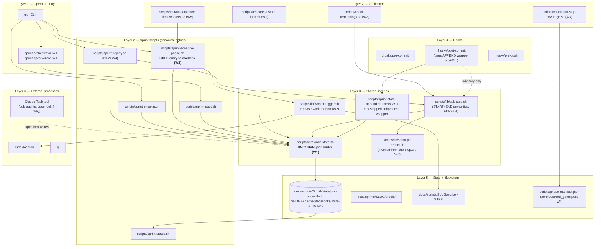

# SPARC Design — harness-truthful-docs-and-wiring-v1

> Generated: 2026-05-19. Inputs: spec.md (§A/H/I/J), solution-sketches.md (recommendation = **Sketch B**), architect-review.md (5 ADRs + 3 conditions), security-review.md (9 surfaces S1–S9 + 6 must-fix), consensus-spec.json (7 ship-gate conditions C1–C7).
>
> This document is the real-design layer the closure sprint's audit failure said was missing. Every Wave below has pseudocode that is buildable, predicates that are testable, and exit conditions that are mechanically checkable.

---

## 1. Specification recap

This sprint converts the harness from theatre to enforcement by landing five ACs in five Waves under the Sketch B parallel-triad plan: **AC-1** unifies the state.json lockfile path so `.husky/post-commit` and `atomic-state.sh` share one critical section per slug (eliminating the closure-sprint corruption mode); **AC-2** wraps `sprint-advance-phase.sh` so it reads a new `scripts/lib/phase-workers.json` map and fires ruflo daemon workers via `worker-trigger.sh`, with graceful degrade recorded as structured bypass when the daemon is down (ADR-002); **AC-3** rewrites USAGE/QUICKSTART/DEVELOPER under a define-ONCE-and-link terminology contract (ADR-003) and adds `_guides/bypass-cheatsheet.md` + `_guides/sub-step-coverage.md`; **AC-4** instruments all 43 deferred gates (14 wizard + 4 spec-lock + 21 verify + 5 deploy) via `record_sub_step` calls — hybrid START+END for the 21 verify gates, END-only for the 18 wizard/spec-lock/deploy gates per ADR-004 — with class-sampled inject-violation-catch-restore proofs (5 per class) and grep-coverage for the rest; **AC-5** dogfoods this sprint through the orchestration scripts and asserts ADR-005's four-part substantive predicate (≥4 distinct worker types, ≥20KB worker-output, every required worker-gate linked to evidence in `.sub_steps[]`, invocations attributed to `sprint-advance-phase.sh`).

---

## 2. Pseudocode per Wave

### W1 — Race fix (1d, AC-1, addresses S1/S2/S3, condition C1, ADR-001)

**Goal:** one lockfile path per slug. Delete the in-repo `state.json.lock` branch. Source `atomic-state.sh` everywhere — including the detached audit heredoc subprocess.

#### W1.a — jq filter contract

Every state-write becomes an `atomic_update_state` call with a jq filter, never an inline `jq … > state.json && mv`:

```bash
# BEFORE (.husky/post-commit:32-54) — DELETE this block
STATE_LOCK="$STATE_FILE.lock"
atomic_state_update() {
  exec 200>"$STATE_LOCK"
  flock -x -w 10 200 || { echo "[post-commit] state lock timeout" >&2; return 1; }
  jq "$1" "$STATE_FILE" > "$STATE_FILE.tmp" && mv "$STATE_FILE.tmp" "$STATE_FILE"
}

# AFTER — single canonical writer
source "$REPO/scripts/lib/atomic-state.sh"
atomic_update_state "$SLUG" "$JQ_FILTER"
# atomic-state.sh:71 owns $LOCK_DIR/state-<slug>.lock; one path, one critical section.
```

#### W1.b — Lock acquire / release pseudocode (atomic-state.sh::atomic_update_state)

```pseudo
function atomic_update_state(slug, jq_filter):
  state_file  = "docs/sprints/" + slug + "/state.json"
  lock_file   = $LOCK_DIR + "/state-" + slug + ".lock"   # $HOME/.cache/lifeos/locks/

  # S1 mitigation — reclaim symlink under our own dir before acquire
  if is_symlink(lock_file):
    rm -f lock_file

  # flock branch (Linux + macOS util-linux)
  if has_flock():
    exec 9>"$lock_file"
    flock -x -w 10 9 || return ERR_FLOCK_TIMEOUT
    tmp = mktemp state_file.tmp.XXXXXX
    jq "$jq_filter" "$state_file" > "$tmp" || { rm -f tmp; flock -u 9; return ERR_JQ }
    mv -f "$tmp" "$state_file"           # atomic rename within same fs
    flock -u 9
    return OK

  # PID-fallback branch (very old macOS, no util-linux flock)
  else:
    if set_C_create(lock_file, our_pid):
      ... same critical section ...
      rm -f lock_file
      return OK
    else:
      holder = read_pid(lock_file); age = now - mtime(lock_file)
      if holder empty AND age > 5s: reclaim
      if holder not running AND age > 30s: reclaim
      sleep 0.5 ; retry up to 20 times
```

#### W1.c — Detached heredoc subprocess fix (architect §1.1 — the third lockfile path)

`.husky/post-commit:181` invokes the reuse-audit under `env -i` + allowlist. That child has no inherited shell state and cannot reliably `source scripts/lib/atomic-state.sh` (the architect's open question on `BASH_SOURCE` resolution under env-strip). Path of least resistance: **a one-liner wrapper script**.

```bash
# scripts/sprint-state-append.sh  (NEW, ~10 LOC)
#!/usr/bin/env bash
set -euo pipefail
slug="${1:?slug required}" ; filter="${2:?jq filter required}"
# absolute path resolution — the wrapper is the canonical entry for env-stripped callers
repo_root="$(cd "$(dirname "${BASH_SOURCE[0]}")/.." && pwd -P)"
source "$repo_root/scripts/lib/atomic-state.sh"
atomic_update_state "$slug" "$filter"
```

`.husky/post-commit:156-166` (the inline heredoc with its own `set -C` lockfile) gets replaced with one call:

```bash
bash "$REPO/scripts/sprint-state-append.sh" "$SLUG" "$JQ_REUSE_AUDIT_APPEND"
```

#### W1.d — 20-writer stress harness (condition C1 + spec §A success-vision)

`scripts/test/stress-state-lock.sh` — pseudocode:

```pseudo
function stress_test(slug, n_writers=20):
  # 4 caller classes, 5 of each — mirrors the real call surface
  classes = [
    ("post-commit",       N times: simulate .husky/post-commit append to gate_history[]),
    ("advance-phase",     N times: bash scripts/sprint-advance-phase.sh --from X --to Y --dry),
    ("worker-trigger",    N times: append .worker_invocations[] via sprint-state-append.sh),
    ("sprint-checkin",    N times: append .checkins[] via atomic_update_state)
  ]
  reset_state_json(slug)        # known-good baseline
  for each (name, op) in classes:
    for i in 1..5:
      op() &                    # all 20 fire in parallel; & detaches
  wait                          # join all 20 child PIDs

  # Acceptance assertions (all must hold)
  assert jq empty docs/sprints/$slug/state.json            # parses
  assert no_orphan_braces docs/sprints/$slug/state.json    # grep -c '^}$' == 1
  assert all_writers_present(.gate_history)                 # 5 entries from post-commit
  assert all_writers_present(.worker_invocations)           # 5 entries from worker-trigger
  assert no_cross_leak(.gate_bypasses, .reuse_audits)       # closure-sprint failure mode absent
  echo "stress: PASS (20 writers, 0 corruption)"
```

Proof file `proofs/W1-race-fix.md` contains: pre-fix run (corrupts), post-fix run (clean), diff of the two state.json files showing orphan `}` only in pre-fix.

---

### W2 — Wrap workers (1d, AC-2, addresses S4/S5/S6, conditions C2/C4, ADR-002)

**Goal:** `sprint-advance-phase.sh` is the sole entry point that fires daemon workers, driven by a declarative `phase-workers.json` map with two tiers (`always` / `strict_only`), per-entry `required:bool`, structural-field validation, and graceful degrade.

#### W2.a — phase-workers.json schema

```json
{
  "$schema": "scripts/lib/phase-workers.schema.json",
  "version": 1,
  "phases": {
    "verifying": {
      "always": [
        { "worker": "audit", "required": true, "timeout_s": 600, "expects": ["findings"] },
        { "worker": "testgaps", "required": true, "timeout_s": 600, "expects": ["gaps"] },
        {
          "worker": "optimize",
          "required": false,
          "timeout_s": 300,
          "expects": ["recommendations"]
        }
      ],
      "strict_only": [
        { "worker": "map", "required": true, "timeout_s": 120, "expects": ["nodes", "edges"] },
        { "worker": "consolidate", "required": true, "timeout_s": 120, "expects": ["summary"] }
      ]
    },
    "pre-deploy": {
      "always": [
        { "worker": "predict", "required": true, "timeout_s": 300, "expects": ["forecast"] }
      ],
      "strict_only": []
    },
    "implementing": {
      "always": [
        { "worker": "deepdive", "required": false, "timeout_s": 600, "expects": ["report"] }
      ],
      "strict_only": []
    },
    "deploying": { "always": [], "strict_only": [] },
    "done": {
      "always": [
        { "worker": "ultralearn", "required": false, "timeout_s": 300, "expects": ["patterns"] }
      ],
      "strict_only": []
    }
  }
}
```

Authority for the rigor tier is `state.worker_rigor` (set at spec-lock). Schema file `phase-workers.schema.json` is checked-in JSON Schema draft-07; `scripts/sprint-advance-phase.sh` rejects loads that fail `ajv`.

#### W2.b — Worker-output JSON schema validation (C4 / S4)

```pseudo
function validate_worker_output(worker_name, expects_fields, json_path):
  # S5 mitigation — worker name must be safe basename
  if not match(worker_name, "^[a-z][a-z0-9_-]{1,32}$"):
    return REJECT("invalid worker name")

  if not jq_parses(json_path): return REJECT("not JSON")

  # S4 mitigation — assert STRUCTURAL fields, never the free-form `.verdict` string
  for field in expects_fields:                              # e.g., ["findings"], ["gaps"]
    if not jq_has_key(json_path, field): return REJECT("missing required field: "+field)

  # S6 mitigation — mtime + elapsed sanity
  if elapsed_s < 1 AND worker_class == "llm-backed":
    return SUSPICIOUS("worker completed implausibly fast")

  return OK
```

Predicates in `sprint-advance-phase.sh` assert on `expects` fields, never on a `verdict:"pass"` string.

#### W2.c — Hook into advance-phase step ordering

```pseudo
# scripts/sprint-advance-phase.sh — AFTER lines 199-238 (atomic-state write + gate_history append)
function advance_phase(from, to, slug):
  with_lock(slug):
    assert state.phase == from                              # parent L12 invariant — keep
    atomic_update_state(slug, ".phase = \"" + to + "\"
                                | .gate_history += [{ from, to, at: now }]")

  # NEW after W2 — trigger workers, OUTSIDE the state-write critical section
  workers = load_phase_workers_json().phases[to]
  rigor   = jq read state.worker_rigor (default "loose")
  fire_list = workers.always ++ (rigor == "strict" ? workers.strict_only : [])

  trigger_workers_parallel(fire_list, slug, to)              # fan-out via worker-trigger.sh
```

#### W2.d — Graceful degrade pseudocode (daemon-down detection + fallback)

```pseudo
function trigger_workers_parallel(fire_list, slug, phase):
  daemon_status = check_ruflo_daemon()                       # `ruflo daemon ping` or socket probe, 2s timeout

  for each w in fire_list:
    if daemon_status == DOWN:
      if w.required:
        # ADR-002: record a structured bypass, not a silent skip
        record_bypass(slug, gate="phase-worker-"+w.worker,
                      why="daemon-unavailable",
                      reasoned_by=getenv("USER"))
        append_worker_invocation(slug, w.worker, status="skipped-required-bypass")
        WARN("[worker] daemon down — required worker " + w.worker + " bypassed")
      else:
        append_worker_invocation(slug, w.worker, status="skipped-advisory")
      continue

    result = bash scripts/lib/worker-trigger.sh "$w.worker" "$slug" --timeout "$w.timeout_s"
    if result == OK:
      validate_worker_output(w.worker, w.expects, "docs/sprints/"+slug+"/worker-output/"+w.worker+".json")
      record_sub_step(slug, gate="phase-worker-"+w.worker, status="passed",
                     evidence_path="docs/sprints/"+slug+"/worker-output/"+w.worker+".json")
      append_worker_invocation(slug, w.worker, status="passed", by="sprint-advance-phase.sh")
    else:
      if w.required:
        record_sub_step(slug, gate="phase-worker-"+w.worker, status="failed", evidence_path="…")
        return FAIL("required worker failed: " + w.worker)
      else:
        append_worker_invocation(slug, w.worker, status="advisory-failed")
```

Pause-during-sprint detection: `advance-phase to=paused` short-circuits — `fire_list = []`.

#### W2.e — Worker-output JSON schema (`worker-output.schema.json`)

```json
{
  "$id": "worker-output.schema.json",
  "type": "object",
  "required": ["worker", "slug", "phase", "completed_at"],
  "properties": {
    "worker": { "type": "string", "pattern": "^[a-z][a-z0-9_-]{1,32}$" },
    "slug": { "type": "string", "pattern": "^[a-z][a-z0-9-]{2,63}$" },
    "phase": { "type": "string" },
    "completed_at": { "type": "string", "format": "date-time" },
    "elapsed_s": { "type": "number", "minimum": 0 },
    "gates_verified": { "type": "array", "items": { "type": "string" } }
  },
  "additionalProperties": true
}
```

Per-worker class schemas (audit / testgaps / optimize / map / consolidate / predict) extend this base and pin their `expects` fields.

---

### W3 — Doc reorg (1.5d, AC-3 + AC-3.5, ADR-003, addresses inherited S13-at-doc-layer)

**Goal:** define-ONCE-and-link contract for `{phase, sub-step gate, worker, sub-agent, autopilot side-car}`. Heading slugs preserved (no broken inbound links). Add `_guides/bypass-cheatsheet.md` + `_guides/sub-step-coverage.md`. Replace `file:///Users/gio/` absolute-path leaks. Wire `scripts/check-terminology.sh` to CI.

#### W3.a — Per-doc section count + line budgets

| Doc                                         | Sections                                                                                                                                                                          | Target lines | Owns definition of                       | Links to                                                                             |
| ------------------------------------------- | --------------------------------------------------------------------------------------------------------------------------------------------------------------------------------- | ------------ | ---------------------------------------- | ------------------------------------------------------------------------------------ |
| `docs/sprints/QUICKSTART.md`                | 7 (Prereqs / Start / Wizard / Day 1-2 / Day 3-10 / Deploy / Troubleshoot)                                                                                                         | ≤320         | (none — pure walkthrough)                | DEVELOPER §Phase model, USAGE §Bypass syntax, \_guides/bypass-cheatsheet.md          |
| `docs/sprints/USAGE.md`                     | 9 (Lifecycle / Sprint cmds / Pause-resume / Amend / Bypass syntax / Worker-rigor / Autopilot side-cars / Cookbook / FAQ)                                                          | ≤620         | **autopilot side-car**                   | DEVELOPER §Phase model, §Sub-agents-vs-workers, \_guides/sub-step-coverage.md        |
| `docs/sprints/DEVELOPER.md`                 | 10 (Architecture / Phase model / Sub-step gates / Sub-agents vs workers / state.json schema / Hooks / Lockfile contract / Predicate engine / Phase-workers.json / Adding a phase) | ≤900         | **phase**, **sub-agent**                 | \_guides/sub-step-coverage.md (sub-step gate), ruflo-for-lifeos.md §workers (worker) |
| `docs/sprints/_guides/bypass-cheatsheet.md` | 5 (Why bypass / Syntax / Rationale taxonomy / Examples / Anti-patterns)                                                                                                           | ≤220         | (none — references USAGE §Bypass syntax) | USAGE §Bypass syntax                                                                 |
| `docs/sprints/_guides/sub-step-coverage.md` | 6 (What is a sub-step / Coverage map / Recording / Failure modes / Predicate semantics / Hybrid START+END)                                                                        | ≤340         | **sub-step gate**                        | DEVELOPER §Sub-step gates, ADR-004                                                   |

**Total budget: ~2400 lines across 5 files.** Excludes tables (which can be long) but is counted at the prose level.

#### W3.b — Terminology contract enforcement (`scripts/check-terminology.sh`)

```pseudo
function check_terminology():
  # Define-ONCE-and-link: each canonical term has one owning doc.
  # Definition signal: heading line "## <Term>" or "### <Term>" + immediate paragraph beginning with the bold-name colon.
  declare -A owners=(
    ["phase"]="docs/sprints/DEVELOPER.md"
    ["sub-step gate"]="docs/sprints/_guides/sub-step-coverage.md"
    ["worker"]="docs/ruflo-sessions/ruflo-for-lifeos.md"
    ["sub-agent"]="docs/sprints/DEVELOPER.md"
    ["autopilot side-car"]="docs/sprints/USAGE.md"
  )
  errors=0
  for term, owner in owners:
    # find definition pattern in any doc
    hits=$(grep -rEln "^#{2,3}\s+${term}\b" docs/sprints/ docs/ruflo-sessions/ | grep -v "$owner")
    if hits not empty:
      echo "[terminology] '$term' is defined OUTSIDE owner $owner:"
      echo "$hits"
      errors++

  exit $errors
```

Pre-commit hook plus a `phase-workers.json: "post-spec-lock"` (no — it's a doc check; run as part of `verify-* phase`). Wired into `verify-docs-terminology` sub-step gate (one of the 21 verify gates instrumented in W4).

#### W3.c — Absolute-path leak replacement (security S-W3)

```bash
# Replace in docs/sprints/USAGE.md and docs/sprints/DEVELOPER.md
sed -i.bak 's|file:///Users/gio/\.claude/plans/hazy-gathering-kettle\.md|~/.claude/plans/hazy-gathering-kettle.md|g'
# Drop link form — the file is operator-private; render as plain code reference, not clickable.
rm *.bak
```

3 hits (per security review §4) → 0 hits post-replace. `grep -r 'file:///Users/' docs/sprints/` is the verify command.

---

### W4 — Wire 43 gates (3-4d, AC-4 + AC-4.5, ADR-004, addresses S7/S8/S9, conditions C5/C6)

**Goal:** every one of the 43 deferred gates has a `record_sub_step` call at its real call-site (no manifest-only declarations). Hybrid schema per ADR-004. Class-sampled inject-violation-catch-restore proof — 5 per class, 20 total — plus grep-coverage for the remaining 23. PII redactor in the evidence path.

#### W4.a — Per-gate pattern (record_sub_step call placement)

Two patterns by gate class:

**Pattern E (END-only)** — for wizard (14), spec-lock (4), deploy-non-execution (some of 5). The artifact's existence IS the proof:

```bash
# Example: scripts/sprint-spec-wizard.mjs — at end of section-A capture
node ... # produce section-A answer JSON
bash scripts/lib/sub-step.sh "$SLUG" wizard-section-A \
  --status passed \
  --evidence "docs/sprints/$SLUG/spec.partial.json"
```

**Pattern SE (START+END)** — for the 21 verify-\* gates and the 2 deploy-execution gates (`deploy-pulumi-up`, `deploy-vercel`). Wraps the long-running body:

```bash
# Example: scripts/verify-typecheck.sh
SLUG="${1:?}"
bash scripts/lib/sub-step.sh "$SLUG" verify-typecheck --start                # ADR-004 START
START=$(date +%s)
if pnpm turbo run typecheck > "$EVIDENCE_LOG" 2>&1; then
  bash scripts/lib/sub-step.sh "$SLUG" verify-typecheck --end passed \
    --evidence "$EVIDENCE_LOG" --elapsed-s "$(( $(date +%s) - START ))"
else
  bash scripts/lib/sub-step.sh "$SLUG" verify-typecheck --end failed \
    --evidence "$EVIDENCE_LOG" --elapsed-s "$(( $(date +%s) - START ))"
  exit 1
fi
```

`record_sub_step --start` writes `.sub_steps[] += [{gate, status:"running", at:NOW}]`. `--end <verdict>` overwrites the entry to `{gate, status:"passed"|"failed", at, elapsed_s, evidence_path}`. Predicate engine treats `running` as NOT PASSED — crashed runs are visible.

#### W4.b — PII redaction in evidence (security S8, condition C5)

`sub-step.sh` decides redaction by extension and writes a sha256 sidecar for recovery from over-redaction:

```pseudo
function record_sub_step(slug, gate, status, evidence_path, ...):
  ext = extension(evidence_path)
  if ext in [".log", ".txt", ".out"] AND status != "running":
    raw_sha = sha256(evidence_path)
    redacted = evidence_path + ".redacted"
    bash scripts/sprint-pii-redact.sh < "$evidence_path" > "$redacted"
    echo "$raw_sha" > "$evidence_path.sha256"            # closure S-CL3 recovery sidecar
    mv "$redacted" "$evidence_path"

  # canonicalize, reject "../" (closure L13)
  evidence_path = canonicalize(evidence_path, base="docs/sprints/$slug/")
  if contains_dotdot(evidence_path): return ERR_TRAVERSAL

  atomic_update_state(slug, jq_filter_for_sub_step(gate, status, evidence_path, ...))
```

#### W4.c — Class-sample matrix (20 inject-violation-catch-restore proofs)

5 representative gates per class. Each proof file has: (a) the inject diff (intentional break), (b) the failing predicate output, (c) the restore diff (revert).

| Class             | Total                                                                                                                                             | Sampled gates (5)                                                                                                                      | Inject technique |
| ----------------- | ------------------------------------------------------------------------------------------------------------------------------------------------- | -------------------------------------------------------------------------------------------------------------------------------------- | ---------------- |
| **wizard** (14)   | wizard-section-A, wizard-section-H, wizard-section-I, wizard-section-J, wizard-assemble                                                           | Truncate the section answer JSON to `{}` — predicate must FAIL because `expects: keys present` is unmet                                |
| **spec-lock** (4) | spec-lock-sketches, spec-lock-architect-review, spec-lock-security-review, spec-lock-hive-mind-consensus, _(spare: spec-lock-baseline-embedding)_ | Replace the artifact body with `# PLACEHOLDER` — predicate FAILS on min-line-count (≥200 for review docs)                              |
| **verify** (21)   | verify-typecheck, verify-lint, verify-tests, verify-rls, verify-worker-audit                                                                      | Inject syntax error / lint violation / failing test / missing RLS policy / spoofed worker JSON — each must FAIL the matching predicate |
| **deploy** (5)    | deploy-pulumi-preview, deploy-human-gate, deploy-pulumi-up, deploy-smoke, deploy-vercel                                                           | Force `pulumi preview` to non-zero / decline human-gate / set `PULUMI_DRY_RUN_FAIL=1` / break smoke URL / break vercel auth            |

Remaining 23 gates ride under grep-coverage report: `scripts/check-sub-step-coverage.sh` greps every gate name from `phase-manifest.json.deferred_gates` against the scripts in `scripts/` + `apps/` and asserts ≥1 `record_sub_step` reference per gate name. Empty result for all 43 = pass.

Proof artifacts:

- `proofs/W4-43-gates-wired.md` — 20 inject-proofs (full diffs) + grep-coverage table for 23
- `proofs/W4-pii-redact.md` — one verify-\* gate evidence file with PII inserted, redactor output, sha256 sidecar contents
- `proofs/W4-evidence-traversal.md` — 4 record_sub_step calls (one per class) with `../` paths, all rejected (closure L13 verify)
- `proofs/W4-deploy-artifact-only.md` — `sprint-deploy.sh` records only artifact paths, not Pulumi stack contents (condition C6)

---

### W5 — Dogfood (1d, AC-5, ADR-005, condition C7)

**Goal:** run THIS sprint through `sprint-advance-phase.sh` from `spec-wizard` → `done` and verify the four-part substantive predicate.

#### W5.a — Verification matrix (file presence + content)

```pseudo
function dogfood_verify(slug="harness-truthful-docs-and-wiring-v1"):
  base = "docs/sprints/" + slug

  # 1. Distinct worker types ≥ 4
  distinct = jq '.worker_invocations | map(.worker) | unique | length' $base/state.json
  assert distinct >= 4

  # 2. Worker output payload ≥ 20KB
  bytes = du -sb $base/worker-output/ | awk '{print $1}'
  assert bytes >= 20480

  # 3. Required worker-gates linked to evidence
  for gate in [verify-worker-audit, verify-worker-testgaps, verify-worker-optimize]:
    entry = jq '.sub_steps[] | select(.gate == "'$gate'")' $base/state.json
    assert entry.status == "passed"
    assert entry.evidence_path matches "worker-output/.*\\.json$"
    assert file_exists(base + "/" + entry.evidence_path)

  # 4. Worker invocations attributed to sprint-advance-phase.sh
  manual = jq '.worker_invocations[] | select(.by != "sprint-advance-phase.sh") | length' $base/state.json
  assert manual == 0

  # 5. Unit test asserts fresh-sprint advance fires ≥3 worker invocations
  bash scripts/test/unit-advance-fires-workers.sh
  assert exit 0
```

Proof file `proofs/W5-dogfood.md` includes the raw jq outputs, the `du -sb` value, and the unit-test transcript.

---

## 3. Architecture — 7-layer harness v0.7.1 (post-W2)



**Key invariants visible in the diagram:**

- **Layer-3 chokepoint:** every write to `state.json` enters via `atomic-state.sh` (Layer 3). No layer has a direct line to Layer-5 STATE except through Layer 3.
- **Single advance entry:** Layer-2 ADVANCE is the only consumer of Layer-3 WORKERS. Closure-sprint failure mode (workers fire from elsewhere) is structurally unreachable.
- **Hooks (Layer 4) → APPEND wrapper → Layer 3:** the env-stripped post-commit subprocess cannot bypass the wrapper because the wrapper is the only path the hook code knows about post-W1.

---

## 4. ADRs (5 formal architecture decisions)

### ADR-W1 — Shared canonical lockfile via sourced atomic-state.sh

**Status:** Accepted. (Same as architect-review ADR-001, restated in design terms.)

**Context.** `.husky/post-commit:32` and `atomic-state.sh:71` resolved to disjoint lockfile paths. Closure sprint observed orphan `}` braces + `gate_bypasses[]` entries leaking into `reuse_audits[]`.

**Decision.** All state.json writers — `.husky/post-commit` (both inline and the detached audit heredoc), `atomic-state.sh`, `worker-trigger.sh`, `sprint-*.sh` family — acquire `$LOCK_DIR/state-<slug>.lock` via `atomic_update_state`. Post-commit's `atomic_state_update()` inline function is deleted. The detached heredoc invokes the new `scripts/sprint-state-append.sh` wrapper (env-stripped-safe).

**Consequences.** One critical section per slug. `flock` self-heals on holder death (Linux + macOS); PID-fallback has explicit symlink reclaim (S1) and stale-reclaim (S3). Cost: shell scripts must `source` a library; benefit: orphan-brace corruption is structurally impossible.

**Alternatives rejected.**

- Status quo + better docs → does not eliminate the race, just describes it.
- File-level mandatory locking (chattr +i) → not portable to macOS.

### ADR-W2 — Wrap-into-advance-phase with declarative `phase-workers.json`

**Status:** Accepted. (Same as architect-review ADR-002.)

**Context.** Operators (and Claude sessions) call `sprint-advance-phase.sh` directly. A separate orchestrator that fires workers would be bypassed in practice — the closure sprint proved this empirically (workers never fired despite a separate orchestrator existing).

**Decision.** `sprint-advance-phase.sh` reads `scripts/lib/phase-workers.json` after a successful state write and calls `trigger_workers_parallel` for the entering phase. Schema is per-(phase, worker-rigor) with `always[]` and `strict_only[]` tiers; each worker entry has `required:bool` and `expects:string[]`. Authority for the rigor tier is `state.worker_rigor`.

**Consequences.** Single-entry-point invariant from harness-parallel-safety-v2 preserved. Daemon-down for `required:true` workers records a structured bypass (`why=daemon-unavailable`); `required:false` workers silent-skip into `worker_invocations[]`. Predicates assert on `expects` fields (S4 mitigation), never on `verdict:"pass"`.

**Alternatives rejected.**

- Separate orchestrator + warn-on-direct-invoke shim → relies on operators reading warnings (closure sprint proved they don't).
- Per-phase config without rigor tier → drifts vs manifest's existing two-tier sub_step structure.

### ADR-W3 — Class-sampled gate proofs (5 per class, 20 total)

**Status:** Accepted.

**Context.** Sketch A's 43-individual-proofs model is more defensible on paper but produces corner-cutting fatigue (~40-50 git operations in one wave, the closure-sprint failure mode). Sketch B's class-sampled methodology was authorized in spec §J as "smoke per gate-class, not per-gate (sampling Production-grade methodology)."

**Decision.** 20 inject-violation-catch-restore proofs (5 per class × 4 classes) land in `proofs/W4-43-gates-wired.md`. The remaining 23 gates ride under a grep-coverage report from `scripts/check-sub-step-coverage.sh` asserting ≥1 `record_sub_step` reference per gate name.

**Consequences.** W4 drops from ~14h to ~7h; the freed 1.5d funds the W5 dogfood. Audit-attack surface is the sampling itself — mitigated by ensuring every one of the 20 sampled proofs has inject diff + failing assertion + restore diff (no prose-only entries). If a reviewer rejects the sampling, escalate the rejected class to individual proofs (~3-4h extra per class).

**Alternatives rejected.**

- Sketch A's 43-individual-proofs → closure-sprint failure mode reproduces.
- Grep-coverage only → no proof gates actually catch violations.

### ADR-W4 — Declarative phase-workers.json with per-entry rigor + required:bool

**Status:** Accepted. (Implements architect ADR-002 details.)

**Context.** Two failure modes to distinguish: required worker fails (must block phase-advance) vs advisory worker fails (must not block). Worker rigor must follow `state.worker_rigor` to mirror the manifest's two-tier sub_step structure.

**Decision.** Schema: `{ "phases": { "<phase>": { "always": [{worker, required, timeout_s, expects}], "strict_only": [...] } } }`. JSON Schema draft-07 file checked-in as `phase-workers.schema.json`; advance-phase rejects invalid loads via `ajv`. Per-worker `expects` enumerates structural fields the predicate validates.

**Consequences.** Operators can pause-during-sprint, run in CI without OAuth, or run locally without `claude` installed — the system tells them what was verified. New worker addition = JSON edit + schema entry, no shell logic change.

**Alternatives rejected.**

- Hard-coded phase→workers map inside advance-phase.sh → not data-driven; PRs touch shell logic for every new worker.
- YAML config → adds a YAML parser dependency for ~30 lines of structure.

### ADR-W5 — Terminology contract (define-ONCE-and-link with CI lint)

**Status:** Accepted. (Same as architect-review ADR-003.)

**Context.** Audit root finding: "docs are not LLM-readable because the same concept is described 3 different ways across the 3 files."

**Decision.** Five terms (`phase`, `sub-step gate`, `worker`, `sub-agent`, `autopilot side-car`) are defined in exactly one owning doc each. All other mentions are markdown links to that anchor. `scripts/check-terminology.sh` greps for the `^### <Term>` definition pattern outside its owner and fails. Wired to the `verify-docs-terminology` sub-step gate.

**Consequences.** Doc drift becomes a CI failure rather than a code-review judgement. Cost: 30 min to write the lint script. Benefit: the audit's root finding becomes structurally impossible.

**Alternatives rejected.**

- Manual quarterly doc review → does not survive churn.
- Single combined doc → loses the QUICKSTART vs USAGE vs DEVELOPER audience separation.

---

## 5. Invariants (load-bearing post-sprint)

Every Wave must preserve these. Predicate engine and pre-push hooks enforce them mechanically.

1. **I-1 (Lockfile unity).** For any slug, every state.json write acquires the same path `$LOCK_DIR/state-<slug>.lock`. Verified by `grep -rn 'STATE_LOCK\|\.lock\b' scripts/ .husky/` showing zero non-canonical paths.

2. **I-2 (Single advance entry).** All worker invocations recorded in `state.json:.worker_invocations[].by` equal `"sprint-advance-phase.sh"`. Verified by `jq '[.worker_invocations[].by] | unique'` returning `["sprint-advance-phase.sh"]` only.

3. **I-3 (Zero deferred gates).** `phase-manifest.json:.deferred_gates | length == 0` after W4 close. Verified by `jq '.deferred_gates | length' scripts/phase-manifest.json`.

4. **I-4 (Evidence traversal blocked).** No `state.sub_steps[].evidence_path` contains `..` or escapes `docs/sprints/<slug>/`. Verified by closure L13 canonicalization in `sub-step.sh` plus a test in `scripts/test/unit-evidence-canonical.sh`.

5. **I-5 (Terminology contract intact).** `scripts/check-terminology.sh` exits 0. Each canonical term (`phase`, `sub-step gate`, `worker`, `sub-agent`, `autopilot side-car`) has exactly one `^### <Term>` definition site across `docs/sprints/` + `docs/ruflo-sessions/`.

---

## 6. Per-Wave entry / exit predicates

State predicates are expressed as jq filters that must return `true` (or non-empty). Filesystem predicates are bash test expressions.

### W1 — race fix

**Entry predicate:**

```bash
jq -e '.phase == "designing"' docs/sprints/$SLUG/state.json
test -f scripts/lib/atomic-state.sh && test -f .husky/post-commit
```

**Exit predicate:**

```bash
# Lockfile unification
! grep -nE '(\$STATE_FILE\.lock|state\.json\.lock)' .husky/post-commit scripts/lib/atomic-state.sh
# Wrapper script exists
test -x scripts/sprint-state-append.sh
# Stress test proof present
test -f docs/sprints/$SLUG/proofs/W1-race-fix.md
jq -e '.sub_steps[] | select(.gate == "race-fix-stress-20-writer" and .status == "passed")' docs/sprints/$SLUG/state.json
# I-1 holds
test -z "$(grep -rn 'STATE_LOCK=' scripts/ .husky/ | grep -v atomic-state.sh)"
```

### W2 — wrap workers

**Entry predicate:** W1 exit predicate holds AND

```bash
jq -e '.gate_history[-1].to == "implementing"' docs/sprints/$SLUG/state.json
```

**Exit predicate:**

```bash
test -f scripts/lib/phase-workers.json
test -f scripts/lib/phase-workers.schema.json
test -f scripts/lib/worker-output.schema.json
# advance-phase sources worker-trigger
grep -q 'trigger_workers_parallel' scripts/sprint-advance-phase.sh
# Daemon-down test produced bypass entry
jq -e '.gate_bypasses[] | select(.why == "daemon-unavailable")' docs/sprints/$SLUG/state.json
# Worker-name regex present (S5 fix)
grep -qE 'worker.*=~.*\^\[a-z\]\[a-z0-9_-\]\{1,32\}\$' scripts/lib/worker-trigger.sh
test -f docs/sprints/$SLUG/proofs/W2-wrap-workers.md
```

### W3 — doc reorg

**Entry predicate:** independent of W1/W2 (parallel-triad worktree, can run from sprint-start).

**Exit predicate:**

```bash
# Five canonical docs exist with target line budgets met
wc -l docs/sprints/QUICKSTART.md            # ≤320
wc -l docs/sprints/USAGE.md                 # ≤620
wc -l docs/sprints/DEVELOPER.md             # ≤900
wc -l docs/sprints/_guides/bypass-cheatsheet.md     # ≤220
wc -l docs/sprints/_guides/sub-step-coverage.md     # ≤340
# Absolute-path leak gone
test "$(grep -r 'file:///Users/' docs/sprints/ | wc -l)" -eq 0
# Terminology contract enforced
bash scripts/check-terminology.sh
jq -e '.sub_steps[] | select(.gate == "verify-docs-terminology" and .status == "passed")' docs/sprints/$SLUG/state.json
```

### W4 — wire 43 gates

**Entry predicate:** W1 + W2 exit predicates hold (sub-step recording needs both lock unity and wrapper-ready advance-phase).

**Exit predicate:**

```bash
# Manifest deferred_gates emptied (I-3)
test "$(jq '.deferred_gates | length' scripts/phase-manifest.json)" -eq 0
# Grep-coverage holds for all 43
bash scripts/check-sub-step-coverage.sh
# 20 inject proofs landed
test -f docs/sprints/$SLUG/proofs/W4-43-gates-wired.md
test "$(grep -cE '^### Inject-proof' docs/sprints/$SLUG/proofs/W4-43-gates-wired.md)" -ge 20
# Security must-fix proofs
test -f docs/sprints/$SLUG/proofs/W4-pii-redact.md
test -f docs/sprints/$SLUG/proofs/W4-evidence-traversal.md
test -f docs/sprints/$SLUG/proofs/W4-deploy-artifact-only.md
# Hybrid schema honored — at least one START+END pair in state.json
jq -e '[.sub_steps[] | select(.status == "passed" and .elapsed_s != null)] | length >= 1' docs/sprints/$SLUG/state.json
```

### W5 — dogfood

**Entry predicate:** W4 exit predicate holds (deferred_gates is empty; all instrumentation in place).

**Exit predicate (the ADR-005 four-part substantive predicate):**

```bash
# 1. Distinct worker types ≥ 4
test "$(jq '.worker_invocations | map(.worker) | unique | length' docs/sprints/$SLUG/state.json)" -ge 4
# 2. Worker output ≥ 20KB
test "$(du -sb docs/sprints/$SLUG/worker-output/ | awk '{print $1}')" -ge 20480
# 3. Required worker-gates linked to evidence
for g in verify-worker-audit verify-worker-testgaps verify-worker-optimize; do
  jq -e --arg g "$g" '.sub_steps[] | select(.gate == $g and .status == "passed" and .evidence_path | test("worker-output/.*\\.json$"))' docs/sprints/$SLUG/state.json
done
# 4. All worker invocations attributed to sprint-advance-phase.sh (I-2)
test "$(jq '[.worker_invocations[] | select(.by != "sprint-advance-phase.sh")] | length' docs/sprints/$SLUG/state.json)" -eq 0
# 5. Unit test passes
bash scripts/test/unit-advance-fires-workers.sh
```

---

## 7. Push approval boundary

This sprint is local-only by default. The following actions require explicit `gio` approval before they happen — even if all gates pass:

**Local-only (no approval needed):**

- All file edits, jq writes, schema additions, lockfile changes, hook edits inside the repo.
- Running `scripts/test/stress-state-lock.sh` (writes only into `docs/sprints/<slug>/state.json`).
- Running `bash scripts/sprint-advance-phase.sh` against this sprint's own slug.
- Producing all proofs/\* files inside the sprint dir.
- Editing `phase-manifest.json` to remove `deferred_gates[]` entries.
- Running the dogfood end-to-end as long as it does not invoke `sprint-deploy.sh` against a real cloud target.

**Requires explicit gio approval (mention in chat + wait for "yes" before executing):**

- `git push` to `origin` for the sprint branch (per org-policies.md autonomy limits).
- `git push --force` of any kind (always disallowed; would need explicit override).
- Invoking `sprint-deploy.sh pulumi-up` or `sprint-deploy.sh vercel` against production stacks.
- Republishing `sprint-harness` to npm (out-of-scope per spec §J).
- Any operation that touches `~/.cache/lifeos/locks/` outside the slug-scoped `state-<slug>.lock` file.
- Modifying `.husky/*` outside `.husky/post-commit` and `.husky/pre-push` (those two are W1 scope; others are infrastructure).
- Editing `scripts/lib/atomic-state.sh::atomic_update_state` in a way that changes the lockfile path contract (would invalidate I-1).

**Note on dogfood and the W1 chicken-and-egg:** W5 dogfood runs against the harness _after_ W1 has landed (per phase ordering). The W1 stress test itself writes to state.json under the new locked path — that is the proof, not a violation.

---

## 8. Verification matrix

Each AC maps to a verification command. Expected output is "exit 0" unless otherwise noted. All commands run from repo root with `SLUG=harness-truthful-docs-and-wiring-v1`.

| AC                                    | Verification command                                                                                                                                                                                        | Expected output                                                                      | Maps to                |
| ------------------------------------- | ----------------------------------------------------------------------------------------------------------------------------------------------------------------------------------------------------------- | ------------------------------------------------------------------------------------ | ---------------------- | ------------------ |
| **AC-1** lockfile unification         | `bash scripts/test/stress-state-lock.sh $SLUG 20`                                                                                                                                                           | `stress: PASS (20 writers, 0 corruption)`; state.json parses; I-1 grep returns empty | C1, S1, S2, S3, ADR-W1 |
| **AC-1** symlink reclaim              | `ln -s /tmp/x $LOCK_DIR/state-$SLUG.lock; bash scripts/lib/atomic-state.sh; test ! -L $LOCK_DIR/state-$SLUG.lock`                                                                                           | exit 0 (symlink replaced)                                                            | S1                     |
| **AC-1** flock self-heal              | `( exec 9>$LOCK; flock -x 9; sleep 999 ) & kill -9 $!; bash scripts/sprint-state-append.sh $SLUG '.x=1'`                                                                                                    | exit 0 within 1s                                                                     | S3                     |
| **AC-2** worker wiring                | `bash scripts/sprint-advance-phase.sh --from designing --to implementing --slug $SLUG; jq '.worker_invocations                                                                                              | length' docs/sprints/$SLUG/state.json`                                               | ≥1                     | C2, ADR-W2, ADR-W4 |
| **AC-2** daemon-down graceful         | `ruflo daemon stop; bash scripts/sprint-advance-phase.sh --from implementing --to verifying --slug $SLUG; jq '.gate_bypasses[-1].why' docs/sprints/$SLUG/state.json`                                        | `"daemon-unavailable"`                                                               | C2                     |
| **AC-2** worker-name regex            | `bash scripts/lib/worker-trigger.sh '../etc/passwd' $SLUG 2>&1 \| grep -q 'invalid worker name'`                                                                                                            | exit 0                                                                               | S5                     |
| **AC-2** structural-field predicate   | `echo '{"verdict":"pass"}' > .claude-flow/metrics/audit.json; bash scripts/sprint-advance-phase.sh --to pre-deploy --slug $SLUG; echo $?`                                                                   | non-zero (missing `findings`)                                                        | S4, C4                 |
| **AC-3** doc presence + line budgets  | `wc -l docs/sprints/{QUICKSTART,USAGE,DEVELOPER}.md docs/sprints/_guides/{bypass-cheatsheet,sub-step-coverage}.md`                                                                                          | each ≤ target in §2.W3.a                                                             | ADR-W5                 |
| **AC-3** terminology contract         | `bash scripts/check-terminology.sh`                                                                                                                                                                         | exit 0                                                                               | C3, ADR-W5             |
| **AC-3** absolute path leak           | `grep -r 'file:///Users/' docs/sprints/ \| wc -l`                                                                                                                                                           | `0`                                                                                  | S-W3                   |
| **AC-4** zero deferred gates          | `jq '.deferred_gates \| length' scripts/phase-manifest.json`                                                                                                                                                | `0`                                                                                  | I-3                    |
| **AC-4** grep coverage                | `bash scripts/check-sub-step-coverage.sh`                                                                                                                                                                   | exit 0 (all 43 gate names have ≥1 `record_sub_step` site)                            | ADR-W3                 |
| **AC-4** 20 inject proofs             | `grep -cE '^### Inject-proof' docs/sprints/$SLUG/proofs/W4-43-gates-wired.md`                                                                                                                               | `≥ 20`                                                                               | ADR-W3                 |
| **AC-4** PII redaction                | `cat docs/sprints/$SLUG/proofs/W4-pii-redact.md; test -f docs/sprints/$SLUG/proofs/<sample-evidence>.log.sha256`                                                                                            | sidecar exists; PII redacted                                                         | C5, S8                 |
| **AC-4** evidence traversal blocked   | `bash scripts/lib/sub-step.sh $SLUG test-gate --evidence '../../etc/passwd' 2>&1 \| grep -q 'traversal'`                                                                                                    | exit 0 (rejected)                                                                    | S7, I-4                |
| **AC-4** deploy artifact-only         | `bash scripts/sprint-deploy.sh --dry --slug $SLUG; jq '.sub_steps[] \| select(.gate \| startswith("deploy-")) \| .evidence_path' docs/sprints/$SLUG/state.json \| grep -v 'pulumi.*output\|stack\|secrets'` | only artifact paths                                                                  | C6, S9                 |
| **AC-4** hybrid START+END schema      | `jq '.sub_steps[] \| select(.status == "running")' docs/sprints/$SLUG/state.json` (during a long verify) then `jq '.sub_steps[-1].elapsed_s' docs/sprints/$SLUG/state.json` (after)                         | running entry visible mid-run; elapsed_s populated post                              | ADR-004                |
| **AC-5** distinct worker types        | `jq '.worker_invocations \| map(.worker) \| unique \| length' docs/sprints/$SLUG/state.json`                                                                                                                | `≥ 4`                                                                                | C7, ADR-W2             |
| **AC-5** worker output bytes          | `du -sb docs/sprints/$SLUG/worker-output/ \| awk '{print $1}'`                                                                                                                                              | `≥ 20480`                                                                            | C7                     |
| **AC-5** required worker-gates linked | `for g in audit testgaps optimize; do jq -e --arg g "verify-worker-$g" '.sub_steps[] \| select(.gate == $g and .status == "passed")' docs/sprints/$SLUG/state.json; done`                                   | all exit 0                                                                           | C7                     |
| **AC-5** I-2 attribution              | `jq '[.worker_invocations[] \| select(.by != "sprint-advance-phase.sh")] \| length' docs/sprints/$SLUG/state.json`                                                                                          | `0`                                                                                  | I-2                    |
| **AC-5** unit advance fires workers   | `bash scripts/test/unit-advance-fires-workers.sh`                                                                                                                                                           | exit 0 (≥3 worker invocations on fresh sprint dir)                                   | ADR-W2                 |

---

## Cross-references

- Architect review ADRs: ADR-001 → §4.ADR-W1; ADR-002 → §4.ADR-W2 + ADR-W4; ADR-003 → §4.ADR-W5; ADR-004 → §2.W4.a (hybrid schema); ADR-005 → §2.W5 + §6 W5 exit predicate.
- Security review surfaces: S1 → §2.W1.b (PID-fallback symlink reclaim); S2 → §2.W1.a + ADR-W1; S3 → §2.W1.b (flock self-heal) + §8 AC-1 flock-self-heal; S4 → §2.W2.b (structural-field predicate); S5 → §2.W2.b worker-name regex; S6 → §2.W2.b mtime + elapsed combo; S7 → §2.W4.b + §8 AC-4 evidence-traversal; S8 → §2.W4.b PII redaction + sha256 sidecar; S9 → §8 AC-4 deploy-artifact-only.
- Consensus ship-gate conditions: C1 → §2.W1.d stress harness + §8 AC-1; C2 → §2.W2.d graceful degrade + §8 AC-2 daemon-down; C3 → §2.W3.b check-terminology.sh + §8 AC-3 terminology; C4 → §2.W2.b validate_worker_output + §8 AC-2 structural-field; C5 → §2.W4.b PII redactor + §8 AC-4 PII redaction; C6 → §8 AC-4 deploy-artifact-only; C7 → §6 W5 exit predicate + §8 AC-5 four-part.

End of design.md. Estimated implementation: 25-29h across 5 waves over the remaining 10 working days of the cycle. Sketch B parallel-triad means W1 + W3 + W4-audit-prep land in worktrees during days 1-2, W2 lands day 3, W4 lands days 4-6, W5 lands day 7. Days 8-10 reserved for verify, security-review re-execution, and audit slack.
