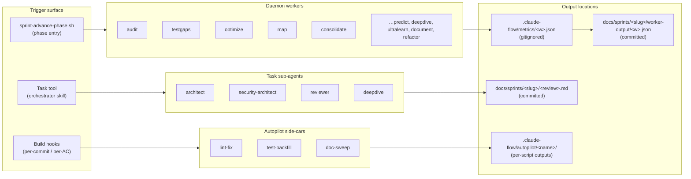

# Sprint System — Usage Guide

> **For:** anyone driving a sprint (operator, Claude session, sub-agent).
> **Pairs with:** [`QUICKSTART.md`](./QUICKSTART.md) (5-minute on-ramp), [`DEVELOPER.md`](./DEVELOPER.md) (internals, terminology contract, extension recipes), [`README.md`](./README.md) (architecture overview).
> **Audience:** someone who has read QUICKSTART and now needs the full mechanical reference.

This guide has **five sections**, in this order:

1. **The 14-day flow** — day-by-day reference: scripts/skills/agents that fire, files that appear, phase transitions.
2. **Phase enforcement (v0.7.0)** — `phase-manifest.json`, `sprint-advance-phase.sh`, sub-step gates, predicate evaluators, replay validator.
3. **Worker architecture** — the three concepts (daemon workers, task sub-agents, autopilot side-cars) and how they differ.
4. **Bypass cheatsheet** — canonical `SPRINT_BYPASS_GATE` / `SPRINT_BYPASS_WHY`; deprecated legacy envs.
5. **Troubleshooting** — symptom-indexed lookup with fix commands.

Terminology used below (phase, sub-step gate, worker, sub-agent, autopilot side-car, predicate, bypass, gate-history, drift) is defined once in [`DEVELOPER.md` §"Terminology contract"](./DEVELOPER.md#terminology-contract). Every other reference in this doc links there.

---

## §1 — The 14-day flow

A normal sprint runs 14 days through 13 phases (v0.7.2+ added `audit-resolution` between `verifying` and `pre-deploy`; **v0.7.3+** added `review-resolution` as the unified superset that walks audit + knip + sonar findings under one phase — `audit-resolution` stays as a legacy alias for sprints that shipped under v0.7.2). The table below is the canonical day-by-day reference. Each row names:

- **Phase / day** — the manifest phase the sprint is in
- **Operator action** — what you (or Claude) trigger
- **Scripts/skills/agents that fire** — what runs under the hood
- **Files that appear in `docs/sprints/<slug>/`** — observable artifacts
- **Phase transition** — what `sprint-advance-phase.sh` moves to next

### Day 0 — Sprint start → `spec-wizard`

| Field                                                | Value                                                                                                  |
| ---------------------------------------------------- | ------------------------------------------------------------------------------------------------------ |
| Operator action                                      | `bash scripts/sprint-start.sh <slug>`                                                                  |
| Scripts                                              | `sprint-start.sh` → `sprint-precheck.sh --mode start --strict` (AC-33 systems-health gate)             |
| Skills                                               | (after start) `sprint-orchestrator` skill auto-loads via `.claude/skills/sprint-orchestrator/SKILL.md` |
| [Daemon worker](./DEVELOPER.md#terminology-contract) | `map` (local, free) — refreshes codebase context, advisory                                             |
| Files                                                | `state.json`, `spec.partial.json`, `.gitkeep`, optional `worker-output/map.json`                       |
| Phase                                                | `null` → `spec-wizard` (initial write by `sprint-start.sh` via `sprint-advance-phase.sh`)              |

### Day 0 — Wizard → `spec-wizard` (in-progress)

| Field                                                          | Value                                                                                                                  |
| -------------------------------------------------------------- | ---------------------------------------------------------------------------------------------------------------------- |
| Operator action                                                | Tell Claude `"start the spec wizard"`                                                                                  |
| Skills                                                         | `sprint-spec-wizard` skill — drives 10 sections (A–J) per `.claude/skills/sprint-spec-wizard/sections/*.md`            |
| Scripts                                                        | `sprint-spec-wizard.mjs answer/section/status`, `sprint-wizard-context.mjs`, `sprint-wizard-coherence.mjs`             |
| [Sub-step gates](./DEVELOPER.md#terminology-contract) recorded | `wizard-section-A` … `wizard-section-J` (10), `wizard-coherence-after-C/F/I` (3), `wizard-assemble` (1) — **14 total** |
| Files                                                          | `wizard-transcript.md`, `spec.partial.json` (grows section by section), `recalled-patterns.json`                       |
| Phase                                                          | stays in `spec-wizard` until §J + assemble complete                                                                    |

### Day ½ — Spec-lock 4-way review → `spec-locked`

| Field                                                                          | Value                                                                                                                                                                      |
| ------------------------------------------------------------------------------ | -------------------------------------------------------------------------------------------------------------------------------------------------------------------------- |
| Operator action                                                                | Tell Claude `"do the spec-lock review chain"`; then `bash scripts/sprint-amend-spec.sh --lock`                                                                             |
| [Task sub-agents](./DEVELOPER.md#terminology-contract) spawned via `Task` tool | `architect` → `architect-review.md`; `security-architect` → `security-review.md`                                                                                           |
| Skills                                                                         | `sprint-orchestrator` produces `solution-sketches.md` directly                                                                                                             |
| Scripts                                                                        | `sprint-hive-mind-spec-lock.sh` → `consensus-spec.json`; `sprint-amend-spec.sh --lock` → `.baseline-embedding.json` + phase advance                                        |
| Sub-step gates recorded                                                        | `spec-lock-solution-sketches`, `spec-lock-architect-review`, `spec-lock-security-review`, `spec-lock-hive-mind-consensus`, `spec-lock-baseline-written` — **4 + baseline** |
| Files                                                                          | `solution-sketches.md`, `architect-review.md`, `security-review.md`, `consensus-spec.json`, `.baseline-embedding.json`                                                     |
| Phase                                                                          | `spec-wizard` → `spec-locked`                                                                                                                                              |

> From this transition forward, drift control is armed: `.husky/pre-commit` runs `sprint-drift-check.sh` on every commit, `.claude/helpers/sprint-hook.cjs` blocks out-of-scope file edits and forbidden bash patterns (`git push`, `pulumi up`, `rm -rf /`, `DROP TABLE`, etc.).

### Days 1–2 — SPARC design → `design-locked`

| Field           | Value                                                                                                                                 |
| --------------- | ------------------------------------------------------------------------------------------------------------------------------------- |
| Operator action | Tell Claude `"do the SPARC design phase"`; sign off → Claude calls `sprint-advance-phase.sh design-locked`                            |
| Skills          | SPARC chain (`/sparc:spec-pseudocode`, `/sparc:architect`)                                                                            |
| Daemon workers  | `ultralearn` (opus) IFF `§B.flags.architecture == true`; `deepdive` (opus) IFF any AC has complexity keyword (auth/RLS/migration/JWT) |
| Sub-step gates  | `design-sparc-spec-pseudocode`, `design-sparc-architect`, `design-locked`                                                             |
| Files           | `design.md` ≥300B                                                                                                                     |
| Phase           | `spec-locked` → `design-locked`                                                                                                       |

### Days 3–4 — Build kickoff → `building`

| Field                                                      | Value                                                                                                                         |
| ---------------------------------------------------------- | ----------------------------------------------------------------------------------------------------------------------------- |
| Operator action                                            | `bash scripts/sprint-build-launch.sh`                                                                                         |
| Workflows                                                  | `docs/workflows/<BRAND_SLUG>-sprint-build.yaml` — `swarm_init` (8 agents) → claims × 7 → autopilot side-cars × 3 → trajectory-start |
| [Autopilot side-cars](./DEVELOPER.md#terminology-contract) | `lint-fix`, `test-backfill`, `doc-sweep` (configs in `.claude-flow/autopilot/*.json`)                                         |
| Daemon workers per wave kickoff                            | `predict` (haiku) — fires from `bash scripts/sprint-wave-start.sh <wave>`                                                     |
| Sub-step gate                                              | `build-launched`                                                                                                              |
| Phase                                                      | `design-locked` → `building`                                                                                                  |

### Days 3–11 — Build (in-progress)

| Field        | Value                                                                                                                                                                |
| ------------ | -------------------------------------------------------------------------------------------------------------------------------------------------------------------- |
| Hooks active | `.husky/pre-commit` (drift + jscpd dup BLOCK at >50% AC-17), `.husky/post-commit` (reuse audit AC-5, pair-mode advisory AC-7), `.husky/pre-push` (review gate AC-13) |
| Per-commit   | `sprint-drift-check.sh` computes cosine similarity vs `.baseline-embedding.json`; <0.75 pauses commit with 3-option prompt                                           |
| Pair mode    | Auto-trigger when AC has complexity keyword (auth/RLS/payment/migration/JWT/secret/delete/password/hash/encrypt)                                                     |
| Phase        | stays `building`                                                                                                                                                     |

### Day 5 — Mid-cycle check-in → `day-5-checkin`

| Field           | Value                                                                                             |
| --------------- | ------------------------------------------------------------------------------------------------- |
| Operator action | `bash scripts/sprint-checkin.sh`; then tell Claude `"walk me through the day-5 check-in"`         |
| Daemon workers  | `consolidate` (local, free) — memory dedup                                                        |
| Scripts         | `sprint-hillchart.mjs --refresh`, `sprint-checkin.sh`                                             |
| Sub-step gates  | `day-5-question-cut`, `day-5-question-push`, `day-5-question-pivot`, `day-5-hill-chart-refreshed` |
| Files           | `check-in-day5.md` (each of `### Cut` / `### Push` / `### Pivot` ≥30 chars), `hill-chart.md`      |
| Phase           | `building` ↔ `day-5-checkin` (auto-returns to `building` after check-in)                          |

### Day 11 — Cleanup → `cleaning`

| Field           | Value                                                                                       |
| --------------- | ------------------------------------------------------------------------------------------- |
| Operator action | `bash scripts/sprint-cleanup-launch.sh <slug>` (add `--commit-deadcode` to actually delete) |
| Daemon workers  | `refactor` (sonnet) IFF spec mentions "refactor"                                            |
| Scripts         | `sprint-deadcode-delete.mjs`, `sprint-test-hardening.mjs`, `sprint-claude-md-upgrade.mjs`   |
| Sub-step gates  | `cleanup-deadcode-delete`, `cleanup-lint-fix`, `cleanup-claude-md-clean`                    |
| Files           | `deadcode-deletions.json`, `test-hardening.csv` + `.json`, `claude-md-proposed-diff.patch`  |
| Phase           | `building` → `cleaning` → `verifying`                                                       |

### Days 11–12 — Verify → `verifying`

| Field                                                                    | Value                                                                                                                                                                                                                                                                                                                                                                                                                                                                                                     |
| ------------------------------------------------------------------------ | --------------------------------------------------------------------------------------------------------------------------------------------------------------------------------------------------------------------------------------------------------------------------------------------------------------------------------------------------------------------------------------------------------------------------------------------------------------------------------------------------------- |
| Operator action                                                          | `bash scripts/sprint-verify.sh` OR tell Claude `"verify the sprint"`                                                                                                                                                                                                                                                                                                                                                                                                                                      |
| Daemon workers (BLOCKING)                                                | `audit` (sonnet, zero-tolerance on findings), `testgaps` (sonnet, blocks on any route in `## Files touched` with zero coverage)                                                                                                                                                                                                                                                                                                                                                                           |
| Daemon workers (advisory)                                                | `optimize` (sonnet)                                                                                                                                                                                                                                                                                                                                                                                                                                                                                       |
| Daemon workers (strict tier only, when `state.worker_rigor == "strict"`) | `map`, `consolidate`                                                                                                                                                                                                                                                                                                                                                                                                                                                                                      |
| Sub-step gates                                                           | `verify-typecheck`, `verify-lint`, `verify-tests`, `verify-api-contract`, `verify-debug-rls`, `verify-module-status`, `verify-perf-profile`, `verify-aidefence-scan`, `verify-sonar`, `verify-knip`, `verify-cycle-check`, `verify-audit-deps`, `verify-bundle-budget`, `verify-coverage-delta`, `verify-migration-check`, `verify-worker-audit`, `verify-worker-testgaps`, `verify-worker-optimize` (+ `verify-worker-map-refreshed`, `verify-worker-consolidate-refreshed` in strict) — **18–20 total** |
| Files                                                                    | `worker-output/audit.json`, `worker-output/testgaps.json`, `worker-output/optimize.json`, `verify-runs/<timestamp>.log`                                                                                                                                                                                                                                                                                                                                                                                   |
| Phase                                                                    | `cleaning` → `verifying` → `pre-deploy`                                                                                                                                                                                                                                                                                                                                                                                                                                                                   |

### Day 12–13 — Review-resolution → `review-resolution` _(v0.7.3+; supersedes `audit-resolution`)_

| Field                | Value                                                                                                                                                                                                                                                                                                                                                                                                       |
| -------------------- | ----------------------------------------------------------------------------------------------------------------------------------------------------------------------------------------------------------------------------------------------------------------------------------------------------------------------------------------------------------------------------------------------------------- |
| Operator action      | `bash scripts/sprint-review-resolve.sh` (interactive walker across audit + knip + sonar findings) OR programmatic `bash scripts/sprint-review-resolve.sh --finding HAR-N fix\|defer\|accept`                                                                                                                                                                                                                |
| Scripts              | `scripts/sprint-review-resolve.sh` (interactive triage; reads `worker-output/{audit,knip,sonar}.json` and aggregates into `state.review_findings[]`), `scripts/sprint-review-rerun.sh` (per-producer baseline diff with FIXED/REGRESSION/UNCHANGED + per-producer regression streak counter)                                                                                                                |
| Sub-step gates       | `review-resolution-fired`, `review-findings-exit-predicate` + per-finding `review-finding-HAR-N-{resolved,deferred,accepted}` (HAR-N is **globally** namespaced across producers within the sprint; AUDIT-1 + KNIP-1 + SONAR-1 collapse into HAR-1/HAR-2/HAR-3 etc.)                                                                                                                                        |
| Predicate kind (NEW) | `review_resolution_complete` — asserts `state.review_findings_resolved_count + review_findings_deferred[].length + review_findings_accepted[].length == review_findings_total` AND every deferred entry has non-empty `deferred_to_sprint` + `ac_id`. Falls back to legacy `audit_findings_*` fields when present (back-compat union view for sprints shipped on v0.7.2)                                    |
| Producers            | **audit** (`ruflo daemon trigger -w audit` → `worker-output/audit.json` — security + correctness, in-scope per `## Files touched`), **knip** (`node scripts/sprint-deadcode-delete.mjs --check --json` → `worker-output/knip.json` — dead-code), **sonar** (`node scripts/sprint-sonar-parse.mjs --json` → `worker-output/sonar.json` — code quality; vacuous PASS when token absent or server unreachable) |
| Files                | `review-resolutions.md` (seeded from `docs/sprints/_templates/review-resolutions.md` on phase entry; per-producer H3 sections with FIXED / DEFERRED / ACCEPTED subsections)                                                                                                                                                                                                                                 |
| Phase                | `verifying → review-resolution → pre-deploy`                                                                                                                                                                                                                                                                                                                                                                |

> **Legacy alias.** `audit-resolution` phase + `sprint-audit-resolve.sh` + `sprint-audit-rerun.sh` + `_templates/audit-resolutions.md` remain valid for sprints that locked spec under v0.7.2. The `review_resolution_complete` predicate transparently consumes the legacy `audit_findings_*` fields when the new `review_findings_*` fields are absent. New sprints should write to the unified `review_findings_*` schema.

> **NOTE — vacuous PASS when audit produced 0 findings.** If `state.audit_findings_total == 0` at phase entry, the exit predicate passes immediately and the operator can advance to `pre-deploy` with no triage step. When findings exist, the operator MUST triage each via Fix / Defer / Accept before advancing — Defer requires an explicit follow-up sprint slug + AC ID (no anonymous deferrals). Resume-safe: every decision is atomically persisted, so Ctrl-C mid-walk is recoverable. See [`DEVELOPER.md` §"Audit-driven fix days"](./DEVELOPER.md#audit-driven-fix-days) for the full design + C-condition coverage.
>
> The 14-day appetite now allocates Days 12–13 as audit-resolution capacity. The "Day 13 — Deploy" row below shifts to Day 14 when audit-resolution actually consumes both days; if findings resolve same-day, deploy still fires on Day 13.

### Day 13 — Pre-deploy review → `pre-deploy`

| Field           | Value                                                                   |
| --------------- | ----------------------------------------------------------------------- |
| Operator action | Tell Claude `"pre-deploy review"`                                       |
| Task sub-agents | `reviewer` → full-diff review; `security-architect` → RLS/auth re-check |
| Sub-step gates  | `pre-deploy-reviewer-agent`, `pre-deploy-security-architect`            |
| Files           | `pre-deploy-review.md` ≥200B                                            |
| Phase           | `audit-resolution` → `pre-deploy`                                       |

### Day 13–14 — Deploy → `deploying`

| Field           | Value                                                                                                                                                                          |
| --------------- | ------------------------------------------------------------------------------------------------------------------------------------------------------------------------------ |
| Operator action | `bash scripts/sprint-deploy.sh` (or `ruflo workflow execute <BRAND_SLUG>-deploy`)                                                                                                    |
| Daemon workers  | `predict` (haiku) — pre-deploy forecast, advisory                                                                                                                              |
| Sub-step gates  | `deploy-pulumi-preview-captured`, `deploy-human-gate-approved`, `deploy-pulumi-up`, `deploy-smoke`, `deploy-vercel`                                                            |
| Files           | `deploy/pulumi-preview.txt`, `deploy/pulumi-up.txt`, `deploy/smoke.json`, `deploy/vercel.txt` (artifact paths only; never Pulumi stack contents or secrets — see condition C6) |
| Phase           | `pre-deploy` → `deploying`                                                                                                                                                     |

> Deploy pauses at `pulumi preview` for human gate. You type `proceed` to continue to `pulumi up`. `git push --force` and direct `pulumi up` outside this workflow are hook-blocked.

### Day 14 — Retro → `done`

| Field           | Value                                                                                                                                                                                                             |
| --------------- | ----------------------------------------------------------------------------------------------------------------------------------------------------------------------------------------------------------------- |
| Operator action | `bash scripts/sprint-end.sh <slug>`; then tell Claude `"walk me through the retro"`                                                                                                                               |
| Daemon workers  | `ultralearn` (opus, advisory) → extracts patterns; `consolidate` (local) → memory dedup; `document` (sonnet) → CLAUDE.md proposals                                                                                |
| Scripts         | `sprint-velocity.mjs`, `sprint-daa-feedback.sh`, `sprint-train.sh` (gated at ≥20 trajectories), `sprint-dashboard.mjs`                                                                                            |
| Sub-step gates  | `retro-worked`, `retro-didnt`, `retro-surprised`, `retro-pattern-1`, `retro-pattern-2`, `retro-pattern-3`, `retro-claude-md`, `retro-followups`, `daa-feedback-batched`, `trajectory-closed`, `velocity-computed` |
| Files           | `retro.md` (6 required H2 sections + ≥3 `### Pattern N: <name>`), `metrics.json`, `dashboard.html`, `daa-feedback.json`                                                                                           |
| Phase           | `deploying` → `done`                                                                                                                                                                                              |

### Anywhere — Pause / resume → `paused`

| Field           | Value                                                                     |
| --------------- | ------------------------------------------------------------------------- |
| Operator action | `bash scripts/sprint-pause.sh "reason"` → `bash scripts/sprint-resume.sh` |
| Sub-step gates  | —                                                                         |
| Files           | `state.prev_phase` set                                                    |
| Phase           | `<any>` → `paused`; resume restores `prev_phase`                          |

---

## §2 — Phase enforcement (v0.7.0)

> **Why this section is §2, not buried later.** Phase enforcement is the load-bearing change that makes everything else trustworthy. Read this before the worker architecture section — sub-step gates and bypasses are concepts referenced everywhere downstream.

### `phase-manifest.json` — the source of truth

`scripts/lib/phase-manifest.json` declares, for every phase, the required artifacts + state fields + sub-step gate names + predicate evaluators. As of v0.7.1 the manifest covers:

- **13 phases (v0.7.3+):** `spec-wizard`, `spec-locked`, `design-locked`, `building`, `day-5-checkin`, `cleaning`, `verifying`, `audit-resolution`, `review-resolution`, `pre-deploy`, `deploying`, `done`, `paused`
- **72 sub-step gates total** (v0.7.3 manifest `1.2.0`): 25 enforced from day one of v0.7.0 + 43 wired in v0.7.1 + 2 added by v0.7.2's `audit-resolution` phase + 2 added by v0.7.3's `review-resolution` phase (`review-resolution-fired`, `review-findings-exit-predicate`)
- **`deferred_gates[]` is EMPTY** post-W4 — every gate name in the manifest has at least one `record_sub_step` call-site in the script tree (verified by `scripts/check-sub-step-coverage.sh`)

Validate any manifest edit before committing:

```bash
node scripts/lib/validate-phase-manifest.mjs
# expected: [OK] manifest valid: 12 phases, 70 unique sub-step gates (v0.7.2+; pre-v0.7.2: 11 phases, 68 gates)
```

### `sprint-advance-phase.sh` — the sole sanctioned writer of `state.phase`

`scripts/sprint-advance-phase.sh <next-phase>` is the **only** sanctioned writer of `state.phase`. Every other phase-writer delegates:

- `sprint-amend-spec.sh --lock` → advances to `spec-locked`
- `sprint-build-launch.sh` → advances to `building`
- `sprint-checkin.sh` → advances to `day-5-checkin` then back to `building`
- `sprint-cleanup-launch.sh` → advances to `cleaning`
- `sprint-verify.sh` → advances to `verifying`
- `sprint-audit-resolve.sh` → advances to `audit-resolution` (v0.7.2+) when the operator completes triage; vacuous PASS path also advances when audit produced 0 findings
- `sprint-predeploy-gate.sh` → advances to `pre-deploy`
- `sprint-deploy.sh` → advances to `deploying`
- `sprint-end.sh` → advances to `done`
- `sprint-pause.sh` / `sprint-resume.sh` → advances to `paused` / back to `prev_phase`

The PreToolUse hook (`.claude/helpers/sprint-hook.cjs`) blocks every other path:

- Inline `jq '.phase = "X"' state.json` from any Bash command → exit 2 (unless caller is `sprint-advance-phase.sh` AND `SPRINT_ADVANCE_PHASE_RUNNING=1` AND `ps -o command= -p $PPID` resolves to `sprint-advance-phase.sh`).
- Direct Write/Edit on `docs/sprints/*/state.json` → exit 2 (no env exemption).

### Sub-step gates — recording, predicates, evaluators

A **sub-step gate** is "a step within a phase that must complete before the phase can advance." Examples: `wizard-section-A`, `verify-typecheck`, `retro-pattern-1`. They are recorded by call-sites via:

```bash
source "$(dirname "$0")/lib/sub-step.sh"
record_sub_step "$SLUG" "verify-typecheck" passed "$EVIDENCE_LOG"
```

`record_sub_step` (in `scripts/lib/sub-step.sh`) appends to `state.sub_steps[]` using the W2 schema `{gate, status, at, evidence_path?, elapsed_s?}`. Long-running gates use the hybrid START+END pattern from ADR-004:

```bash
record_sub_step "$SLUG" verify-typecheck --start
# … run typecheck …
record_sub_step "$SLUG" verify-typecheck --end passed --evidence "$LOG" --elapsed-s 42
```

`--start` writes `status: "running"`. `--end` overwrites with `passed` or `failed`. The predicate engine treats `running` as NOT PASSED — crashed runs are visible.

**Predicate evaluators** live in `scripts/lib/phase-predicates.sh`. Today's kinds:

| Kind                        | Evaluator                            | Fails when                                  |
| --------------------------- | ------------------------------------ | ------------------------------------------- |
| `file_exists`               | `_pp_pred_file_exists`               | path missing                                |
| `file_min_bytes`            | `_pp_pred_file_min_bytes`            | file under threshold                        |
| `file_contains_heading`     | `_pp_pred_file_contains_heading`     | regex match absent                          |
| `json_path_present`         | `_pp_pred_json_path_present`         | jq path returns null                        |
| `json_path_equals`          | `_pp_pred_json_path_equals`          | jq path != value                            |
| `json_path_in`              | `_pp_pred_json_path_in`              | jq path ∉ allowed set                       |
| `state_field_min_length`    | `_pp_pred_state_field_min_length`    | array shorter than min                      |
| `state_field_all_values_in` | `_pp_pred_state_field_all_values_in` | any value outside whitelist                 |
| `sub_step_recorded`         | `_pp_pred_sub_step_recorded`         | gate not in `state.sub_steps[]` as `passed` |

### PII redaction in evidence

`sub-step.sh` invokes `scripts/sprint-pii-redact.sh` on evidence files with extensions `.log`, `.txt`, `.out` (and stores a `.sha256` sidecar for over-redaction recovery). Patterns redacted: email, UUID, JWT (`eyJ`), API keys (`AIza`, `sk-`), passwords (`password=…`), connection strings (`postgresql://…`).

Evidence paths are canonicalized against `docs/sprints/<slug>/` — any `../` in the resolved path returns `ERR_TRAVERSAL` and the record is rejected.

### Replay validator (CI gate)

`scripts/sprint-replay-validator.mjs` (also invokable via `bash scripts/sprint-system-test.sh --replay-gate-history`) walks every closed sprint and asserts:

1. `gate_history[]` is monotonic by `at`.
2. Every required sub-step gate per phase walked through is in `gates_passed[]` ∪ `gate_bypasses[]`.
3. Bypasses have `why` ≥10 chars + `gate` matches manifest.
4. Doc-vs-manifest drift: every gate name in this guide's §1 + §3 tables exists in `phase-manifest.json`.

Wired into `.github/workflows/test.yml` as a PR gate. Default `--ignore-pre 2026-05-19T00:00:00Z` skips pre-v0.7.0 closures. `doc_drift == 0` is required.

### Single bypass UX

The only sanctioned way to skip a predicate (with `≥10 chars` rationale):

```bash
SPRINT_BYPASS_GATE=<gate-name> SPRINT_BYPASS_WHY='<≥10 chars rationale>' \
  bash scripts/sprint-advance-phase.sh <next-phase>
```

See [§4 — Bypass cheatsheet](#4--bypass-cheatsheet) for full syntax, multi-gate form, path-shaped gates, and the deprecated legacy envs.

---

## §3 — Worker architecture

> **This section is the fix for the two-surface confusion.** Previously USAGE.md, QUICKSTART.md, and DEVELOPER.md described "workers" in three subtly different ways. There are actually **three distinct concepts**. They have different triggers, different output paths, and different state fields. Don't conflate them.

### The three concepts



### Concept 1 — Daemon workers (ruflo daemon)

**What.** Long-running, LLM-backed processes managed by the ruflo daemon (`ruflo daemon`). Each shells out to `claude --print` (uses the operator's Claude Code OAuth, not a separate API key). 10 worker types: `map`, `predict`, `audit`, `testgaps`, `optimize`, `consolidate`, `document`, `refactor`, `deepdive`, `ultralearn`.

**Trigger.** Fire on **phase entry** per `scripts/lib/phase-workers.json` (NEW in v0.7.1). The trigger is hard-coded: `sprint-advance-phase.sh` is the **sole entry point**. After a successful state write, it reads the phase-workers map, picks the entries for the entering phase (filtered by `state.worker_rigor ∈ {lax, strict}`), and calls `scripts/lib/worker-trigger.sh::trigger_workers_parallel`.

**Output.** Each worker writes JSON to `.claude-flow/metrics/<worker>.json` (gitignored; ruflo daemon's native location), then `worker-trigger.sh` copies the file to `docs/sprints/<slug>/worker-output/<worker>.json` (**committed; audit trail**). The output is validated against `scripts/lib/worker-output.schema.json` — it must contain the per-worker `expects` structural fields from `phase-workers.json` (e.g., `audit` must have `findings`, `testgaps` must have `gaps`). Predicates assert on those fields, never on a free-form `verdict:"pass"` string.

**State recording.** Two state fields, kept in sync:

- `state.worker_runs[]` — W2 schema: `{worker, at, status, phase, blocking}` — the canonical post-W2 record
- `state.worker_invocations[]` — legacy schema (pre-W2): `{worker, at, elapsed_s, output, by}` — preserved for back-compat with older sprints and tooling; `by` must equal `"sprint-advance-phase.sh"` per invariant I-2

**Graceful degrade.** If the ruflo daemon is down at fire time and the worker is `required: true`, the run is recorded as a structured bypass (`gate: phase-worker-<name>`, `why: daemon-unavailable`) in `state.gate_bypasses[]` AND `state.worker_invocations[].status = "skipped-required-bypass"`. If `required: false`, it's a silent advisory skip (`status: "skipped-advisory"`).

**OpenCode Native Intercept.** If the runtime is `opencode` (via `SPRINT_RUNTIME=opencode` or `.sprintrc.json`), `worker-trigger.sh` skips the `ruflo` daemon entirely. It emits an `ACTION_REQUIRED` instruction to `stderr`, commanding the active OpenCode agent to natively satisfy the JSON schema using its own toolset. This bridges the background-daemon architecture into OpenCode's synchronous agent model seamlessly.

**Scope source-of-truth (v0.7.2+).** Scope-bound workers (today: `audit`, `testgaps`) read `state.files_touched[]` at gate-eval time. `state.files_touched[]` is the canonical source — set by `sprint-amend-spec.sh --lock` from spec.md §H1 and updated by `sprint-amend-spec.sh --add-file`. The spec.md `## Files touched` section is parsed only as a fallback for legacy / pre-spec-lock sprints whose `state.json` lacks the field. See [§3 — Worker scope](#worker-scope-v072) above.

### Concept 2 — Task sub-agents (Claude Task tool)

**What.** Sub-agents spawned via the Claude Task tool by the `sprint-orchestrator` skill. They are LLM-backed reviewers, not daemon processes. Four types in active use: `architect`, `security-architect`, `reviewer`, `deepdive`.

**Trigger.** Two checkpoints:

- **Spec-lock (Day ½):** orchestrator spawns `architect` + `security-architect` after the wizard produces `spec.md`.
- **Pre-deploy (Day 12):** orchestrator spawns `reviewer` + `security-architect` for full-diff review.

**Output.** Sub-agents write **directly** to the sprint dir: `docs/sprints/<slug>/architect-review.md`, `.../security-review.md`, `.../pre-deploy-review.md`. **NOT** to the daemon-worker pipeline. **NOT** to `worker-output/`.

**State recording.** Recorded as sub-step gates (`spec-lock-architect-review`, `spec-lock-security-review`, `pre-deploy-reviewer-agent`, `pre-deploy-security-architect`) via `record_sub_step` at the orchestrator skill's call-site after the markdown file is written. They do NOT appear in `state.worker_runs[]` or `state.worker_invocations[]`.

### Concept 3 — Autopilot side-cars

**What.** Background side-effect helpers configured in `.claude-flow/autopilot/*.json`. Three in use: `lint-fix`, `test-backfill`, `doc-sweep`. They are NOT LLM-backed in the same sense — they wrap deterministic tools (`pnpm lint:fix`, vitest generators, JSDoc proposals).

**Trigger.** Configured triggers in their JSON (manual / per-AC commit / paired with daemon worker / N commits in same area). They run **during the build phase**, paused outside it.

**Output.** Per-script outputs into `.claude-flow/autopilot/<name>/` and direct edits to source files where authorized. `doc-sweep` PROPOSES (never auto-commits) into `claude-md-proposed-diff.patch`.

**State recording.** Recorded under `state.autopilot_log[]` (not `worker_runs[]`, not `sub_steps[]`).

### The cheat-sheet

| Concept                | Trigger                                         | Triggered by                                      | Output path                                          | State field                              |
| ---------------------- | ----------------------------------------------- | ------------------------------------------------- | ---------------------------------------------------- | ---------------------------------------- |
| **Daemon worker**      | Phase entry (declarative map)                   | `sprint-advance-phase.sh` via `worker-trigger.sh` | `worker-output/<w>.json` (committed)                 | `worker_runs[]` + `worker_invocations[]` |
| **Task sub-agent**     | Orchestrator decision at spec-lock / pre-deploy | `sprint-orchestrator` skill via `Task` tool       | `<review>.md` directly (e.g., `architect-review.md`) | `sub_steps[]` (as the relevant gate)     |
| **Autopilot side-car** | Build-phase background trigger                  | `.claude-flow/autopilot/*.json` config            | `.claude-flow/autopilot/<name>/` + proposed diffs    | `autopilot_log[]`                        |

### Worker scope (v0.7.2+)

> **What changed.** Prior to v0.7.2, `audit` and `optimize` daemon workers scanned the entire repo and reported every finding — producing 10+ pre-existing findings on every sprint regardless of which files the sprint touched. Operators desensitized to real audit signal; the canonical pattern became "bypass-with-rationale-and-ship". v0.7.2 retrofits `gate_audit_blocks` with the **scope-bounding pattern** already proven in `gate_testgaps_blocks` (`scripts/lib/worker-gates.sh:58-106` — the canonical reference implementation).

`scripts/lib/phase-workers.json` (`version: 1.1.0`) now declares a `worker_scope` map per phase, per worker. Three scope strategies:

| `scope`         | Meaning                                                                                                  | `scope_mode`                                                       |
| --------------- | -------------------------------------------------------------------------------------------------------- | ------------------------------------------------------------------ |
| `files-touched` | Worker output post-filtered against `state.files_touched[]` at gate-eval time (Sketch A, locked default) | `post-filter` (only mode implemented in v0.7.2)                    |
| `repo`          | Worker scans the whole repo; gate sees all findings                                                      | `none`                                                             |
| `spec-h1`       | Reserved for future env-var or prompt-inject delivery at worker invocation                               | `env-var` / `prompt-inject` (placeholder — not implemented in 0.7) |

**Default per-worker (back-compat):** `{scope: "repo", scope_mode: "none"}`. A phase entry without a `worker_scope` block keeps prior behavior.

**Current `verifying` phase declarations** (after AC-4):

```json
"worker_scope": {
  "audit":    { "scope": "files-touched", "scope_mode": "post-filter" },
  "testgaps": { "scope": "files-touched", "scope_mode": "post-filter" },
  "optimize": { "scope": "repo",          "scope_mode": "none" }
}
```

**Concrete example — prior sprint's noise dataset.** `harness-truthful-docs-and-wiring-v1` produced 10 audit findings, all in `.claude/helpers/{github-safe,memory,session,statusline}.js` — none of which were in that sprint's `state.files_touched[]`. With scope-bounding:

```
[gate-audit] scope=0 in-scope + 10 out-of-scope (noise ratio: 100% out-of-scope)
[gate-audit] advisory (out-of-scope findings — not blocking):
  [OUT/high] .claude/helpers/github-safe.js:45 — Command injection risk...
  …
exit code: 0   # PASS — 0 in-scope blockers
```

All 10 findings logged as advisory `[OUT/<severity>]` lines on stderr; the gate passes. Real in-scope findings still block (zero-tolerance preserved within scope). Out-of-scope findings remain visible so they can be filed as follow-up sprint scope.

**Scope source-of-truth.** `state.files_touched[]` (populated by `sprint-amend-spec.sh --lock` from spec.md §H1 + later `--add-file` amendments) is read at gate-eval time. The spec.md `## Files touched` section is a fallback awk-parse for legacy / pre-spec-lock sprints. Inside the scope filter, an audit-finding path matches if it has any string-suffix overlap with a `files_touched[]` entry.

**Reference**: `gate_testgaps_blocks` (`scripts/lib/worker-gates.sh:58-106`) is the canonical scope-bounded gate pattern — `gate_audit_blocks` was retrofitted in W1 of `harness-audit-resolution-and-scope-v1` to mirror it. Sprint authors extending a new blocking worker should copy this pattern.

### Per-phase worker map

`scripts/lib/phase-workers.json` (validated against `phase-workers.schema.json`) maps each phase to two tiers of daemon-worker entries:

```json
{
  "phases": {
    "verifying": {
      "always": [
        { "worker": "audit", "required": true, "timeout_s": 600, "expects": ["findings"] },
        { "worker": "testgaps", "required": true, "timeout_s": 600, "expects": ["gaps"] },
        {
          "worker": "optimize",
          "required": false,
          "timeout_s": 300,
          "expects": ["recommendations"]
        }
      ],
      "strict_only": [
        { "worker": "map", "required": true, "timeout_s": 120, "expects": ["nodes", "edges"] },
        { "worker": "consolidate", "required": true, "timeout_s": 120, "expects": ["summary"] }
      ]
    },
    "pre-deploy": {
      "always": [
        { "worker": "predict", "required": true, "timeout_s": 300, "expects": ["forecast"] }
      ],
      "strict_only": []
    },
    "implementing": {
      "always": [
        { "worker": "deepdive", "required": false, "timeout_s": 600, "expects": ["report"] }
      ],
      "strict_only": []
    },
    "done": {
      "always": [
        { "worker": "ultralearn", "required": false, "timeout_s": 300, "expects": ["patterns"] }
      ],
      "strict_only": []
    }
  }
}
```

`state.worker_rigor` (set at spec-lock) decides whether `strict_only[]` workers fire. `lax` skips them; `strict` includes them.

### Cost model

Per 14-day sprint, typical fan-out:

- Day 0: `map` (local, free)
- Days 1–2: `deepdive` or `ultralearn` only on complex sprints (~10–15 min opus)
- Build waves: `predict` per wave (~20s haiku each × ~5 waves)
- Day 5: `consolidate` (local, free)
- Day 11: `refactor` only on refactor-flagged sprints (~5 min sonnet)
- Days 11–12: `audit` + `testgaps` + `optimize` (~30 min sonnet total)
- Day 14: `document` + `consolidate` + `ultralearn` (~5 min sonnet + opus)

**Total: ~50 min Sonnet per sprint** — >99% reduction vs the pre-v0.7.0 scheduled-worker model (which fired every 10–30 min regardless of usefulness).

### Daemon state during a sprint

```bash
ruflo daemon status
# Expect: RUNNING (background); Workers Enabled: 0
# The daemon stays warm so `ruflo daemon trigger -w <worker>` is fast;
# no worker fires on its own schedule.
```

To re-enable a scheduled worker (NOT recommended): `ruflo daemon enable -w <worker>`. To disable one: `ruflo daemon enable -w <worker> --disable`.

---

## §4 — Bypass cheatsheet

> Long-form rationale + anti-patterns live in [`_guides/bypass-cheatsheet.md`](./_guides/bypass-cheatsheet.md). This section is the operational reference.

### Primary syntax (v0.7.0+)

```bash
SPRINT_BYPASS_GATE=<gate-name> \
SPRINT_BYPASS_WHY='<≥10 chars rationale>' \
  bash scripts/sprint-advance-phase.sh <next-phase>
```

- `SPRINT_BYPASS_GATE` — required. Matches a sub-step gate name from `phase-manifest.json` OR a path-shaped predicate (string containing `.` or `/`, e.g., `design.md`).
- `SPRINT_BYPASS_WHY` — required, **≥10 characters**. `bypass.sh::check_bypass` exits 1 if missing or too short.
- Multi-gate: `SPRINT_BYPASS_GATE='gate1,gate2,gate3'` (comma-separated). Single `WHY` applies to all.

Every accepted bypass appends to `state.gate_bypasses[]`:

```json
{
  "gate": "verify-sonar",
  "why": "Sonar container down — escalated to infra; rerun scheduled within 24h",
  "at": "2026-05-19T12:00:00Z",
  "caller": "sprint-advance-phase.sh"
}
```

Surfaces in `dashboard.html`, retro.md, and `sprint-velocity.mjs.metrics.json.flags.high_bypass = true` when >3 bypasses in one sprint.

### Examples

```bash
# Single gate
SPRINT_BYPASS_GATE=verify-sonar \
SPRINT_BYPASS_WHY='Sonar container down — escalated to infra; rerun scheduled within 24h' \
  bash scripts/sprint-advance-phase.sh pre-deploy

# Multi-gate (pre-existing failure unrelated to this sprint)
SPRINT_BYPASS_GATE='verify-typecheck,verify-tests' \
SPRINT_BYPASS_WHY='Pre-existing @<BRAND_SLUG>/db failure unrelated to this sprint; tracked in #1234' \
  bash scripts/sprint-advance-phase.sh pre-deploy

# Path-shaped (artifact predicate)
SPRINT_BYPASS_GATE=design.md \
SPRINT_BYPASS_WHY='Design rationale captured inline in spec.md §B + §D; design.md not separately required for this sprint shape' \
  bash scripts/sprint-advance-phase.sh building
```

### Deprecated legacy envs (v0.7.x compat only, removal v0.8.0)

These all still work — they auto-translate to the canonical UX, emit a stderr deprecation warning, and synthesize `SPRINT_BYPASS_GATE` + `SPRINT_BYPASS_WHY` entries:

| Legacy env                    | Auto-translates to gate         |
| ----------------------------- | ------------------------------- |
| `SPRINT_DRIFT_BYPASS=1`       | `drift-check`                   |
| `SPRINT_DESIGN_LOCK_BYPASS=1` | `design-locked`                 |
| `SPRINT_HIVE_MIND_BYPASS=1`   | `spec-lock-hive-mind-consensus` |
| `SPRINT_DUP_BYPASS=1`         | `pre-commit-duplication`        |
| `SPRINT_SKIP_REUSE_AUDIT=1`   | `post-commit-reuse-audit`       |
| `SPRINT_NO_REVIEW_GATE=1`     | `pre-merge-review`              |
| `SPRINT_PRECHECK_BYPASS=1`    | `sprint-precheck`               |
| `SPRINT_GH_BYPASS=1`          | `gh-mirror-sync`                |
| `SPRINT_SKIP_GRAPHIFY=1`      | `verify-graphify-rebuild`       |

> **Removal scheduled v0.8.0.** Migrate to the canonical UX now. The stderr warning includes the exact translated command so you can copy-paste it.

### When bypass is appropriate

- **External service down** (Sonar, ruflo daemon, GitHub API rate-limit).
- **Pre-existing failure unrelated to this sprint** (typecheck error in `@<BRAND_SLUG>/db/seed/` predating sprint-start).
- **Not-applicable predicate** (harness-itself sprint with no Lambdas → no `verify-debug-rls`).
- **Operator judgment override** with rationale + scheduled follow-up.

### When bypass is NOT appropriate

- **Real drift.** Amend spec instead — `bash scripts/sprint-amend-spec.sh --add-file <path>` records `scope_amendments[]`, not `gate_bypasses[]`. Different signal.
- **Failing tests.** Always fix or remove the test.
- **Missing retro patterns.** Three patterns is a small ask. If you can't extract three, the sprint probably had unobserved drift.
- **Real audit findings in scope.** Use `bash scripts/sprint-audit-resolve.sh --finding HAR-N defer --to-sprint <slug> --ac-id AC-N --rationale '<≥10 chars>'` to defer with an explicit follow-up; this records to `state.audit_findings_deferred[]`, not `gate_bypasses[]`. Different signal — bypass means "skipped a check", deferral means "filed the finding to a named successor". For genuinely accepted risk, use `--finding HAR-N accept --owner <name> --rationale '<…>'` which lands in `state.audit_findings_accepted[]`. Both are PII-redacted via `sprint-pii-redact.sh` before persistence (per C5).

### Security — don't put secrets in `SPRINT_BYPASS_WHY`

`state.json` is git-committed. The `why` string lives in git history forever. Do NOT include passwords, API keys, tokens, PII, internal hostnames, or IP addresses. The redactor only runs on evidence files attached to sub-step records, NOT on the bypass `why` field.

---

## §5 — Troubleshooting

Symptom-indexed. Each entry has the fix command inline; longer explanations link to [`_guides/troubleshooting.md`](./_guides/troubleshooting.md) or [`DEVELOPER.md`](./DEVELOPER.md).

### "git commit hangs for 30+ seconds"

Post-commit `pnpm dlx jscpd` cold-cache download (~50 MB).

```bash
pnpm dlx jscpd --version                          # pre-warm cache
# or skip once:
SPRINT_BYPASS_GATE=post-commit-reuse-audit SPRINT_BYPASS_WHY='Cold dlx cache; pre-warming separately' git commit ...
```

Full diagnosis: [`_guides/troubleshooting.md` §"git commit hangs"](./_guides/troubleshooting.md).

### "state.json corrupted (orphan `},` or invalid JSON)"

Pre-W1 (before this sprint), two callers wrote to disjoint lockfile paths and races corrupted state.json under concurrent commit hooks. Fixed in W1: all callers source `scripts/lib/atomic-state.sh::atomic_update_state`. If you see corruption on a v0.7.1+ sprint:

```bash
# 1. Inspect:
jq . docs/sprints/<slug>/state.json

# 2. Stress-test the lockfile (W1 proof harness):
bash scripts/test/stress-state-lock.sh <slug> 20

# 3. Recover from .bak:
source scripts/lib/atomic-state.sh
recover_state_from_bak <slug>
```

Full recipe: [`DEVELOPER.md` §"State.json race recipe"](./DEVELOPER.md#state-json-race-recipe), [`_guides/state-json-recovery.md`](./_guides/state-json-recovery.md).

### "Drift check blocks a legitimate commit"

Three options:

```bash
# 1. Amend spec (work is in scope; spec didn't mention it)
AMEND_WHY='...' AMEND_INTENT='...' bash scripts/sprint-amend-spec.sh --add-file <path>

# 2. Discard commit
git reset HEAD~ --soft

# 3. Canonical bypass
SPRINT_BYPASS_GATE=drift-check SPRINT_BYPASS_WHY='<rationale ≥10 chars>' git commit ...
```

### "Hook blocks `git push` outside any sprint"

Hooks only fire when an active sprint has `phase != "done"` and `phase != "paused"`. If a stale sprint is stuck mid-phase:

```bash
bash scripts/sprint-status.sh            # identify the active sprint
bash scripts/sprint-end.sh <slug>        # close it
# or
bash scripts/sprint-pause.sh "reason"    # suspend enforcement
```

### "Worker output missing — `worker-output/audit.json` not present after verify"

Three causes, in order of likelihood:

1. **Worker fired manually** (not via `sprint-advance-phase.sh`). Check `state.worker_invocations[].by` — every entry must equal `"sprint-advance-phase.sh"` (invariant I-2). If you see `null` or another caller, the worker was triggered directly and the output didn't land in the right place. Re-run via:
   ```bash
   bash scripts/sprint-advance-phase.sh verifying    # re-enters the phase; refires required workers
   ```
2. **Daemon down.** Check `state.gate_bypasses[]` for `gate: phase-worker-audit` with `why: daemon-unavailable`. Restart:
   ```bash
   ruflo daemon start --workspace .
   ```
3. **Structural-field predicate failed.** The worker wrote `{"verdict": "pass"}` but the `expects: ["findings"]` predicate rejected it. Inspect `.claude-flow/metrics/audit.json` directly.

### "I can't get past spec-lock — hive-mind consensus dissented"

Read `docs/sprints/<slug>/consensus-spec.json` for the dissent reasoning. Either:

```bash
# Address dissent in spec.md, then re-lock:
$EDITOR docs/sprints/<slug>/spec.md
bash scripts/sprint-amend-spec.sh --lock
# or canonical bypass with rationale:
SPRINT_BYPASS_GATE=spec-lock-hive-mind-consensus \
SPRINT_BYPASS_WHY='Hive-mind dissent on §I scope is advisory; solo-dev judgement override per §J' \
  bash scripts/sprint-amend-spec.sh --lock
```

### "Wizard skipped a section I wanted answered"

Skip rules come from `sections_answers.A.flags`. Edit the partial state directly:

```bash
$EDITOR docs/sprints/<slug>/spec.partial.json
# Edit sections_answers.A.flags, then re-emit the section:
node scripts/sprint-spec-wizard.mjs section <slug> <X>
```

### "PR body auto-fill didn't run"

`.github/workflows/sprint-pr-body.yml` only runs when the branch matches `sprint/*` AND `docs/sprints/<slug>/spec.md` exists. Manual:

```bash
node scripts/sprint-pr-body.mjs <slug> --pr <number>
```

### "Daemon workers not running"

```bash
ruflo daemon status                       # expect RUNNING; Workers Enabled: 0 by design
ruflo daemon start --workspace .          # if Stopped
```

7 of 12 documented workers actually implement in v3.7.0-alpha.42 (build limitation). The rest fall back to manual invocation. See [`DEVELOPER.md` §"Known limitations"](./DEVELOPER.md#known-limitations).

### "`timeout` command not found" on macOS

macOS doesn't ship GNU `timeout`. Either `brew install coreutils` and use `gtimeout`, OR drop the wrapper — internal scripts already have per-tool timeouts.

### "node process count > 40 / RAM > 5 GB"

Concurrent reuse audits stacking up:

```bash
ps -axo pid,ppid,pmem,rss,etime,command | grep node | sort -k4 -rn | head -10
pkill -9 -f jscpd
pkill -9 -f sprint-reuse-audit
```

Full diagnosis: [`_guides/troubleshooting.md` §"node process count"](./_guides/troubleshooting.md).

---

## Quick reference card

```
START         bash scripts/sprint-start.sh <slug>
STATUS        bash scripts/sprint-status.sh
PAUSE         bash scripts/sprint-pause.sh "reason"
RESUME        bash scripts/sprint-resume.sh
AMEND         AMEND_WHY='...' AMEND_INTENT='...' bash scripts/sprint-amend-spec.sh
              bash scripts/sprint-amend-spec.sh --lock          # spec-lock gate
              bash scripts/sprint-amend-spec.sh --cut AC-3      # cut AC
              bash scripts/sprint-amend-spec.sh --add-file <p>  # widen scope
CHECK-IN      bash scripts/sprint-checkin.sh
END           bash scripts/sprint-end.sh <slug>

WIZARD        node scripts/sprint-spec-wizard.mjs status <slug>
              node scripts/sprint-spec-wizard.mjs section <slug> A
              node scripts/sprint-spec-wizard.mjs assemble <slug>

HILL CHART    node scripts/sprint-hillchart.mjs <slug> --refresh
DASHBOARD     node scripts/sprint-dashboard.mjs <slug> --open
STANDUP       node scripts/sprint-standup.mjs <slug>
PR BODY       node scripts/sprint-pr-body.mjs <slug>
VELOCITY      node scripts/sprint-velocity.mjs <slug>

PHASE ADVANCE bash scripts/sprint-advance-phase.sh <next-phase>
BYPASS        SPRINT_BYPASS_GATE=<gate> SPRINT_BYPASS_WHY='<≥10 chars>' \
                bash scripts/sprint-advance-phase.sh <phase>

TALK TO ME    "start a sprint for <X>"
              "show me the spec so far"
              "redo §C"
              "walk me through the day-5 check-in"
              "engage pair mode for AC-3"
              "verify the sprint"
              "walk me through the retro"
```

---

## Where to go next

- [`QUICKSTART.md`](./QUICKSTART.md) — 5-minute on-ramp
- [`SCRIPTS.md`](./SCRIPTS.md) — canonical inventory of every harness script (90+ files, categorized by role)
- [`DEVELOPER.md`](./DEVELOPER.md) — internals, terminology contract, extension recipes, state.json schema
- [`README.md`](./README.md) — architecture overview
- [`_guides/bypass-cheatsheet.md`](./_guides/bypass-cheatsheet.md) — long-form bypass rationale
- [`_guides/sub-step-coverage.md`](./_guides/sub-step-coverage.md) — sub-step gate coverage map + hybrid START+END semantics
- [`_guides/troubleshooting.md`](./_guides/troubleshooting.md) — long-form troubleshooting recipes
- [`_template/spec.md`](./_template/spec.md) — canonical spec template
- [`../../.claude/skills/sprint-orchestrator/SKILL.md`](../../.claude/skills/sprint-orchestrator/SKILL.md) — 14-day protocol Claude follows
- `~/.claude/plans/hazy-gathering-kettle.md` — original design plan with 36 captured decisions

---

**Last refreshed:** 2026-05-19 (sprint `harness-truthful-docs-and-wiring-v1` Wave 3).
